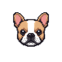
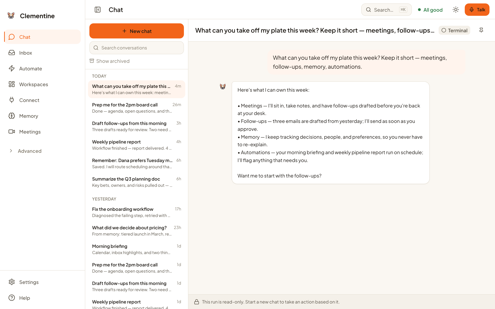
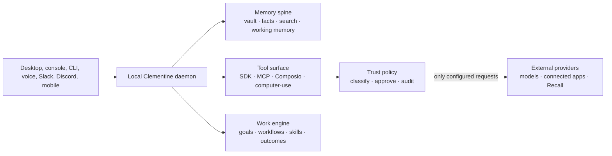

<p align="center">
  
</p>

<h1 align="center">Clementine</h1>

<p align="center">
  <strong>A local-first AI operator for one person and the work that follows them.</strong>
</p>

<p align="center">
  Persistent memory · governed tool use · workflows and skills · voice and meetings
</p>

<p align="center">
  <a href="https://github.com/Natebreynolds/clemmy/actions/workflows/test.yml"></a>
  <a href="https://github.com/Natebreynolds/clemmy/releases"></a>
  <a href="LICENSE"></a>
</p>



Clementine runs a personal agent daemon on your computer and gives it a native desktop shell, a focused console, persistent memory, and one approval policy across every tool. It can reason over your work, use connected apps, run scheduled workflows, capture meetings, and report results back to the channel where the work began.

Clementine is built for a single owner. It is local-first, not cloud-free: the daemon and primary data stores live on your machine, while enabled model providers and integrations receive the data required to perform the work you request.

## What Clementine does

| Capability | What is implemented |
| --- | --- |
| Persistent memory | Markdown vault, working memory, structured facts and entities, SQLite full-text search, and optional embeddings. |
| Governed action | Local tools, computer-use, MCP servers, and Composio actions share a common side-effect taxonomy and approval policy. |
| Workflows and skills | Author reusable `SKILL.md` procedures, schedule workflows, inspect runs, and preserve per-run artifacts and outcomes. |
| Connected work | Use configured email, calendar, documents, CRM, messaging, research, and other services through Composio or MCP. |
| Multiple channels | Desktop console, CLI chat, OpenAI Realtime voice, Slack, Discord, an authenticated mobile surface, and a local webhook API. |
| Meetings | On Apple Silicon macOS, detect supported meeting windows, prompt for capture, transcribe recordings, keep notes, and prepare post-meeting analysis. |
| Native notch surface | Dictate requests, follow live task and approval status, and control Recall meeting capture from a surface attached to the Mac notch. |

## Three system invariants

### One memory spine

Clementine does not rely on one ever-growing prompt. It retrieves relevant context from a local Markdown vault, a structured memory database, current working memory, and prior run evidence. Memory survives restarts and remains inspectable on disk.

### One compact tool surface

Built-in tools, installed skills, MCP servers, Composio integrations, and computer-use are discovered behind a common registry. Large integration catalogs are searched on demand rather than injected into every model turn.

### One trust policy

Every tool is classified as `read`, `write`, `execute`, `send`, or `admin`. The selected scope determines when Clementine can continue automatically:

| Scope | Read | `write_file` in an allowed root | Other non-destructive write/execute in a workspace | Outside a workspace | Irreversible send | Admin/destructive |
| --- | --- | --- | --- | --- | --- | --- |
| `strict` | auto | auto | ask | ask | ask | ask |
| `workspace` | auto | auto | auto | ask | ask | ask |
| `yolo` | auto | auto | auto | auto | ask | ask |

Agent-owned runtime directories are automatic in every scope. A user-approved plan or goal can pre-authorize its explicitly enumerated non-admin actions, including a send; otherwise irreversible sends still ask even in `yolo`. The command denylist remains active in every scope, and administrative or destructive actions continue to require approval.

## Meetings and the Mac notch

On Apple Silicon Macs, the desktop app can use Recall's Desktop SDK to detect Zoom, Google Meet, and Microsoft Teams windows without adding a participant bot to the call. When enabled, Clementine can prompt from the notch, start or stop capture, stream transcript events, and turn completed meetings into durable notes and follow-up context. Intel Macs can run Clementine, but Recall's native macOS recorder is ARM64-only.

Meeting capture is optional and has an explicit external boundary:

- Recall-based capture uploads meeting media and transcript data to Recall's service.
- Recall settings support zero-retention and bounded timed-retention modes for cloud media.
- A separate local recording path is available for in-person meetings and local transcription.
- Microphone, screen capture, and system-audio permissions are requested only for the features that need them.
- The notch exists only while the Clementine desktop app is running and can be disabled in Settings.

Notch dictation is transcribed and handed to the local agent, while task and approval status comes from Clementine's shared activity snapshot. Recall meeting prompts and recording controls use the native meeting-capture bridge.

## Privacy and data boundaries

Local-first describes where Clementine runs and keeps its primary state; it does not mean every optional feature operates offline.

| Data or feature | Boundary |
| --- | --- |
| Memory, goals, workflows, run records, and logs | Stored under `CLEMENTINE_HOME`, which defaults to `~/.clementine-next/`. |
| Credentials | The canonical local file vault is plaintext JSON. On macOS and other POSIX systems, Clementine writes it with owner-only `0600` permissions. On Windows, it lives in per-user app state and relies on the operating-system profile and ACL boundary. It is **not encrypted at rest**. Environment-variable fallback and explicit legacy Keychain import/repair are also supported. |
| Desktop preferences | Electron stores shell-specific preferences in the operating system's per-user app-data directory. |
| Model calls | Prompts and selected context go to the model provider you configure. |
| Connected apps | Relevant task data goes to the Composio, MCP, Slack, Discord, or other provider you enable. |
| Recall meetings | Capture data is uploaded to Recall when Recall meeting capture is enabled, subject to the retention mode you select. |
| Mobile access | The mobile surface uses an authenticated tunnel only when you explicitly enable it. |

Treat access to your operating-system account as access to Clementine's local data. Use full-disk encryption, a strong login password, and least-privilege integration credentials. See [SECURITY.md](SECURITY.md) for the supported disclosure process and current security boundaries.

## Install

### macOS app

The signed and notarized macOS app is the primary distribution. Current release automation builds Apple Silicon and Intel artifacts.

1. Open [GitHub Releases](https://github.com/Natebreynolds/clemmy/releases).
2. Download the DMG for your Mac.
3. Drag **Clementine** to **Applications** and launch it.
4. Complete model authentication, then add only the integrations you want.
5. Grant optional macOS permissions as features request them.

The first-run flow supports Codex OAuth, an OpenAI API key, or both. An OpenAI API key is required for optional API-backed capabilities such as embeddings and OpenAI Realtime voice. Composio, Slack, Discord, Recall, and other integrations are configured separately.

On macOS, closing the main window leaves the daemon running. Quit Clementine from the menu bar or with <kbd>⌘</kbd><kbd>Q</kbd> to stop it.

### Run the daemon and CLI from source

Requirements: Node.js `>=22.15.0`, npm, and credentials for at least one supported model path.

```bash
git clone https://github.com/Natebreynolds/clemmy.git
cd clemmy
npm ci
npm run setup
npm run daemon:start
npm run chat
```

Stop the background daemon with:

```bash
npm run daemon:stop
```

### Run the desktop app from source

The full desktop path also needs the nested app dependencies and built web surfaces:

```bash
npm ci
npm --prefix apps/desktop ci
npm --prefix apps/console-web ci
npm --prefix apps/mobile-web ci

npm run build
npm run build:console-web
npm run build:mobile-web
npm --prefix apps/desktop run build
npm --prefix apps/desktop start
```

macOS is required to exercise the complete native permission, Recall, and notch paths.

## Architecture



The Electron shell supervises the local daemon and loads the daemon-served console. The daemon owns memory, execution, channels, and policy. There is no required Clementine cloud control plane.

### Local data layout

```text
~/.clementine-next/
├── vault/                         Markdown knowledge and authored workflows
│   └── 00-System/workflows/       Workflow definitions
├── state/
│   ├── memory.db                  Structured facts, entities, FTS, embeddings
│   ├── secrets-vault.json         Plaintext vault; owner-only 0600 on POSIX
│   ├── tool-events/               Append-only tool-event records
│   └── meeting-capture/           Meeting records and capture state
├── skills/                        Installed skills
├── workflows/runs/                Workflow run state and artifacts
├── goals/                         Persistent goals
├── mcp/servers.json               MCP server configuration
├── working-memory.md              Current cross-session working context
└── logs/                           Daemon, supervisor, and integration logs
```

Set `CLEMENTINE_HOME` to use a different root.

## Configuration

Start from [.env.example](.env.example). Do not commit a populated `.env` file.

The source daemon binds its console and webhook server to `127.0.0.1:8420` by default. The desktop supervisor can select another available loopback port at runtime, so desktop integrations should discover the active URL rather than hardcode a port.

Useful configuration groups include:

- model authentication and routing;
- Composio, Slack, Discord, and Recall credentials;
- trusted workspace directories;
- MCP server discovery and optional auto-import;
- webhook host, port, and secret;
- meeting capture, media retention, and transcription settings.

## Repository map

| Path | Purpose |
| --- | --- |
| `src/` | Daemon, agent runtime, memory, tools, channels, execution, and integrations. |
| `apps/desktop/` | Electron shell, daemon supervisor, native permissions, Recall bridge, and notch window. |
| `apps/console-web/` | Current React console. |
| `apps/mobile-web/` | Authenticated mobile web surface. |
| `apps/web/` | Public Clementine landing page. |
| `skills/` | Repository-shipped skill examples and reference implementations. |
| `examples/plugins/` | Example plugin bundles. |
| `docs/` | Architecture notes, research, and point-in-time design records. |
| `.github/workflows/` | Test and desktop release automation. |

## Development

Core checks:

```bash
npm run typecheck
npm test
npm run test:release-assets
```

Surface-specific checks:

```bash
npm --prefix apps/console-web run typecheck
npm --prefix apps/console-web run build
npm --prefix apps/mobile-web run typecheck
npm --prefix apps/mobile-web run build
npm --prefix apps/desktop run typecheck
npm --prefix apps/desktop run build
```

Additional harness evaluations, smoke tests, and surface-specific guidance are listed in [package.json](package.json), the [testing guide](docs/development/testing.md), and the [documentation index](docs/README.md).

## Platform status

| Platform | Status |
| --- | --- |
| macOS | Primary desktop target. Release workflow produces signed and notarized DMG and ZIP artifacts for Apple Silicon and Intel. Native meeting capture and notch features live here. |
| Windows | Release CI builds an NSIS installer on normal version tags. It may be unsigned unless Windows signing credentials are configured, and macOS-native features are not available. Check each release for current parity. |
| Linux | No supported desktop artifact is published. Running the daemon from source remains a developer path. |

## Contributing and support

- Read [CONTRIBUTING.md](CONTRIBUTING.md) before opening a pull request.
- Follow the [Code of Conduct](CODE_OF_CONDUCT.md).
- Report vulnerabilities privately according to [SECURITY.md](SECURITY.md), never in a public issue.
- Use [GitHub Issues](https://github.com/Natebreynolds/clemmy/issues) for reproducible non-security bugs and focused feature proposals.

## License

Clementine is available under the [MIT License](LICENSE).
