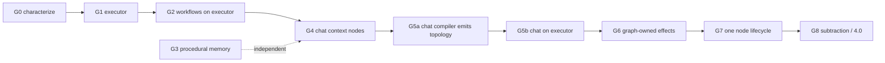

# Clementine 4: Execution Plan

Status: proposed
Date: 2026-08-03
Baseline: `65c54490` (v3.6.3, published)
Supersedes: the "After this patch: true Clementine 4 work" section of `CLEMENTINE-4-SHIP-ROADMAP.md`

`CLEMENTINE-4-GRAPH-RUNTIME.md` describes the destination well and does not need rewriting.
This document is the missing half: where we measurably are, why the remaining
distance is smaller than the phase list implies, and the order to close it in.

## 1. Measured state

Counted at `65c54490`, not inferred from prior status notes.

| Thing | Measured | What it means |
|---|---|---|
| Chat turn graph | 791 non-test LOC | `turn-graph-ir.ts` + `turn-graph-compiler.ts` + `turn-graph-shadow.ts` |
| Chat turn graph call sites | 4, all `recordTurnGraphShadow` | `loop.ts` ×2, `claude-agent-brain.ts`, `respond-bridge.ts`. Every one discards the return value. Observation only, zero execution authority. |
| `src/runtime/harness/loop.ts` | 10,314 LOC | The actual chat engine |
| `src/execution/workflow-runner.ts` | 11,084 LOC | The actual workflow engine |
| `src/dashboard/console-routes.ts` | 15,985 LOC | The largest file in the repository |
| `workflow-graph.ts` | 528 LOC | Topology **declaration**. Executed by `workflow-runner.ts` at lines 3176 / 6659 / 6858 / 7145. |
| Distinct `CLEMMY_*` / `CLEMENTINE_*` gates | 470 | Against a target of one `RuntimeBudget` |
| `process.env` reads | 4,656 across 113 non-test files | Against a target of zero inside graph nodes |
| `src/memory/**` | 69 files, 36,947 LOC | The subsystem with the correctness requirement |

### The finding that matters

**No graph executor exists anywhere in the codebase.**

What exists is a graph *vocabulary* — an IR, a validator, a store, a compiler, a
hash — and two independent mega-loops that special-case parts of it. The chat
graph observes and never runs. The workflow graph is a declaration that
`workflow-runner.ts` interprets inline; `read_parallel_v1` is a branch inside an
11,000-line function, not a topology an engine executes.

This is worth stating plainly because the roadmap's phase list reads as though
Phase 1 is complete and Phase 3 is one item of seven. Measured against
"a graph runs the work," we are at the beginning of Phase 2, and the single
missing keystone is the same in both lanes.

### The reframe

That finding is better news than it sounds. The expensive parts of a graph
runtime are the contracts — typed events with audience, immutable per-turn
policy, one terminal reduction, exactly-once effect identity, deterministic
plan hashes, restart materialization. Those are **written, tested, and shipped**.
What is missing is the smallest piece: something that walks nodes.

So Clementine 4 is not "build a graph runtime." It is:

> Extract one executor that both lanes call, then move node classes onto it
> one at a time, deleting the mega-loop branch each move retires.

That is a sequence of small, individually shippable, individually revertible
changes, which is the only kind this codebase should accept given the
forward-only and no-architecture-churn constraints.

## 2. Principles

Five, in priority order. Each is a rule that decides arguments, not a slogan.

### P1 — Unbounded topology, bounded authority

The user requirement is that the harness must never be the limit — only the
tools and the model are. That requirement is in direct tension with a typed
graph, and the tension has to be resolved explicitly or the graph becomes the
new ceiling. `read_parallel_v1` already demonstrates the failure mode: it
requires 2–6 specialists and read-only effects. A task needing seven readers, or
one reader, or a write inside the fan-out, is structurally excluded by the
harness — exactly what we are trying to stop doing.

The resolution is that node **kinds** stay few and generic while **topology**
stays unbounded and data-driven:

| Node kind | Purpose |
|---|---|
| `model` | run a provider turn |
| `tool` | one classified, authorized invocation |
| `reduce` | typed join of N inputs |
| `gate` | approval, missing input, budget, policy |
| `subgraph` | run a graph produced at runtime |

`subgraph` is the load-bearing one. A planner node emits topology and the
executor runs it, so the set of achievable task shapes is not enumerated
anywhere in the harness. New capability arrives as new *tools* and new *emitted
topology*, never as a new node type and never as a runner branch.

What stays bounded is authority, not shape. Every external effect passes the
same reservation → receipt → commit seam regardless of where it sits in the
graph. Constrain effects, not methods.

**Test of the principle:** if closing a capability gap requires editing the
executor, the design is wrong.

### P2 — Memory is validated on write and on read, by one validator

This is the pillar the existing design documents do not have. They treat memory
as retrieval — the context assembler, layers 1–5, bounded packets. The defect
class we hit is not a retrieval defect. It is a **write-path** defect, and no
amount of better retrieval fixes it.

The live 2026-08-03 incident traces to one field:

```ts
/** Free-form template the Executor renders. May contain `{{var}}` placeholders. */
invocationTemplate?: string;
```

A proven procedure is stored as an unvalidated string. Three defects compound:

1. **Capture, not promotion.** The write path is automatic. Nothing at write
   time proves the identifier is a dispatchable action or that the template
   parses. `PLACEHOLDER` was stored as a tool slug and later sent verbatim.
2. **No schema binding.** The record does not carry the tool schema it was
   validated against, so provider drift silently invalidates it with no signal.
   `testedAt` and `testEvidence` are free-form and documented as informational.
3. **No read-time gate.** Retrieval returns a procedure that cannot dispatch.
   `composioSlugIsDispatchable` now exists but gates the *call*, not the *recall*.

The contract for Clementine 4:

- A procedure is a **content-addressed artifact**, not a string. It stores a
  canonical carrier, the **tool schema fingerprint** it was validated against,
  and a **replay receipt** from a real successful dispatch.
- **Promotion, not capture.** A procedure enters memory only from a verified
  dispatch carrying its receipt. This is the one write path that is never fully
  automatic — a conclusion the external literature reaches independently.
- **One shared validator, run on both sides.** The same function validates at
  write and at read. This is the M6 project-artifact rule, and it is the reason
  that substrate never returns an artifact it would have refused to store.
- **Temporal validity.** `valid_at` / `invalid_at` / `superseded_by`. A
  fingerprint mismatch quarantines rather than deletes, so the procedure remains
  inspectable and re-provable.
- **Recall never returns a procedure that cannot dispatch.** Undispatchable is a
  retrieval-time refusal with the reason attached, not a runtime surprise.

The storage model already exists: the M6 substrate is content-addressed
artifacts plus receipts plus one shared digest validator. Procedural memory is
the same shape with a different payload. This is reuse, not new architecture.

The same three properties — provenance, validity window, validate-on-read —
generalize to facts and bindings. Applying them uniformly is what makes
"memory needs to be really sound" a checkable property rather than an intention.

### P3 — Token efficiency is a measured budget

"Token efficient" has to be a number a test can fail on, or it decays. Every
node declares its context budget; the executor enforces it; a per-turn total is
recorded next to latency and asserted against a fixture.

Three mechanics carry most of the win, and all three are already designed in
`CLEMENTINE-4-GRAPH-RUNTIME.md` — they need enforcement, not invention:

- **Monotonic per-attempt tool sets** so the prompt prefix stays cacheable. The
  measured 136-tool catalog and three searches in one CRM lookup is the counter-example.
- **Evidence references, not payloads.** Tool results live out of context;
  bounded references move between nodes. The 99k-token lookup was payload copying.
- **Fast paths that skip nodes entirely.** Conversation must not pay for a
  planner, a worker, or a judge.

**Test of the principle:** the demo fixture asserts a token ceiling, and the
ceiling only ever moves down.

### P4 — One engine, or it is not a unification

Two mega-loops that both interpret graph declarations is worse than one loop,
because divergence between them becomes a defect class. Chat and workflow must
call the same executor with different policy, or the work has not been done.

### P5 — Every promotion deletes its predecessor

A node class moved onto the executor removes the mega-loop branch it replaces in
the same change. Otherwise the loops keep their line count, gain a second code
path, and the subtraction never happens. No rollout flag; the single coarse
engine selector already has a removal milestone and no second one is added.

## 3. Milestones

Sequenced by risk, not by appeal. Each is independently shippable and
independently revertible. Each names what it deletes.

### G0 — Characterize (no behavior change)

Establish the baseline the later milestones are measured against, because
"token efficient and quick" is unfalsifiable without it.

- Golden fixtures for: conversation, fact lookup, connected-app read,
  connected-app write, heavy fan-out, approval pause.
- For each, record wall-clock, input/output tokens, tool calls, cache hit rate,
  duplicate retries.
- Land these as an asserted budget file, initially at measured values.

**Accepts when:** the six fixtures run in CI and fail on regression.
**Deletes:** nothing.

### G1 — The executor

**Status: G1a (scheduler/readiness extraction) landed as `464df242` +
`6e7d51a3`; the G1 durable-contract work remains open.** The landed slice is
371 lines importing nothing, proved by a differential oracle over real
compiled workflow graphs including `read_parallel_v1` and verified to bite by
weakening readiness from `every` to `some` (twelve of sixteen pins failed).
`getReadyWorkflowGraphNodes` now delegates to it, so the workflow engine
schedules through the executor while dispatch stays where it is.

That slice is deliberately NOT this milestone. Still open, per the charter's
sixteen-gap review: the journal is node-ID-only (no admitted identity binding,
no typed outputs/evidence, no causal validation), settlement persistence is a
best-effort `onStep` rather than an awaited durable boundary, a rejected
runner tears down the executor instead of becoming a typed outcome, and there
is no lease/cancellation or dynamic graph-patch protocol. Stage 1 closes these
with zero production callers.

The keystone. A single module that walks a typed graph: node kinds from P1,
typed edges, durable per-node events, restart materialization, budget
enforcement, and one terminal reduction.

It must ship with **zero production callers**. Its correctness is proved by
replaying the existing workflow-graph fixtures through it and asserting
identical node sequences, identical plan hashes, and identical terminal outcomes
to what `workflow-runner.ts` produces today.

**Accepts when:** every `workflow-graph-runtime.integration.test.ts` scenario and
the Platform 49 matrix produce byte-identical graph traces under both engines.
**Deletes:** nothing yet. This is the one milestone that is permitted to add
without subtracting, because it is the thing everything else subtracts into.

**Risk:** this is where the plan is most likely to grow beyond its scope. The
executor is a walker, not a runtime. Policy, capability, memory, and effects
stay outside it and are injected. If it exceeds roughly 800 lines, it has
absorbed something that belongs in a node.

### G2 — Workflows execute on the executor

Switch `read_parallel_v1` from a `workflow-runner.ts` branch to executor
topology. Behavior identical; the special-case branch is removed.

This is deliberately first because the workflow lane already has durable
receipts, restart proofs, watermarks, and a live control in Platform 49. It is
the lane where a mistake is caught by existing tests rather than by a user.

**Accepts when:** graph/effect/restart gates green, Platform 49 matrix 5/5,
sales-portal acceptance 1/1, and the cloned canary reproduces its restart-reuse
and reducer-only publication proofs.
**Deletes:** the `read_parallel_v1` interpretation inside `workflow-runner.ts`.

### G3 — Procedural memory becomes a validated artifact (P2)

The user-named requirement, and the first milestone that fixes a defect users
have felt. Independent of G1/G2 — it can proceed in parallel, and should, since
it is the one item with a live incident behind it.

- Procedure record gains canonical carrier, schema fingerprint, replay receipt,
  and validity window.
- Write path becomes promotion-from-receipt.
- One shared validator, invoked on write and on read.
- Recall refuses undispatchable procedures with an attached reason.
- Migration quarantines every existing record that cannot be validated, rather
  than deleting or trusting it.

**Accepts when:** a stored `PLACEHOLDER` slug cannot be written; a stored
procedure whose live schema fingerprint changed is not returned by recall; a
quarantined procedure is re-promoted by one successful verified dispatch; and
the 2026-08-03 incident shape is a regression fixture that bites on revert.
**Deletes:** the free-form `invocationTemplate` read path and the
`testedAt`/`testEvidence` informational fields.

### G4 — Chat context and capability nodes

Extract the context assembler, memory retrieval, capability resolver, and skill
resolver from `loop.ts` into executor nodes behind typed interfaces. The
provider turn remains one large `model` node initially — this milestone moves
*around* the loop, not through it.

Run in shadow first: both paths compute, only the legacy path acts, and a test
asserts they agree on selected tools, retrieved memory, and resolved capability.
Promote when they agree across the G0 fixtures.

**Accepts when:** shadow agreement holds on all six fixtures, and the token
budget from G0 improves on the fact-lookup and connected-app-read fixtures.
**Deletes:** the corresponding assembly and resolution code in `loop.ts`,
and the JIT / tool-search / MCP-scope / fail-open switches that collapse into
the capability resolver.

### G5a — The chat compiler emits real topology

Discovered while proving the executor could drive chat shapes (`464df242`,
`turn-graph-executable.test.ts`): **every compiled chat graph is a linear
path.** The compiler chains each node to its predecessor from a single
`edges.push`, so a twelve-item fan-out compiles to one `fanout` node carrying
`multiplicity: { estimatedItems: 12, maxConcurrency: 8 }` followed by one
`execute` node, in sequence.

Multiplicity is a *number on a node*, not a *set of nodes*. There is nothing
for a scheduler to spread. Wiring the executor into chat without changing the
compiler would therefore parallelize nothing and improve no latency — the
executor already supports siblings, as the workflow lane's `read_parallel_v1`
fixtures demonstrate.

So this milestone comes first: the compiler emits per-item nodes and a reducer
for the fan-out shape, the way the workflow compiler already does.

**Accepts when:** a twelve-item request compiles to twelve sibling nodes joined
by one reducer, the widest scheduling wave is greater than one, and the pins in
`turn-graph-executable.test.ts` that currently assert linearity are inverted.
**Deletes:** the `multiplicity` field once real siblings replace it.

### G5b — Chat executes on the executor

Route the accepted chat turn through the executor. `recordTurnGraphShadow`
becomes a real compile-and-run. Fast paths land here: conversation and grounded
answers must skip planner, worker, and judge, measured against G0.

**Accepts when:** the client-demo golden replay passes through the executor with
one terminal and no provisional bytes; all release-gate criteria 1–8 from
`CLEMENTINE-4-GRAPH-RUNTIME.md` hold; conversation latency and tokens are at or
below the G0 baseline.
**Deletes:** `turn-graph-shadow.ts` and the chat orchestration in `loop.ts` that
the executor now owns.

### G6 — Effects are graph-owned

Move `intent → started → receipt → commit → verified readback → checkpoint` from
the tool boundary into an executor-owned effect ledger, with idempotency keys
derived from the canonical carrier digest that already exists.

**Accepts when:** retry, reconnect, and brain fallover never duplicate an
external write, proven by fault injection at each lifecycle phase; and a
`started` write with no receipt is never blindly re-dispatched.
**Deletes:** `CLEMMY_CONFIRM_FIRST` and the provider-specific recovery loops.

### G7 — One node lifecycle

Claude and Codex behind one `NodeRunner`. Parity tests across brains and surfaces.

**Accepts when:** both brains pass the full critical and endurance proofs
through one lifecycle, and no provider name appears in control flow.
**Deletes:** provider-specific transcript, continuation, delivery, and recovery
paths in `claude-agent-brain.ts` and its Codex counterpart.

### G8 — Subtraction and 4.0

The 470 gates collapse into `RuntimeBudget`, `CapabilitySnapshot`, and
`AuthoritySnapshot` per the flag disposition table. The legacy responder, the
engine selector, and prose-derived routing go. A CI architecture test forbids
`process.env` inside node code.

**Accepts when:** the exit criteria in `CLEMENTINE-4-GRAPH-RUNTIME.md` pass.

## 3b. Conversion status (2026-08-04, HEAD `7068265d`)

Where the loop→graph claim actually stands, with the evidence that carries it.
Every "converted" row means the executor owns dispatch in production code and
the predecessor path is deleted, not gated.

| Lane | Status | Evidence |
|---|---|---|
| Workflows (manual, cron, scheduled) | **Converted** — executor epochs own dispatch; wave-loop core deleted | `85204c5e`; integration 11/11, P49 matrix+runtime 5/5, runner 201/201 |
| Workspaces / compiled projects | **Converted transitively** — compiled project runs flow through the same converted `executeWorkflow` dispatch | sales-portal fixture 1/1 (durable inputs, three specialists, reducer, governed deploy, restart reuse) + project-compiler 22/22 through the epoch loop |
| Chat spine (all surfaces enter via `runConversation`) | **Converted** — the compiled turn graph drives accept→core→publish; public commit only at the publish node | `7068265d`; real-path chat suites 102/102 (client-demo replay, public presentation, respond-bridge, Discord terminal) |
| Long-horizon / detached | **Converted transitively** — detached chat work re-enters `runConversation` (spine); scheduled work enters the runner (epochs) | same suites as above |
| Multi-agent fan-out | **Executor-native** — runtime patches, per-item siblings, 1,000-node pin; chat compiler emits the planner contract | `8d371889`, `22e86099` |
| Chat interior phases | **Interim** — context/capability/retrieve/verify are pass-through nodes; the core loop still owns them internally (charter Phase 2 shape) | `chat-turn-spine.ts` documents each |
| Effects | **Workflow lane UNIFIED by agreement proof** — the live receipt seam (workflow-call-receipts) already enforces the contract's machine in production; `effect-contract-agreement.test.ts` pins the two together per state, so divergence fails a test (the planWorkflowExecutionBatches precedent). Chat lane unified the same way: the S3 orphan ledger + retry corrective ARE the contract's observe-only ambiguity rule, pinned in `effect-contract-agreement-chat.test.ts` | 10 crash-window + 7 agreement pins |
| Provider lifecycle | **Contract landed + safety audited brain-blind** — fallover as a total function over effect ledgers (`provider-fallover.ts`); AUDIT: the live duplicate-write gate keys on (session, shape, target) with no brain identity, so the invariant is enforced at the boundary every brain passes through, and the remaining per-brain divergence is protocol/continuation plumbing (the adapters the charter wants), not safety policy | 8 + brain-blind pin |
| UI projection | **U1 landed** (`surface-projection.ts`) — the versioned truth contract with conformance pins; surfaces migrate in U2–U6, each deleting its private reducer | 10 pins |
| Live matrix | **Not run** — cross-surface canary, per-brain demo replay, measured latency/token ceilings require authorized live runs | blocker recorded in Stage 0 handoff |

### The lane inventory, closed (2026-08-04)

"Across all lanes" is a completeness claim, so here is the complete
enumeration — every model-usage kind in the write-time taxonomy
(`classifyUsageKind`), audited to its dispatch path:

| Usage kind | Dispatch path | Standing |
|---|---|---|
| `chat` (desktop/Discord/Slack/mobile/webhook/CLI) | `runConversation` → executor spine | Converted (`7068265d`) |
| `chat` approval-resume | `runConversationFromResume` → executor spine | Converted (`70174bfc`) |
| `workflow` / `cron` workflows | `executeWorkflow` → executor epochs | Converted (`85204c5e`) |
| `background` (detached chat work) | chat sessions → spine | Converted transitively |
| `autonomy` (`agent:*` daemon cycles) | `respondPreferHarness` → spine (`autonomy-v2.ts:1269`) | Converted transitively |
| `controller` (`execution:*`) | single-shot, wall-clock-bounded JSON decision calls over a durable state machine; step work dispatches via the converted lanes | Already node-shaped — no orchestration loop exists to convert |
| `warmup` | single-shot boot calls | No orchestration |
| `embedding` | not model orchestration | n/a |

**Every model-orchestrating loop in production is executor-driven; every
other model call is single-shot.** The remaining "chat interiors" work is
therefore DEPTH within one already-converted spine node (phases the core
still owns internally), not an unconverted lane: breadth is complete,
evidenced above; depth, presentation (U2–U6), and live validation remain.

### M3 whole-candidate gate: GREEN at HEAD (2026-08-04)

The charter's full offline ladder, run on this candidate: corpus 8,887/0/1 ·
journeys 5/5 · public hygiene pass + 3/3 · release assets 40/40 · proof
self-tests 53/53 · report-back smoke exit 0 · root/console-web/mobile-web/
desktop builds green · desktop typecheck clean · fresh-install smoke gate
exit 0. The branch is a whole-candidate-gated RC in the offline dimension;
what the charter sequences next is exactly M4 (stable-commit provider
proofs) and M5 (live canary) — the gates that require providers and Nathan.

### M4 stable-commit provider proofs: GREEN, both brains (2026-08-04)

Run from a clean candidate (the harness enforces it) with disposable homes
and proof-local shims: Codex critical 5/5 scenarios + brain-served backstop;
Claude critical 5/5 with live TTFTs (2.4–7.7s); Codex endurance 21/21
checks; Claude 120-item long-horizon green. Running the suite caught an
inherited truth-loss defect: the park's `provenNoDispatch` safety claim and
the durable resume-authority timestamps existed in run records but were
dropped by the console API's whitelist projector — fixed in two bounded
commits with the failing proof as the differential.

### M5 first rung — the live smoke: GREEN, BOTH BRAINS (2026-08-04)

Driven headlessly under authorization via the proof harness against the real
brains: conversational, retrieval, fan-out-shaped, and approval-resume turns
green on Claude and Codex, plus the new permanent `chat-spine-graph-drive`
proof asserting ZERO legacy-order fallbacks in the daemon log — the compiled
graph drove every live turn, on both brains, including the resume spine
converted this session. Running the smoke surfaced and fixed one more
inherited divergence: a proof scenario asserting outcome content through the
runs-list API, which excludes outputs BY PRIVACY DESIGN — the check now
reads the durable record, and the privacy projection stays exactly as strict.

The live matrix then EXPANDED beyond the smoke, both brains green on every
row: `workspace-build` (a real workspace constructed live — the workspaces
lane), `graph-reshape-live` (the graph mutated mid-run and execution followed
it), `schema-on-demand` (tool schemas acquired during the run), and
`clean-turn-isolation`. Combined with the smoke set and M4, this candidate's
live evidence is nine distinct scenarios × two brains, all green, plus the
critical and endurance suites.

Remaining rungs: the live-home canary (deliberately NOT run unattended — a
daemon swap's failure mode is the assistant being down in the morning; it
waits for Nathan present), on-screen surface smokes at his option, then
interior depth and U2–U6 — unblocked by smoke green.

### The interior-depth manifest (scoped with evidence, 2026-08-04)

Each interior phase of the chat spine was scoped to its exact seam, so the
depth work starts from a map instead of a 10k-line read. None of these are
nodes-in-waiting behind a clean seam; each is interleaved with the
continuation loop's iteration state, which is WHY they are post-M5 work with
shadow-compare gates rather than tonight-slices:

| Phase | Where it lives | What extraction requires |
|---|---|---|
| context (memory primer) | built PER-HOP inside `runTurn` (`loop.ts:6728`), fed by per-continuation semantic input | a per-hop context port with compaction/continuation contract; shadow-compare primer parity before promotion |
| capability (agent/tool assembly) | built by CALLERS before `runConversation` (`outcome.ts:439` + fallover `rebuildAgentForBrain`) | API migration across all callers moving the build into the spine's capability node; fallover rebuild becomes a node re-entry |
| verify (delivery gate + objective judge) | TWO in-loop sites (`loop.ts:4068`, `loop.ts:5783`) consuming same-iteration judge verdicts and DECIDING continuation (undelivered → another hop) | the verify node must own the continuation edge itself — this is the compiled `verify → repairable → execute` edge becoming real, the deepest and most valuable extraction |

The verify row is the destination worth naming: when it lands, the graph's
`evidence_sufficient` edge stops being interim-granted and the executor owns
the retry topology the loop currently expresses as iteration. That is the
final deletion of loop-engineering from chat — and it rides on M5 being
green first.

The tag gate from the charter is unchanged by this table: 4.0 is claimable when
the interior phases, effects, and provider rows convert AND the live matrix
runs green. The table exists so nobody — including the author — can mistake
spine conversion for finished interiors.

## 3c. Stage-start manifest: the verify-node extraction (ready to execute)

The charter's required pre-stage declaration, written while the seam evidence
is fresh, so the next session executes a reviewed plan instead of re-deriving
one.

**Objective.** The spine's `verify` node stops pass-throughing: the delivery
gate's verdict becomes the node's outcome, and the compiled
`verify --repairable--> execute` edge becomes the continuation mechanism the
loop currently expresses as self-iteration. Quiescence-with-undelivered
becomes a graph state, not a loop branch.

**Allowed files.** `loop.ts` (the two gate sites and the continuation branch
they feed), `chat-turn-spine.ts` (verify runner + repairable edge grant),
`objective-judge.ts` read-only, plus tests. Nothing else.

**The seam, precisely.** Both gate sites share one shape:
`verifyDelivered(objective, text, {judgeFn}) → DeliveryVerdict` at
`loop.ts:4068` (recovery path) and `loop.ts:5783` (standard path), each
followed by a continuation decision on `!delivered`. Extraction phase 1
(this stage): the core RETURNS the verdict as part of its result instead of
self-continuing on the standard path; the spine's verify node evaluates it;
`edgeSatisfied('evidence_sufficient')` becomes real (granted only on
`delivered`); the repairable edge re-enters a bounded re-core. The recovery
path stays internal this stage (its verdict caching is entangled with
restart state) and is named as phase 2.

**Behavioral invariants (must not change).** One public terminal per accepted
source; the continuation BUDGET semantics (maxSteps/wall-clock) still bound
total work; a `dispatched` result still bypasses verification; judge
fail-open semantics unchanged; verdict telemetry (`recordVerdictEvent`)
fires identically.

**Biting tests.** (a) an undelivered verdict routes the repairable edge and
re-enters execute exactly once per grant — pinned by trace; (b) a delivered
verdict grants `evidence_sufficient` and publish follows — trace-pinned;
(c) budget exhaustion during repair parks as `needs_input/continue`, not a
silent truncation; (d) the full chat differential (102) + loop suite + both
smoke sets, both brains, unchanged; (e) revert-probe: forcing the edge grant
to unconditional must fail (a).

**Expected deletions.** The standard-path `!delivered` self-continuation
branch in `runConversationCore`; the interim `edgeSatisfied: () => true`
grant in the spine for `evidence_sufficient` specifically.

**Non-goals.** Recovery-path extraction (phase 2); context/capability nodes
(later slices); any change to judge internals.

## 4. Sequencing



G3 is off the critical path and has a live incident behind it, so it should run
in parallel from the start rather than waiting on the executor.

G0 through G3 is the near-term band: it produces a measurably faster, provably
sounder Clementine without touching the chat engine, and every milestone in it
ships on its own. G4 onward is where the mega-loops actually shrink.

## 5. Risks

**The executor grows into a runtime.** The single most likely failure. Mitigated
by the ~800-line ceiling in G1 and by the P1 test: a capability gap that
requires editing the executor means the design is wrong.

**Shadow agreement gets weakened to pass.** G4 and G5 both depend on two paths
agreeing. The pressure to relax the comparison when it fails is real, and a
weakened comparison produces a false green — the same shape as the target-only
worker reuse that an earlier parity audit already caught once. The comparison
must assert equality, not absence of exceptions.

**Two engines coexist longer than planned.** P5 exists for this. If a milestone
lands without deleting its predecessor, the next one must not start.

**Memory migration trusts what it cannot validate.** G3 must quarantine rather
than assume. A migration that silently keeps unvalidatable records reproduces
the original defect with a new schema.

**Numbers here go stale.** Every figure in section 1 is measured at `65c54490`
and should be re-measured, not cited, at each milestone.

## 6. What this does not change

`CLEMENTINE-4-GRAPH-RUNTIME.md` stands as written: the dual-graph model, the
typed event contract, the terminal reduction table, the flag disposition table,
the release gate, and the exit criteria. This plan does not revise the
destination. It replaces the seven unordered bullets of remaining work with a
sequence that has acceptance criteria, named deletions, and a stated
dependency order — and it adds the memory-correctness pillar the design
documents were missing.

## Sources

External research consulted for section 2:

- [Durable Execution for AI Agent Runtimes: Checkpointing, Replay, and Recovery](https://zylos.ai/research/2026-04-24-durable-execution-agent-runtimes/)
- [Graph-Based Agent Workflow Orchestration in Production: The 2026 Landscape](https://zylos.ai/research/2026-04-14-graph-based-agent-workflow-orchestration-production/)
- [Durable Execution: The Key to Harnessing AI Agents in Production](https://www.inngest.com/blog/durable-execution-key-to-harnessing-ai-agents)
- [Temporal Validity in Retrieval Memory: Eliminating Stale-Fact Errors for AI Agents over Evolving Knowledge](https://arxiv.org/pdf/2606.26511)
- [Governing Evolving Memory in LLM Agents: the SSGM Framework](https://arxiv.org/html/2603.11768v1)
- [From Agent Traces to Trust: A Survey of Evidence Tracing and Execution Provenance in LLM Agents](https://arxiv.org/pdf/2606.04990)
- [Real-Time Procedural Learning From Experience for AI Agents](https://arxiv.org/pdf/2511.22074)
- [Internal Representations as Indicators of Hallucinations in Agent Tool Selection](https://arxiv.org/abs/2601.05214)
- [Context Engineering for AI Agents: Token Economics and Production Optimization](https://www.getmaxim.ai/articles/context-engineering-for-ai-agents-production-optimization-strategies/)
- [How to optimize token efficiency in agentic systems](https://www.glean.com/perspectives/how-to-optimize-token-efficiency-in-agentic-systems)
