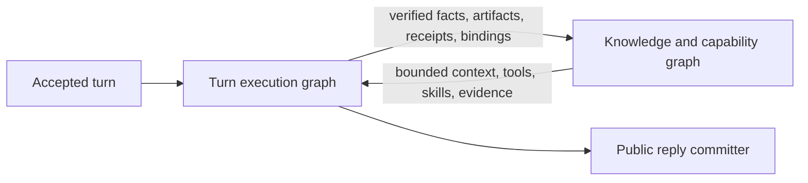
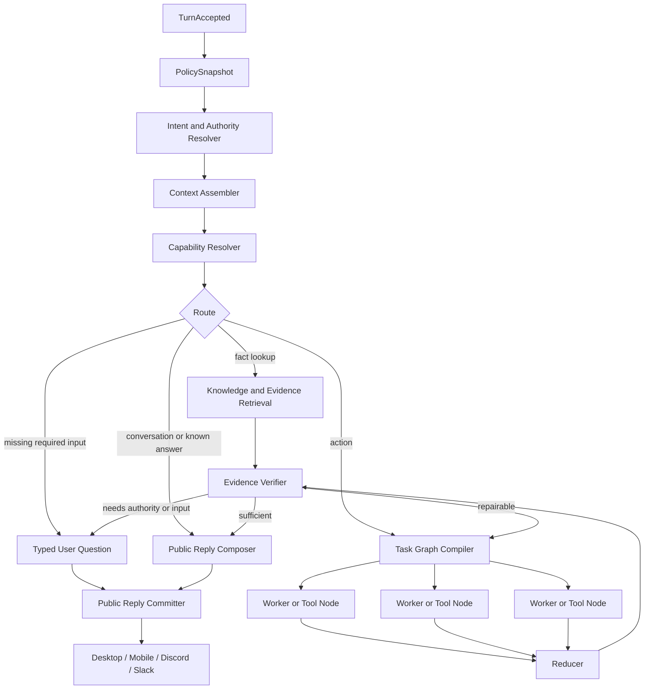

# Clementine 4 Graph Runtime

Status: Horizon A implemented; Horizon B pilot 1 implemented behind explicit graph semantics and shadow observation; local candidate gates are green; clean-commit live proofs and a controlled canary remain
Date: 2026-08-01

## Implementation checkpoint

The v3.6 repair now has a typed `TurnOutcome`, an exactly-once delivery committer, and a one-way public-event projector. The default Standard, Claude Agent SDK, and plan-first chat paths converge on that boundary. Raw model deltas were removed; tool progress is projected without arguments; retries and safe brain fallover remain private until one terminal outcome is committed; transcript and reconnect replay use only the public projection. Preflight failures now create a durable terminal instead of leaving mobile or SSE clients waiting.

Every mutable chat ingress now claims a stable provider/client request before work, binds the exact accepted source, and either joins/replays that logical turn or fails closed. Approval resumes use the same source-owned terminal contract. Startup opens ingress only after orphan fencing, approval draining, recovery, report-back, workers, and timers are armed; standalone mutating listeners share the foreground lease. Logical transcripts pair terminals in accepted-source order, while durable viewer state, notification delivery, and a report-back outbox survive restarts. Memory schema v32 quarantines unresolved pre-identity inbox rows, and existing databases receive a verified, unpruned pre-migration snapshot before upgrade.

The patch removes the ceremonial confirmation beat and its separate first-contact fan-out pause; only a one-release, read-only decoder remains for acknowledgements against alignments already persisted by 3.5. It also treats legacy response fallback as an explicit break-glass path. The full graph migration is not complete: executable chat context/capability nodes, graph-owned effect authority and receipts, remaining non-chat legacy terminal writers, and the broader provider-neutral executor migration belong to the phases below. A sanitized structural replay of the exact client-demo failure shape now protects the public projection, terminal ownership, reader parity, and retry boundary. Its raw-to-sanitized provenance still requires an independent human review against the private source log.

Pilot 1 now adds two deliberately asymmetric graph paths:

- Every accepted chat turn compiles one provider-neutral graph IR in shadow mode. The graph records typed route, fast path, policy hash, capability requirements, effect ceiling, nodes, and edges against the exact `sourceUserSeq`; it does not execute nodes, alter prompts/tools/approvals/terminals, or publish user bytes. Mutating and unknown effects remain deferred to the existing runtime tool boundary.
- An authored workflow step may declare `subgraph.mode: read_parallel_v1`. The compiler expands two to six read-only specialist siblings and uses the authored step as their reducer. Every branch and the reducer are physically limited to `workflow_step_result` and run-scoped artifact queries; external fetches and all writes/sends remain separate authored graph nodes.

Neither path adds an environment gate. Shadow chat compilation is observational. The workflow mode is versioned executable topology in the definition, validated at create/update/preflight, pinned in the admitted definition hash, persisted in the run graph, and re-materialized on restart.

The experimental standalone chat capability resolver/fan-out executor is parked outside the candidate: no chat ingress calls it, and it does not yet bind production context, capability authority, verification, terminal ownership, or publication. Today, real fan-out/fan-in execution belongs to the authored workflow graph; chat graph compilation remains private observation.

Local v3.6 candidate validation is green from an immutable clean checkout of code candidate `282ecb60`: the release-focused graph/demo/effect/sales gate passed 167/167; the full isolated repository corpus passed 8,266 with zero failures and two environment/build-conditional skips; and the conditional console/runner/daemon set passed 42/42 after builds. Journeys passed 5/5, public-hygiene tests passed 3/3, release-asset tests passed 40/40, unified report-back smoke passed 7/7, proof self-tests passed 53/53, fresh-install smoke passed after its desktop-build prerequisite, and daemon, mobile-web, console-web, and desktop builds completed. Live both-brain/provider proof and the controlled cloned-workflow canary are deliberately not inferred from unit tests.

## Demo failure diagnosis

The 3.5 failure is a publication-ownership bug, not primarily a prompting bug. The old bridge forwarded `request.onChunk` into a provider loop before the turn had passed continuation, verification, or terminal reduction. The Claude path tried to classify each incomplete text prefix as either a reply envelope, narration, or plain prose; mobile then exposed the same provisional callback over SSE. Once an incomplete prefix was classified as prose, those bytes were already public and no later judge, retry, filter, or clean final answer could retract them.

The durable ledger for the likely demo-shaped turn contains a clean final completion after memory recall, capability discovery, and external reads. That does not prove the visible stream was clean; it demonstrates why final-transcript-only testing missed the defect. Horizon A therefore removes raw provider streaming at the bridge and makes public presentation a typed, post-reduction artifact. Tests must assert both the committed transcript and every live/replayed public event, including adversarial provisional text.

The same sanitized trace exposes the intelligence/latency problem beyond narration. A straightforward connected-CRM lookup took roughly 74 seconds and about 99k recorded input tokens. Initial capability scoping found no intent family and failed open to a 136-tool catalog; the run then searched that catalog three times before completing the reads. That is not a reason to hard-code another CRM route. It is the Phase 2 requirement in concrete form: resolve intent to a cached, proven capability binding, load only the needed schemas, and invalidate that binding only when the account, schema fingerprint, or outcome changes.

The confirmation-beat decision is also evidence-based. `CLEMMY_CONFIRM_BEAT` did run in production: the ledger has 226 preflight decisions across 125 chat sessions, including 12 `align` decisions. Only one later execute decision retained a `confirmedIntentKey`, so the beat did not reliably carry authority into execution and should not remain as a safety substitute. This is distinct from `CLEMMY_CONFIRM_FIRST`, the fail-closed guard for irreversible same-shape batch writes. The patch keeps that real effect-safety guard until the graph's intent-and-authority node and durable effect receipts subsume it.

## Objective

Clementine 4 should turn a user request into a small, explicit execution graph that can recall relevant memory, discover connected tools and installed skills on demand, perform work in parallel when useful, verify consequential claims, and publish one clean answer.

The runtime—not model prose—must own routing, continuation, approval, retry, and delivery. Model loops remain useful inside individual nodes, but a loop must not simultaneously own control flow, memory assembly, tool authority, verification, and the user-visible stream.

## Empirical control: Platform 49

The Platform 49 scheduled workflow is the current positive control. Its durable local records contain 11 consecutive scheduled runs from 2026-07-30 17:00Z through 2026-08-01 01:00Z. All 11 reached `completed` / `succeeded` on attempt one, satisfied all four pinned criteria, passed readiness with no blockers or warnings, committed one successful scoped write, acknowledged report-back, and notified the destination. Runtime was 49–126 seconds, with a 67-second median. Every eligible two-hour schedule slot fired once, backed by a deterministic per-slot receipt.

The traces contain nine or ten lifecycle events depending on whether an optional advisory was emitted. Every trace still has exactly one start, one admitted graph, one step start/completion pair, one verdict, one terminal, and one summary. That stable spine—rather than the workflow's domain-specific prompt—is the baseline to carry into chat.

The kickoff turn is also useful evidence: one explicit request acquired memory, tools, a relevant skill, external reads, scoped writes, workspace state, a schedule, and verification on demand without a generic confirmation or approval pause. But this is a reliability control, not an efficiency target. All 11 scheduled observations happened to take the no-new-data branch, so they do not prove the changed-item branch or a complex multi-node DAG. Telemetry also shows large cumulative token use and repeated tool/schema discovery. Clementine 4 must cache proven capability bindings and load schemas only on cache miss or invalidation rather than copy that cost.

| Proven workflow property | Chat graph requirement |
|---|---|
| Immutable admitted definition and hashes | Immutable per-turn intent, policy, capability, and authority snapshot |
| Durable schedule/run receipt | Durable accepted-turn and attempt identities |
| Explicit objective, success criteria, and invariants | Typed requested outcome, required slots, and completion criteria |
| Bounded source/sink mutation contract | Explicit effect classification, authority, and idempotency contract |
| One necessary logical step | Compile only necessary nodes; keep direct-answer and simple-action fast paths |
| Incremental checkpoint and dedupe rules | Preserve progress and effect receipts across retries, restarts, and brain fallover |
| Readiness before execution and a durable verdict | Resolve capabilities before work and verify evidence before claiming completion |
| Repeated discovery of the same working tool chain | Cache validated capability bindings and schema fingerprints in the admitted plan |
| One terminal plus acknowledged report-back | One public reply committer and channel-independent delivery receipt |

The workflow scheduler/runner is not being replaced in the production repair. It remains the non-regression lane and architectural reference, with one narrow executable subgraph pilot added to prove real fan-out/fan-in, restart reuse, and worker telemetry. Existing workflows—including Platform 49—retain their exact admitted topology unless explicitly edited. Chat should inherit the runner's admission, bounded authority, durable state, verification, and terminal semantics without copying a large frozen workflow prompt into every turn.

## Pilot contract and live canary

The workflow pilot is intended for heavy read-only reasoning over already fetched, durable inputs. A representative shape is:

```yaml
steps:
  - id: fetch_source
    side_effect: read
    # Existing connected-tool/call node writes an exact run artifact.

  - id: fetch_destination
    side_effect: read
    # Independent read; can already overlap with fetch_source.

  - id: reconcile
    dependsOn: [fetch_source, fetch_destination]
    side_effect: read
    subgraph:
      mode: read_parallel_v1
      specialists:
        - id: page_audit
          prompt: Inspect every artifact page and report exact counts.
        - id: delta_audit
          prompt: Find new or changed opaque source records with evidence.

  - id: apply_changes
    dependsOn: [reconcile]
    side_effect: write
    # Existing receipt-backed effect boundary; never part of read_parallel_v1.
```

For the first live canary, clone rather than rewrite Platform 49. Run a no-op occurrence, a changed item on the final page, and a restart after one specialist completes. Require parallel readiness width of at least two, nonzero `worker_started`/`worker_result`, one reducer result, one public terminal/report, exact opaque IDs, and no specialist/control text in public output. Only then attach the cloned reducer to the existing scoped write node. `CLEMMY_CONFIRM_FIRST` remains until an executable authority node plus durable effect receipts replace its invariant; a shadow authority node is not a replacement.

The sanitized Platform 49 evidence now has two layers. The workflow characterization covers 500 records in five pages, a greater-than-32-KB durable artifact, an opaque Slack-style identifier changed only at record 499, overlapping specialists, reducer-only publication, restart artifact reuse, and the following no-op poll. A second production-runtime integration drives queue admission, raced schedule receipts, a local provider shim, exact call receipts, checkpoint/watermark state, capability block/resume, report-back, notification, and terminal journal through five tests. It proves new/no-op/final-page-change/unauthorized-sibling-resume/ambiguous-lost-response behavior without calling a live provider. These tests do not claim provider effects are graph-owned; that remains a Clementine 4 exit criterion.

The end-of-month sales-portal acceptance adds the intended long-task shape: a greater-than-200-KB durable input with 1,200 rows, three overlapping read-only analysts, one reducer, downstream HTML/backend/data artifacts, one separately governed and receipted deploy node, restart reuse, no-op replay, and one reducer-only terminal/report. It is a deterministic offline acceptance, not a Netlify or Railway deployment.

## Two release horizons

### Horizon A: production repair

Ship a narrow reliability release tomorrow. Its purpose is to close the public-output boundary and prove the current engines can no longer narrate internal bookkeeping.

Required scope:

1. Route every chat surface through one public reply committer.
2. Never stream raw executor/model deltas. Stream typed progress, then verified public-reply deltas, or deliver the final reply atomically.
3. Keep the raw ledger internal/operator-only and derive user events through a fail-closed one-way projector.
4. Permit only typed public presentation events committed at the delivery boundary to carry user-visible final text.
5. Treat retries, corrective continuations, and brain fallover as child attempts of the same accepted turn—not synthetic user turns.
6. Remove the default-on alignment/confirmation beat. Ask only when a required slot is genuinely unresolved.
7. Replay the client demo log through every supported brain and chat surface before release.

Do not combine this release with a broad deletion of legacy feature-flag branches. Bake invariants into the new seam, leave unrelated legacy cleanup for the graph migration, and keep the diff reviewable.

Version decision:

- Ship this candidate as `v3.6.0`: required request identities, public streaming, replay behavior, and durable schemas change observably for all users.
- Do not label this repair `v4.0.0`. Reserve 4.0 for the graph-runtime exit criteria below.

### Horizon B: Clementine 4

Clementine 4 replaces the two semantic mega-loops with one provider-neutral graph runtime. Claude, Codex, and future brains become node runners behind the same contracts rather than separate implementations of continuation, recovery, transcript, and delivery semantics.

## Dual-graph model

Clementine 4 uses two graphs with different lifetimes and responsibilities. Keeping them distinct is what makes the system knowledgeable without putting the entire world into every prompt.

### Knowledge and capability graph

This is the durable, incrementally updated graph behind turns. Its nodes include people, organizations, projects, conversations, facts, memories, artifacts, sources, connected accounts, tools, skills, and prior successful tool bindings. Typed edges record relationships such as `works_with`, `mentioned_in`, `produced`, `supports`, `contradicts`, `requires_tool`, `provided_by_account`, and `validated_by`.

The graph stores identifiers, provenance, freshness, authority, and compact searchable representations; bulky source documents and tool payloads remain in their owning stores behind references. Retrieval starts from entities and intent in the accepted turn, traverses only relevant edges, and returns a bounded context/evidence subgraph. Connecting a tool, installing a skill, recording a durable user fact, or completing verified work updates this graph explicitly.

This is not permission to treat remembered text as truth. Facts retain source and freshness metadata, capabilities retain connection and authority state, and conflicting claims remain separate until verified.

### Turn execution graph

This is an ephemeral, durable-by-event graph compiled for one accepted turn. It selects only the nodes the request needs: a direct reply fast path, retrieval, specialist workers, tool calls, reducers, verification, approval/input pauses, and publication. Independent work can fan out and reducers fan it back in; every transition is typed and auditable.

The execution graph reads a bounded subgraph from the knowledge/capability graph and writes verified facts, artifacts, receipts, and learned bindings back after execution. Model loops are node runners inside this graph. They do not own global routing, authority, retry, memory, or delivery.



## Target turn graph



Fast paths are intentional. Chitchat and grounded answers already available in context should not pay for a planner, worker, or judge. The runtime adds nodes only when intent, freshness, risk, or evidence demands them.

## Core contracts

### Graph events

Every graph event carries durable identity and visibility:

```ts
interface GraphEvent {
  turnId: string;
  attemptId: string;
  nodeId: string;
  parentNodeId?: string;
  kind: string;
  audience: 'internal' | 'operator' | 'user';
  status: 'started' | 'progress' | 'paused' | 'completed' | 'failed';
  payloadRef?: string;
  evidenceRefs?: string[];
  policyHash: string;
}
```

Internal model output, tool protocols, judge reasons, steering prompts, and retry instructions are never renderable. A `UserReply` is a separate typed artifact, not a field inferred from arbitrary prose. Exactly one terminal public outcome may be committed for an accepted turn.

### Logical-turn identity and terminal reduction

The accepted `user_input_received` event is the logical turn. Its durable sequence is the publication and replay identity. Provider attempts, retries, restarts, and brain fallovers are physical executions underneath that turn; each receives its own `attemptId` but binds back to the same `sourceUserSeq`. Message-text proximity, a reused run ID, and "latest event" are never identity proof.

Every engine exit reduces through one provider-neutral terminal node:

| Private execution resolution | Public `TurnOutcome` |
|---|---|
| Completed with user-safe answer | `done / answer` |
| Missing material user input | `needs_input / question` |
| Exact registered approval required | `needs_input / approval` |
| Runtime budget window exhausted | `needs_input / continue` |
| Safe replay cannot be proven | `blocked` |
| Unrecoverable runtime failure | `failed / error` |
| Exact user stop | `cancelled / stopped` |

Only this reducer can call the public reply committer. Operational `run_failed` rows, recovery candidates, provisional model replies, approval telemetry, and restart notices stay private or nonterminal. If the exact logical terminal already exists, restart and fallover reconcile it and perform no further dispatch.

### Immutable per-turn policy

Resolve policy once at `TurnAccepted`, persist its version and hash, and pass it into every node:

```ts
interface ChatRuntimePolicy {
  schemaVersion: 'chat-policy-v1';
  engine: 'graph' | 'legacy';
  capabilities: CapabilitySnapshot;
  authority: AuthoritySnapshot;
  context: ContextPolicy;
  verification: VerificationPolicy;
  budgets: RuntimeBudget;
}
```

No graph node may call `getRuntimeEnv()` or read `process.env`. A CI architecture test should enforce that boundary. Runtime settings changed by an operator take effect on the next accepted turn, never halfway through an attempt.

A newly connected or disconnected account is not an ambient flag mutation. It emits a typed `CapabilityChanged` event, refreshes the capability snapshot, and causes an explicit re-plan when the current turn needs it.

## Intelligence nodes

### Intent and authority resolver

Produces typed intent, required slots, freshness need, risk, requested outcome, candidate capabilities, and authority. It asks a question only when an unresolved slot materially changes the work or an external effect lacks authority. Ordinary action requests proceed without a ceremonial alignment beat.

### Context assembler

Builds a bounded context packet from distinct layers:

1. Stable identity, preferences, standards, and durable user facts.
2. Active objective, accepted turn, current plan, approvals, and working state.
3. Query-relevant episodic and semantic memory.
4. Recent conversational turns and cross-session continuation references.
5. Tool and artifact evidence references from this attempt.

Stable content remains cacheable. Volatile content sits in the turn tail. Compaction replaces payloads with durable references and summaries; it never silently discards authority, tool outcomes, active commitments, or unresolved questions.

### Capability and tool resolver

Uses the connected-capability registry as truth. Tool names and compact descriptions remain searchable; full schemas load only on demand.

The resolver should:

- semantically rank connected tools against intent and remembered successful bindings;
- keep a small recovery kernel always available (`tool_search`, schema acquisition, execution, memory, skill search, and status);
- acquire a missing schema during the run without restarting the turn;
- preserve a monotonic per-attempt tool set so prompt caches remain stable;
- store full tool results out of context and pass bounded evidence references forward;
- classify effects before execution and attach idempotency/recipient/authority metadata.

The current overlapping JIT, tool-search, MCP-scope, fail-open, and provider-specific switches collapse into this one resolver.

### Skill resolver and verifier

Keep only a compact installed-skill index in normal context. Match skills from intent, load the best skill when relevant, and attach its requirements to the task graph. A skill with required scripts, assets, or validation steps produces typed completion criteria. Verification checks evidence that those requirements ran; it does not rely on the executor saying it followed the skill.

### Task graph compiler and workers

Compile only the work that is actually necessary. Independent reads or artifact sections may fan out; dependencies remain ordered. Each worker receives the smallest relevant context, tools, authority, and evidence set. Reducers merge typed results, not free-form chat histories.

External writes require an idempotency key and a durable reservation/commit record. Uncommitted work may retry or fall over to another brain. Committed or uncertain work must never be blindly replayed.

### Verification and reply composition

Verification is evidence- and risk-driven rather than a global judge toggle:

- deterministic checks for tool success, recipient integrity, artifact existence, idempotency, and skill execution;
- freshness and citation checks for factual claims;
- semantic review only for consequential or weakly evidenced outcomes;
- no second-model judge on ordinary conversation or concrete low-risk tool results.

The reply composer receives user-safe conclusions and evidence, not internal control messages. The public reply committer owns streaming, final persistence, reconnect replay, and out-of-band report-back for every channel.

## Flag disposition

The harness currently reads a large set of mutable environment controls. Clementine 4 should use four dispositions:

| Class | Treatment |
|---|---|
| Safety/operator | Keep only a global external-write pause, per-run user stop, destructive maintenance authorization, and hard resource ceilings. These controls fail closed and are audited. |
| Auth/capability | Represent provider auth, connected accounts, model roles, read-only/full authority, and allowed tools in `CapabilitySnapshot`/`AuthoritySnapshot`. |
| Behavior tuning | Move limits, timeouts, concurrency, retrieval bounds, and retry budgets into the versioned `RuntimeBudget`; inject test overrides rather than reading env inside nodes. |
| Rollout residue | Delete default-on/off gates once their behavior is an invariant or intentionally absent. |

Bake into the graph path and remove their switches:

- memory/history/context assembly;
- query recall and stable snapshots;
- on-demand tool and skill discovery;
- schema acquisition and monotonic tool surfaces;
- skill-execution verification;
- safe committed-result recovery;
- terminal report-back and public-output sanitation;
- guardrail persistence, recipient integrity, and dangerous-write loop protection.

Delete behavior rather than preserve a switch for alignment beats and background-offer nudges. Replace provider-specific continuation and judge flags with graph transitions and risk-aware verification. Consolidate every `*_MAX_*`, `*_TIMEOUT_*`, retry, threshold, top-K, and concurrency value into `RuntimeBudget`.

One coarse `CLEMENTINE_CHAT_ENGINE=graph|legacy` rollback selector is acceptable for the first graph release only. Give it an explicit removal milestone. Delete the per-surface harness switches and legacy responder fallback when the legacy engine is removed.

## Migration phases

### Phase 0: freeze and characterize

- Preserve the client demo log as a golden replay fixture.
- Measure current answer quality, latency, input/output tokens, tool calls, and duplicate retries on v3.3, v3.5, and current main.
- Stop adding output-shape regexes except defense-in-depth at the final boundary.

### Phase 1: publication boundary and policy snapshot

- Introduce typed event audience and one public reply committer.
- Stop raw executor streaming on every surface.
- Snapshot and persist per-turn policy.
- Bind retries/fallover to one `turnId` with child `attemptId`s.
- Ship the production repair after the release gate passes.

### Phase 2: context and capability nodes

- Extract the context assembler, memory retrieval, capability resolver, tool acquisition, and skill resolver behind typed interfaces.
- Keep the existing loops as temporary executor nodes.
- Record evidence and payload references rather than copying large results through prompts.

### Phase 3: graph execution

- Add task compilation, dependency edges, fan-out/fan-in, reducer, authority pauses, and evidence-based verification.
- Put simple chat and known-answer requests on a measured fast path.
- Shadow-run graph decisions against the legacy path without performing duplicate effects.

### Phase 4: provider convergence

- Adapt Claude, Codex, and future brains to one `NodeRunner` lifecycle.
- Remove provider-specific transcript, continuation, delivery, and recovery loops.
- Require parity tests across brains and surfaces.

### Phase 5: subtraction and 4.0

- Delete the legacy responder and per-surface routing forks.
- Delete rollout flags and the arbitrary live flag escape hatch.
- Remove prose parsers used for control flow and synthetic user-input continuations.
- Tag `v4.0.0` only after the exit criteria pass.

## Release gate

Test both Claude and Codex on desktop, mobile, Discord, and Slack across:

- plain conversation;
- current-fact retrieval;
- connected-app reads and writes;
- skill-governed artifacts;
- anaphoric follow-ups that depend on prior memory and tool scope;
- parallel batches;
- approval and missing-input pauses;
- provider failure before and after an external write;
- process restart, SSE reconnect, transcript reopen, and report-back;
- adversarial internal text containing `summary`, `reply`, `done`, `nextAction`, tool syntax, and judge reasoning.

Add a sanitized Platform 49-derived control fixture with opaque source and destination identifiers. It must exercise more than the observed no-op production samples:

1. A new source item appends exactly one destination record.
2. The next no-op run performs no record append but advances its digest/checkpoint once.
3. A changed source thread updates the existing record without appending a duplicate.
4. A duplicate schedule receipt creates no second run.
5. A source-side write is denied while the scoped destination write succeeds exactly once.

Across all five cases, assert one immutable plan hash, a capability-binding cache hit after initial discovery, zero generic confirmation requests, one report, one public terminal, and no raw tool/reasoning projection.

The release is blocked unless all of these are true:

1. Only the public reply committer emits user-visible bytes.
2. Every accepted turn has exactly one terminal public outcome.
3. Retry, reconnect, and brain fallover never duplicate an external write.
4. Transcript replay matches the committed live answer.
5. Relevant memory, connected tools, and installed skills remain available after continuation and compaction.
6. Simple chat does not invoke unnecessary planners, workers, or judges.
7. Tool schemas and retrieved memory stay within policy budgets, and the stable prompt prefix remains cacheable.
8. The exact client demo replay passes on every supported brain/surface pair.

Before publishing, run typecheck, the full isolated test suite, public-hygiene and release-asset tests, unified report-back smoke, both-brain critical proofs, and the new graph/publication replay suite.

## Clementine 4 exit criteria

`v4.0.0` means:

- one graph runtime and one provider-neutral node lifecycle;
- one immutable per-turn policy snapshot;
- one context assembler and capability resolver;
- memory, tool, and skill acquisition available on demand;
- one public reply committer across all channels;
- typed control flow with no regex/prose-derived routing;
- exactly-once external-effect semantics;
- no legacy responder and no scattered behavioral gates;
- demonstrated quality, latency, token, replay, and safety parity across supported brains and surfaces.
