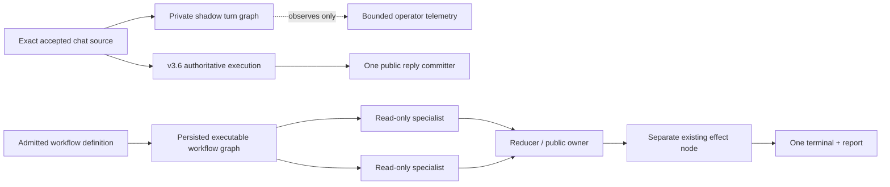

# Clementine 4: Parallel Ship Roadmap

Status: local freeze candidate and isolated Codex proof complete; controlled cloned-workflow canary pending
Date: 2026-08-01
Immediate objective: produce a strong live-canary candidate today without claiming the unfinished parts of Clementine 4

## What “done today” means

Today’s shippable boundary is not the final `v4.0.0` architecture. It is a release candidate that:

1. Keeps the v3.6 public-output and exactly-once terminal repair intact.
2. Observes every accepted chat turn through a private provider-neutral graph without changing execution.
3. Executes explicitly authored heavy read-only workflow work as real specialist fan-out plus a reducer.
4. Proves restart reuse, result-only authority, reducer-only publication, and nonzero worker lifecycle telemetry.
5. Replays the exact client-demo failure shape and the Platform 49 effect/idempotency matrix before a live canary.
6. Adds no new environment rollout gate and does not rewrite existing workflows automatically.

Do not call the candidate `v4.0.0` yet. True 4.0 still needs executable chat context/capability nodes, graph-owned external-effect authority and receipts, one provider-neutral node lifecycle, and removal of the legacy mega-loops.

## Current candidate state

Already implemented:

- Typed `TurnOutcome`, one public reply committer, raw-delta removal, exact logical-turn identity, restart/fallover reconciliation, and transport idempotency.
- A private turn-graph IR compiled once per exact accepted `sourceUserSeq`.
- Closed-schema immutable shadow policy, deterministic graph hashes, atomic source-owned dedupe, bounded operational telemetry, and no raw prompt/session-title/classifier-noun leakage.
- Direct-reply, retrieval, single-action, and fan-out action graph shapes; all effect authority remains deferred to the existing runtime tool boundary.
- `read_parallel_v1` workflow topology: two to six read-only specialist nodes, one authored reducer, durable graph persistence, restart materialization, worker events, and private branch outputs.
- Create/update schemas, YAML round-trip, canonical validation/preflight, admitted-definition hashing, execution-surface change detection, creation-test topology parity, and `workflow_get` visibility for the new subgraph.
- A sanitized Platform 49 characterization with 500 opaque records, five pages, a greater-than-32-KB artifact, a change at record 499, overlapping specialists, restart reuse, reducer-only final/report output, and a second-poll no-op.
- A sanitized structural replay from the exact client-demo run. It exposed duplicate legacy terminal rows for one accepted source; read-side canonicalization now elects one terminal in the golden replay and public-projection suites.
- A durable Platform 49 effect/runtime matrix that drives the production queue, local provider shim, exact-call receipts, watermark/checkpoint store, capability resume, report-back, notification, and terminal journal.
- An end-of-month sales-portal acceptance run with 1,200 rows, a greater-than-200-KB durable input, three overlapping analysts, one reducer, generated HTML/backend/data artifacts, one governed deploy receipt, restart reuse, and one reducer-only terminal/report.

Current evidence:

- Focused graph/effect/restart and publication/transport release gates: 1,107/1,107 passing when run serially.
- Client-demo golden replay plus public-projection suites: 17/17 passing after read-side canonicalization; the golden now has seven named assertions and explicitly proves the observed two-raw-to-one-public collapse.
- Serialized reconnect/publication regression gate: 197/197 passing across projection, transcripts, dashboard streams, mobile routes, and transport idempotency.
- Executable workflow-graph integration: 11/11 passing, including creation-test parity, model-snapshot restart, real specialist overlap, final-page Platform 49 characterization, reducer-only publication, and fail-closed branch failure.
- Durable Platform 49 runtime matrix: 5/5 passing; end-of-month sales-portal acceptance: 1/1 passing.
- Release-focused graph/demo/effect/sales gate from the clean candidate: 167/167 passing serially; the parked experimental resolver/executor is not part of that count or release surface.
- Shadow graph/compiler/observer and hook suites pass in isolation; the compiler benchmark is about 0.21 ms per compile.
- Typecheck and `git diff --check` are green.
- Immutable clean-checkout M3 evidence for code candidate `282ecb60`: full corpus 8,266 pass / 0 fail / 2 environment/build-conditional skips; post-build conditional set 42/42; journeys 5/5; release assets 40/40; proof self-tests 53/53; unified report-back 7/7; tracked hygiene green; fresh-install smoke green after its desktop-build prerequisite; and all root/mobile/console/desktop builds green.
- Stable-commit Codex proof on `3c6186c6`: all five critical scenarios passed 89/89 checks plus the exact-brain-served backstop; the 120-item endurance manifest passed 20/20 with 120/120 durable completions, 240 checkpoints, one terminal outcome, no narration leak, and no ledger anomaly. The proof used a disposable home and proof-local provider shims; it did not mutate a real connected account.

Still missing for today’s final go/no-go:

- Independent sanitization/provenance review of the landed demo fixture; a fixture hash alone does not prove structural equivalence to the private raw source.
- A controlled live canary on a cloned workflow and selected chat surfaces.
- Claude/both-brain parity proof if the release claim will include Claude; the completed stable-commit proof establishes the Codex lane only.

The experimental standalone chat capability resolver/executor has been parked outside the candidate: no live chat path calls it, and carrying unused execution code would add an unsupported release surface. Today’s executable long-task guarantee is the connected workflow graph; chat turn graphs remain observation-only until a production caller, authority binding, terminal ownership, and parity gate land together.

## Runtime boundary



The shadow graph never owns execution. Workflow specialists never own external effects. This separation is the release safety boundary.

## Parallel ownership

| Lane | Owner | Scope | File boundary |
|---|---|---|---|
| A — core graph candidate | Codex | Finish shadow/workflow integration audit, publication projection, docs, full gates, canary handoff | Existing graph, harness, workflow runner/store/validator/authoring files |
| B — exact demo golden replay | Functionally complete; Nathan/private-source reviewer owns provenance | Seven named golden assertions over the sanitized failure shape and public reader parity | Fixture and replay test landed; only raw-to-sanitized provenance remains human-reviewed |
| C — Platform 49 effect matrix | Complete in local deterministic tests | Helper characterization plus production admission/receipt/checkpoint/capability/report runtime tests | Two integration test files; no live provider or production workflow mutation |
| D — live canary | Nathan + Codex after gates | Clone, run, observe, and decide ship/no-ship | Live state only after explicit go; never mutate Platform 49 in place |

### Files currently owned by Codex

Do not concurrently edit these until Codex hands them off:

- `src/runtime/graph/turn-graph-*.ts`
- `src/runtime/harness/eventlog.ts`
- `src/runtime/harness/eventlog-operational-mirror.ts`
- `src/runtime/harness/public-presentation.ts`
- `src/runtime/harness/respond-bridge.ts`
- `src/runtime/harness/claude-agent-brain.ts`
- `src/runtime/harness/loop.ts`
- `src/execution/workflow-runner.ts`
- `src/execution/workflow-graph.ts`
- `src/execution/workflow-graph-runtime.integration.test.ts`
- `src/execution/workflow-validator.ts`
- `src/execution/workflow-enforce.ts`
- `src/execution/workflow-authoring.ts`
- `src/memory/workflow-store.ts`
- `src/tools/orchestration-tools.ts`
- Clementine 4 and v3.6 release documents

If a new test exposes a core failure, the other agent should report the exact failing assertion and proposed invariant before editing an owned file. This keeps two correct fixes from overwriting each other.

### Shared-worktree handoff protocol

Both agents are editing the same working tree. A lane is not handed off by saying “done”; it is handed off with an exact file list and reproducible evidence.

At lane start and handoff, run:

```bash
git status --short -- \
  src/runtime/harness/fixtures/client-demo-v35.sanitized.json \
  src/runtime/harness/client-demo-golden-replay.test.ts \
  src/execution/platform49-effect-matrix.integration.test.ts
```

The handoff message must contain:

```text
Lane:
Changed paths:
Fixture provenance/sanitization review:
Focused command(s) and pass/fail counts:
Known failing invariant(s), with exact assertion text:
Core edit requested: none | path + invariant + smallest proposed seam
```

Do not run a repository-wide formatter or edit a Codex-owned path as part of cleanup. Lanes B and C are closed for implementation. From this point through M3, all other agents must pause edits and commits so the tested SHA plus dirty candidate file set remains stable.

## Lane B: exact client-demo golden replay

The sanitized fixture and replay have landed. Its seven named assertions cover control-plane exclusion, nonempty settled presentations, the observed two-raw-to-one-public terminal collapse, exactly one settled presentation per closed accepted source, byte-for-byte public-reader parity, retry-as-physical-child identity, and discarded-draft exclusion. A later completion supersedes a provisional awaiting edge; otherwise the awaiting question is the settled presentation answered by the next user source. The exact-one assertion remains equality, so silence is not success.

Functional Lane B work is complete. The remaining item cannot be inferred from a fixture hash or public repository state: a human with access to the private raw demo log must independently confirm that the sanitized event order and key shapes preserve the source failure without retaining client content.

Deliverables:

1. Preserve the original raw log outside tracked source if it contains client data.
2. Create a sanitized deterministic fixture that retains the exact event ordering, partial chunks, control-envelope shapes, tool/progress events, retry/fallover boundary, and final answer shape that reproduced the demo failure.
3. Record a mapping/hash note proving the sanitized fixture preserves structure without committing names, tokens, tool arguments, or client facts.
4. Replay the fixture through the public-event projection and each relevant transport adapter.
5. Assert:
   - no provisional model chunk is public;
   - no `analysis`, tool arguments, `summary/reply/done/nextAction` control envelope, judge prose, or retry narration is public;
   - exactly one terminal presentation belongs to the exact accepted source;
   - reconnect/transcript replay returns the same terminal text;
   - a fallover/retry remains a physical child attempt, not a second logical user turn;
   - home/desktop and the demonstrated mobile/Slack/Discord surface, as applicable to the log, agree byte-for-byte on terminal text.

Preferred new files:

- `src/runtime/harness/fixtures/client-demo-v35.sanitized.json`
- `src/runtime/harness/client-demo-golden-replay.test.ts`

Read these existing seams for the real projection/adapter behavior, but do not edit them without a failing-invariant handoff:

- `src/runtime/harness/public-presentation.test.ts`
- `src/runtime/harness/respond-bridge.test.ts`
- `src/runtime/harness/transcript.test.ts`
- `src/runtime/harness/session-transcript.test.ts`
- `src/channels/transport-idempotency.test.ts`
- `src/channels/mobile-routes.test.ts`
- `src/channels/slack-ingress-idempotency.test.ts`
- `src/channels/discord-harness-terminal.test.ts`

Do not weaken expected output to “does not throw.” The fixture must assert every public byte/event and the exact terminal owner.

Lane B's local automated proof is complete. Run it serially as part of a stable candidate:

```bash
npm run typecheck
npx tsx --test --test-concurrency=1 \
  src/runtime/harness/client-demo-golden-replay.test.ts \
  src/runtime/harness/public-presentation.test.ts \
  src/runtime/harness/respond-bridge.test.ts \
  src/runtime/harness/transcript.test.ts \
  src/runtime/harness/session-transcript.test.ts \
  src/channels/transport-idempotency.test.ts \
  src/channels/mobile-routes.test.ts \
  src/channels/slack-ingress-idempotency.test.ts \
  src/channels/discord-harness-terminal.test.ts
git diff --check
```

`git diff --check` and `check:public-hygiene` do not inspect untracked files. The fixture therefore requires a human provenance/sanitization review now, and `check:public-hygiene` must be rerun after the exact candidate files are committed.

## Lane C: Platform 49 effect/idempotency matrix

This lane is complete in two layers: a pure/helper characterization and a production-runtime integration test around a local provider shim. Neither calls a live provider, and neither puts effects inside `read_parallel_v1`.

Files:

- `src/execution/platform49-effect-matrix.integration.test.ts`
- `src/execution/platform49-effect-runtime.integration.test.ts`

Use the existing receipt/effect contracts as read-only references:

- `src/runtime/harness/tool-effect.test.ts`
- `src/execution/workflow-call-receipts.test.ts`
- `src/execution/workflow-watermark-store.test.ts`
- `src/channels/transport-idempotency.test.ts`

Use opaque string identifiers such as `1785000000.000499`; numeric normalization is a test failure. Reuse a 500-item/final-page shape where practical.

Each case gets an isolated temporary home/database and fresh shim counters. The runtime file has five tests covering the six behaviors below; run them serially. “Concurrent duplicate” means only the two admissions inside the raced-admission test compete, not that the whole test file races shared state.

Proven sequential cases:

1. New item: exactly one destination append and verified readback.
2. Next no-op: zero append/update and one checkpoint transition.
3. Changed final-page item: exactly one update to its existing destination identity and zero append.
4. Concurrent duplicate schedule receipt: one accepted run, one effect, one terminal, and one report.
5. Unauthorized source mutation plus authorized destination mutation: source dispatch count remains zero; destination write commits once. Required missing authority persists as `blocked_capability` with a needs-input notification, and the same run resumes without replay after capability restoration.
6. Provider commit followed by a lost response remains ambiguous and is never blindly re-dispatched or requeued.

For each effect, assert the existing structured lifecycle where supported:

```text
intent -> started -> provider receipt -> local commit -> verified readback -> checkpoint
```

If the current runtime does not expose a lifecycle phase, do not synthesize a fake green receipt. Assert the safest current terminal behavior, identify the missing phase in the handoff, and remove that capability from today’s release claim until Codex either closes the seam or Nathan explicitly defers it.

Release-blocking assertions:

- A `started` mutation with no receipt is never blindly re-dispatched.
- Checkpoint never advances before effect commit.
- Duplicate schedule/client receipt creates no second run, write, report, or terminal.
- Source/destination IDs remain exact strings through artifacts and receipts.
- One public terminal/report contains reducer conclusions, not specialist/tool/control text.
- `CLEMMY_CONFIRM_FIRST` is not removed or bypassed by this test. It remains until executable graph authority and durable receipts fully replace it.

Lane C local proof:

```bash
npm run typecheck
npx tsx --test --test-concurrency=1 \
  src/execution/platform49-effect-matrix.integration.test.ts \
  src/execution/platform49-effect-runtime.integration.test.ts \
  src/execution/workflow-graph-runtime.integration.test.ts \
  src/execution/workflow-call-receipts.test.ts \
  src/execution/workflow-watermark-store.test.ts \
  src/runtime/harness/tool-effect.test.ts \
  src/channels/transport-idempotency.test.ts
git diff --check
```

## Lane A: Codex remaining work

1. ~~Finish adversarial workflow-subgraph audit and incorporate only concrete blockers.~~ Complete; storage-slug artifact lookup and per-node `maxTurns` forwarding were repaired.
2. ~~Rerun the graph runtime fixture after the report-back public-step projection fix.~~ Complete; 11/11 passing.
3. ~~Merge Lane B/C acceptance evidence into the candidate.~~ Complete; the release-focused graph/demo/effect/sales gate is 167/167.
4. ~~Run full isolated repository tests against an immutable clean checkout.~~ Complete; 8,266/0/2, with the two conditional cases covered by a post-build 42/42 run.
5. ~~Run journeys, public hygiene, release assets, report-back smoke, proof self-tests, and builds.~~ Complete and green; fresh-install smoke passed after building its required desktop bundle.
6. Run live provider proofs only from a stable candidate commit with configured providers.
7. Produce one go/no-go report with exact failures, no inferred green status.

## Merge checkpoints

### M0 — ownership freeze

- Each agent states the files they will touch.
- No one stages the whole dirty worktree.
- No commit, tag, push, deploy, or live workflow mutation without Nathan’s explicit instruction.

### M1 — lane-local proof

Each lane runs typecheck, its focused tests, and `git diff --check`. Test commands that share SQLite/eventlog state must run serially; parallel mega-commands can create false `SQLITE_BUSY` failures.

For an untracked new fixture/test, `git diff --check` is not evidence that the file was inspected. Include it in the handoff file list and review it directly; the post-commit M4 hygiene rerun is mandatory.

### M2 — integrated focused gate

Run serially:

```bash
npm run typecheck
npx tsx --test --test-concurrency=1 \
  src/runtime/graph/turn-graph-compiler.test.ts \
  src/runtime/graph/turn-graph-shadow.test.ts \
  src/runtime/harness/client-demo-golden-replay.test.ts \
  src/runtime/harness/public-presentation.test.ts \
  src/runtime/harness/delivery-committer-terminal-states.test.ts \
  src/runtime/harness/respond-bridge.test.ts \
  src/runtime/harness/transcript.test.ts \
  src/runtime/harness/session-transcript.test.ts \
  src/channels/transport-idempotency.test.ts \
  src/execution/workflow-graph-runtime.integration.test.ts \
  src/execution/platform49-effect-matrix.integration.test.ts \
  src/execution/platform49-effect-runtime.integration.test.ts \
  src/execution/workflow-sales-portal.integration.test.ts
git diff --check
```

If a named new file has not landed, omit it rather than creating a placeholder.

### M3 — whole-candidate gate

Run after all file edits stop:

```bash
npm run typecheck
npm test
npm run journeys
npm run check:public-hygiene
npm run test:public-hygiene
npm run test:release-assets
npm run proof:selftest
npm run smoke:report-back
npm run build
npm run build:mobile-web
npm run build:console-web
npm --prefix apps/desktop run typecheck
npm --prefix apps/desktop run build
npm run test:smoke:gate
```

Do not run repository-wide suites concurrently against shared test state. Build desktop before `test:smoke:gate`; a pristine checkout correctly returns exit 2 when the required desktop bundle does not exist. Record the command, exit code, pass/fail/skip counts, wall time, and exact source status in one go/no-go note. A later focused pass does not erase a whole-suite failure; classify the original failure as deterministic, environmental, prerequisite ordering, or shared-state contention with the reproducing command.

### M4 — stable-commit provider proof

After Nathan authorizes a candidate commit:

```bash
git status --short
git rev-parse HEAD
npm run check:public-hygiene
npm run proof:critical:codex
npm run proof:endurance:codex
npm run proof:critical
npm run proof:fusion:codex
```

The proof harness rejects a dirty source tree, so `git status --short` must be empty and the evidence note must pin the printed SHA. `npm run proof:critical` runs the critical scenarios across configured brains, including Claude. A SKIP is not a pass for a brain named in the release claim; explicitly exclude an unavailable brain rather than assuming parity.

### M5 — live canary

1. Clone Platform 49; never edit the reliable production definition in place.
2. Add separate source/destination read nodes, a `read_parallel_v1` reducer, and keep the existing scoped write as a separate downstream node.
3. Run a no-op, a final-page change, and a restart after one specialist completes.
4. Require readiness width at least two, nonzero `worker_started` and `worker_result`, one reducer output, one report, one terminal, exact IDs, and no public internal narration.
5. Send a direct chat lookup/action on the chosen demo surfaces and inspect the private shadow plan plus the committed public reply.
6. Stop on any duplicate effect, raw/public leak, missing terminal, ambiguous receipt, or regression in the original Platform 49 schedule.

## Today’s go/no-go

Go to a limited live patch/canary only if:

- Lanes B and C are green or any intentionally deferred case is explicitly removed from the release claim.
- M2 and M3 are fully green.
- The exact demo replay emits one clean terminal and no provisional bytes.
- The cloned workflow proves real fan-out/reducer telemetry and exact restart behavior.
- Existing Platform 49 remains unchanged and healthy.
- Shadow telemetry shows graphs but never influences execution or public output.

No-go if:

- A test passes only by re-enabling raw streaming, restoring synthetic user turns, or weakening public projection.
- An invalid/missing subgraph silently runs as a flat parent step.
- A specialist gains external effect authority.
- Report-back contains specialist/tool/control prose that the canonical output excluded.
- A `started` write without a receipt automatically retries.
- A duplicate request/schedule receipt creates another effect or terminal.
- The exact demo log is replaced with an easier synthetic shape.

## After this patch: true Clementine 4 work

1. Make context, memory retrieval, capability/tool discovery, skill resolution, and evidence retrieval executable provider-neutral nodes.
2. Persist one closed, immutable policy/capability/authority snapshot per accepted turn.
3. Add capability binding and schema caches with account/schema fingerprint invalidation.
4. Implement graph-owned effect identity and `intent -> started -> receipt -> commit` recovery.
5. Move Claude, Codex, and future providers behind one `NodeRunner` lifecycle.
6. Promote measured shadow decisions to execution one node class at a time.
7. Delete legacy loops, provider-specific control flow, prose-derived routing, and obsolete rollout gates only after parity proofs.

## Copy/paste freeze instruction for the other agent

> Please pause all edits and commits on the Clementine worktree while Codex runs M3. Lane B's seven golden assertions, Lane C's 5/5 production-runtime effect matrix, and the 1/1 sales-portal acceptance are green. The only Lane B item left is an independent human comparison of the sanitized fixture to the private raw demo log. The experimental standalone chat resolver/executor is parked outside this candidate because it has no production caller yet. Do not commit, tag, push, deploy, or mutate Platform 49. If you find a release blocker, report the exact file, assertion, and invariant without editing the tree.
