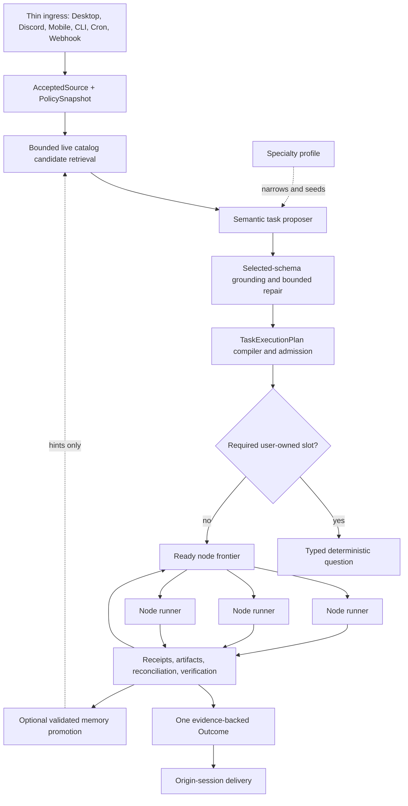

# Clementine Blank-State Universal Execution

Status: Canonical execution doctrine (normative child of north-star-unification.md)

Date: 2026-08-21

Audience: Clementine runtime, agent, capability, workflow, memory, and reliability implementers

This document specializes [North-Star Unification](north-star-unification.md) for clean-install capability discovery and arbitrary multi-tool execution. It is a normative child of that document, not a competing architecture. Where wording conflicts, `north-star-unification.md` controls product constitution.
This document is the sole detailed execution doctrine. Dated tree facts, caller
counts, and phase status live in [migration-status-2026-08-21.md](migration-status-2026-08-21.md),
not here.

The key words **MUST**, **MUST NOT**, **REQUIRED**, **SHOULD**, **SHOULD NOT**, and **MAY** are normative.

---

## 1. Executive mandate

Clementine's product promise is not that she knows one developer's tools, remembers one developer's successful recipes, or recognizes a growing list of familiar prompt shapes.

The product promise is:

> A newly installed Clem, with empty memory, can understand a user's request, discover the capabilities that user has connected, construct a safe and complete execution plan, and carry it through for as long as necessary. Repeated use makes her faster, more personalized, and less interruptive; it does not make previously impossible core execution become possible.

This must hold across:

- host-native tools;
- local MCP servers;
- local CLI programs with conforming manifests;
- Composio toolkits and connected accounts;
- Recall.ai recording, job, webhook, and transcript capabilities;
- browser or computer-use capabilities with explicit lifecycle contracts;
- installed skills and plugins;
- saved workflows;
- user-created specialty agents;
- future carriers and providers not named anywhere in the core runtime.

The architecture is successful when adding a conforming capability does **not** require a change to central planning, routing, policy, graph execution, settlement, or delivery code.

“Arbitrary task” has a precise meaning here. It means a task whose providers, tool names, topology, duration, and number of steps were not enumerated in core code. It does **not** mean Clementine must execute an untyped, unauditable, unavailable, unauthorized, or technically impossible operation. Every request must nevertheless end in a truthful and actionable state.

For any accepted request, Clem MUST always have one truthful current task state:

1. verified completion;
2. a precise user-owned input or authority dependency;
3. a durable host-owned wait/retry state with an owner and wake condition;
4. verified cancellation or effect reconciliation after cancellation; or
5. proven terminal impossibility expressed as `failed` with the exact actionable reason.

Many durable progress/checkpoint Outcomes MAY occur while the task is active. Exactly one canonical final task Outcome identity exists. Delivery of that Outcome to an offline surface is idempotent and retryable rather than assumed physically instantaneous.

`blocked` is never an ownerless final category. It is a transient host-owned state with a retry/watch condition. Missing credentials, user choices, install actions, or essential user inputs are `needs_input`. A condition proven permanently impossible under the accepted task becomes an actionable terminal `failed` Outcome.

A generic control-plane crash, silent abandonment, invented completion, or requirement to have performed the task previously is not an acceptable state.

---

## 2. Why this document exists

The repository already contains much of the correct reliability kernel: accepted-source identity, graph admission, leases, budgets, exact call authority, physical dispatch fencing, settlements, receipts, artifact verification, durable workflows, and one-outcome aspirations.

The product is still short of the blank-state promise because those pieces are divided across overlapping authorities and specialized execution paths:

- live chat can compile a graph-shaped representation while still executing through a model-with-tools loop when the typed dispatcher returns conversation;
- a participating semantic path must not fall through to an untyped action loop, but proportional runners are not yet the universal live path;
- `AcceptedGoal` historically assumed one collection and one primary destination; plural destinations are now representable;
- expected-work contracts, workflow graphs, project plans, read-lane envelopes, and tool proposals can each describe overlapping parts of the same work;
- source binding depends too heavily on prior successful receipts, creating a first-use bootstrap problem;
- core semantic classification still relies on prompt vocabulary and narrow grammar;
- memories and recipes can become practical prerequisites rather than optional accelerators;
- safety-focused tests have sometimes accepted “nothing unsafe happened” even when the requested work became impossible to complete;
- model-authored preflight or terminal prose can still sit on a correctness or liveness-critical path;
- provider-specific verticals and user-shaped examples have leaked into assumptions about universal task topology.

This document defines the convergence target. It is not a request to build another planner, another ledger, another dispatcher, or another agent lane beside the existing ones.

The strongest architectural rule is:

> `TaskExecutionPlan` is the canonical admitted graph, not an additional authority artifact. `NodeInvocationPlan` is its exact-call child authority, not a provider recipe. Memory and specialty agents only accelerate creation of these artifacts.

---

## 3. Product proof obligation

### 3.1 Blank install

A `BlankInstall` is a built or packaged Clementine candidate using a new isolated data directory with:

- no conversation memory;
- no learned tool choices;
- no procedure artifacts;
- no verified-read receipts;
- no capability aliases;
- no prior sessions;
- no test registries;
- no source-tree-only files;
- no ambient state borrowed from the developer's home;
- no provider-specific recipe required for the acceptance task.

Two blank states matter:

1. **No external capability is connected.** Clem must converse normally. A request requiring an external service becomes one actionable connection dependency.
2. **A novel capability is connected but has never been used.** Clem must discover, understand, bind, and use that capability from its live contract without relying on memory.

### 3.2 Cold and warm equivalence

`ColdPath` means there is no usable prior binding or memory for the requested work. `WarmPath` means validated memory, schemas, aliases, or specialty profiles may seed resolution.

Cold and warm paths MUST preserve:

- the same user intent;
- the same effect and destination ceilings;
- the same data-movement constraints;
- equivalent completion criteria;
- equivalent authorization and verification standards.

Warm execution MAY select an equivalent cheaper or faster implementation, ask fewer questions, load fewer schemas, and use fewer model tokens. It MUST NOT possess authority or reachability that a conforming cold path cannot eventually establish from live facts.

### 3.3 One execution kernel

Every carrier, brain, surface, altitude, specialty profile, workflow, and background activation MUST converge on this chain:

```text
accepted durable source
  → typed semantic task contract
  → live federated capability catalog
  → admitted TaskExecutionPlan revision
  → sealed NodeInvocationPlan for each executable node
  → fenced logical and physical dispatch
  → typed result, reconciliation, and verification
  → evidence reduction
  → one canonical final Outcome identity with idempotent origin delivery
  → optional validated memory promotion
```

Conversation and already-grounded answers skip unnecessary machinery. A simple read uses the proportional one-node form of the same kernel. Long-running work adds durable nodes and activations; it does not gain a second authority path.

---

## 4. Definitions

| Term | Definition |
|---|---|
| **AcceptedSource** | The exact durable user or system input that owns the task revision and its semantic authority. |
| **Carrier** | A transport or integration surface through which capabilities are discovered or invoked: MCP, CLI, Composio, Recall.ai, host-native, browser/computer, or future adapter. |
| **CapabilityCatalogAdapter** | Carrier-specific code that converts live carrier facts into the provider-neutral manifest contract and implements the shared invocation lifecycle ports. |
| **CapabilityManifest** | A versioned, provider-neutral semantic, schema, effect, account, cost, and lifecycle description of one operation. |
| **CatalogSnapshot** | The bounded, immutable set of manifest identities and revisions used while compiling a task-plan revision. |
| **ControlPlaneDiscovery** | Metadata, schema, connection, and catalog work that cannot read user/business data, start a metered business job, or mutate external state. |
| **BusinessDispatch** | An invocation that reads user/business data, starts a metered job, creates an artifact, sends data, or mutates external state. |
| **TaskExecutionPlan** | The canonical admitted task graph and authority ceiling for one immutable revision of an accepted task. |
| **NodeInvocationPlan** | Exact, sealed call authority for one executable plan node. |
| **DataContract** | The schema, cardinality, completeness, provenance, freshness, and classification promised by a node input or output. |
| **EdgeProjectionContract** | The exact mapping of predecessor output fields into successor input slots. |
| **EffectScope** | The exact operation, account, destination, mutation mode, recipient, fields, cardinality, and data-egress ceiling authorized for a node. |
| **StandingAuthority** | Explicit durable user or administrator policy that may fill an authority slot. Ordinary memory is not standing authority. |
| **ProcedureHint** | A remembered or shipped preference for finding a capability or graph skeleton. It is non-authoritative and must be revalidated live. |
| **SpecialtyAgentDefinition** | A versioned execution profile that narrows context, budgets, and semantic hints inside the one Clem core. |
| **OperationalEffect** | Cost or external lifecycle impact such as starting a paid job or subscription, even when returned data is read-only. |
| **DataEffect** | Whether an operation reads, computes, writes, sends, or destroys data. |
| **UncertainEffect** | A business dispatch whose external outcome cannot yet be proven returned, absent, or committed. |

In this document, Recall.ai refers to the recording/transcript integration. It is distinct from Clementine's memory recall subsystem.

---

## 5. Non-negotiable principles

### 5.1 Meaning belongs to the model; authority belongs to the host

The model SHOULD propose task semantics and topology because open-ended language cannot be correctly understood through an expanding grammar of regexes, tool nouns, provider names, and user-specific examples.

The model MUST NOT mint:

- accepted-source identity;
- provider/account authority;
- effect authority;
- capability existence;
- schema validity;
- argument provenance;
- approval;
- dispatch receipts;
- completion.

The host validates the proposal against the exact accepted source, policy, live catalog, connection state, schemas, and durable evidence. A bounded semantic checker MAY reject or mark a proposal uncertain. It cannot grant authority or declare work complete.

### 5.2 Memory is an accelerator, never a prerequisite

Memories, recipes, aliases, tool choices, and specialty profiles MAY:

- rank candidates;
- seed semantic retrieval;
- provide validated defaults;
- reduce catalog calls;
- reduce model calls;
- cache graph skeletons;
- preserve user preferences.

They MUST NOT:

- create capability authority;
- replace a live schema or account check;
- widen an effect or destination;
- bypass an approval or user-owned slot;
- make cold execution impossible;
- replay a stale action directly;
- turn historical provider output into current arguments without a sealed mapping.

### 5.3 Recipes and names are hints

A stored action slug, MCP tool name, CLI command, actor identifier, workflow template, or getter name is a discovery hint.

At use time Clem MUST:

1. resolve the hint inside the accepted semantic/provider family;
2. verify it against the current live catalog;
3. verify its account, schema, effect, lifecycle, and result contract;
4. fall back to bounded generic discovery if it is stale;
5. block or ask when zero or multiple materially different candidates remain.

An exact user-selected capability is never silently substituted. A user-delegated “best compatible tool” selection MAY self-heal within the accepted family and effect scope.

### 5.4 Unbounded topology, bounded authority

The graph may contain one node or thousands of nodes, branches, joins, retries, async waits, and dynamically admitted subgraphs. Authority remains local and bounded at every node.

Adding topology does not widen:

- providers;
- accounts;
- effects;
- destinations;
- recipients;
- fields;
- cardinality;
- data egress;
- authority budgets or aggregate operational-spend ceilings.

Budgets have three different meanings and MUST NOT be collapsed:

- **AuthorityBudget:** providers, effects, destinations, recipients, field/cardinality ceilings, and data egress. It never auto-widens.
- **OperationalBudget:** metered jobs, provider calls, money, and externally consumed bytes. Renewal follows explicit task/user policy and never happens merely because an activation restarted.
- **ActivationBudget:** model calls, tokens, steps, fan-out, and wall-clock for one activation. Exhaustion checkpoints the task and schedules a new activation under policy; it is not task completion and does not itself require user approval.

### 5.5 No optional model pass may determine liveness

Model-authored acknowledgements, questions, summaries, or stylistic rewrites are optional presentation improvements. Every typed control state MUST have a deterministic, user-safe rendering.

Timeout, empty model output, malformed output, or provider outage MUST NOT convert a valid control state into a generic failed turn. Late results MUST be cancelled or generation-invalidated so they cannot mutate or publish after the task has moved on.

### 5.6 Safety, usefulness, and performance are separate gates

“Zero unauthorized calls” is necessary but insufficient.

Release acceptance MUST separately prove:

- safety;
- semantic fidelity;
- reachability from blank state;
- useful completion;
- exact-once behavior;
- truthful partial completion;
- recovery;
- cancellation;
- presentation;
- latency and token proportionality.

### 5.7 Nothing rests

Every non-terminal state has an owner and a wake condition.

- A missing user credential, choice, or essential input is `needs_input`.
- A transient provider/catalog condition is host-owned `blocked` with a scheduled retry or watcher.
- A long-running job is a durable wait node bound to the original job identity.
- An uncertain external effect enters reconciliation.

“Blocked” without an owner is a stall and therefore a product failure.

### 5.8 Requirement coverage (REQ-1)

Every material accepted-source span MUST map to a `RequirementCoverageContract` entry with an explicit posture:

- `specified` — the source or policy named it;
- `none` — the source explicitly does not require it;
- `unresolved` — the source requires it and it is not yet bound;
- `delegated` — the source intentionally left it open under an admitted slot.

An empty array, false boolean, missing property, or null MUST NOT stand for more than one of those postures. Examples: empty projection is not “arbitrary fields”; `multiItem.detected=false` does not prove singular work; a missing destination is not “no destination”; a missing transform must not drop requested analysis.

Plan admission fails when any material requirement is `unresolved`. No business dispatch may begin while coverage is incomplete unless the accepted task explicitly authorizes an independently useful partial stage and the remaining dependency is a typed `DependencyRequest`.

### 5.9 Proportional control (CTRL-1)

The host validates a source-bound `ControlComplexityAssessment` and selects the least complex sufficient orchestration mode:

- `direct` — one fully bound operation; semantics, capability, account, arguments, effect, completion, and presentation settled before dispatch;
- `bounded_loop` — homogeneous typed iteration (pagination, polling, deterministic batch) under one admitted family and effect ceiling, with explicit item/iteration/time/call budgets; the loop cannot select a new provider, destination, effect, recipient, or account;
- `durable_pipeline` — ordered checkpoints that can outlive one activation;
- `durable_graph` — branches, joins, plural effects, human boundaries, async waits, partial completion, uncertain effects, or independently recoverable work.

Conversation does not receive a `TaskExecutionPlan`. A one-operation task may have a one-node plan and MUST NOT pay for a general graph scheduler.

These modes are proportional compilations of one `TaskExecutionPlan`. They are not separate planners, catalogs, ledgers, or Outcome writers. Runners own mechanics only. All runners share reservation, dispatch, settlement, evidence, cancellation, and Outcome.

The model may propose topology. The host may not be downgraded on durability, recovery, human boundaries, effects, or verification.

If direct or loop execution discovers additional required complexity, it MUST stop before any unplanned business crossing, checkpoint evidence, admit an immutable successor plan revision, preserve satisfied work, prevent replay of completed effects, and resume from the new frontier.

### 5.10 Capability truth pipeline (CAT / AUTH-5)

```text
provisioning and credential authority
  → carrier enumeration
  → trusted CapabilityContract
     + fresh CapabilityObservation
     + exact AccountBoundInstance
  → rebuildable advisory retrieval index
  → bounded candidate retrieval
  → semantic selection
  → TaskExecutionPlan freezes contract/observation/account references
  → NodeInvocationPlan revalidates and dispatches
```

An index hit proves neither authority nor availability. An index miss proves neither absence nor need for a new connection. The index MUST NOT author effect, lifecycle, schema, account, implementation, argument, reconciliation, or verification truth, and MUST NOT manufacture `trusted`, `current`, or `independent` status. Plans do not dispatch from index rows.

Unknown effect or lifecycle metadata remains discoverable but non-executable unless an adapter-attested, signed/bundled, reviewed, or enforced-boundary contract supplies the maximum behavior. Connecting a credential is not effect classification. Tool-name heuristics may widen risk; they MUST NOT prove read-only or grant execution.

### 5.11 Generic DependencyRequest (DEP-1)

A versioned, provider-neutral `DependencyRequest` covers:

- `connection_missing`;
- `capability_contract_missing`;
- `capability_certification_required`;
- `account_or_resource_choice`;
- `user_input`;
- `approval`;
- `spend_authority`;
- `argument_provenance_missing`;
- `external_wait`;
- `transient_catalog_or_provider_state`;
- `policy_resolution`.

Only authoritative fresh catalog absence may create `connection_missing`. Index miss, empty shortlist, compiler/binder failure, empty projection, semantic-model failure, optional author timeout, and missing argument mapping MUST NOT masquerade as a connection request. A missing source binding cannot produce a “confirm this source” question.

Lifecycle: open → resolving/provisioning → authoritative validation → satisfied → successor plan admitted → exact task activation enqueued once. A connection event alone does not satisfy. Wake and satisfaction MUST be exactly-once.

Projected or actual operational spend crossing a user-declared ceiling is `spend_authority`. `costClass: 'unknown'` on a metered operation fails closed until priced or ceiled.

### 5.12 Learning is an accelerator (G-FLYWHEEL)

Memory, recipes, aliases, tool-choice pins, and specialty profiles may rank, seed, cache skeletons, and reduce schema/model/question cost. They MUST NOT create authority, existence, wider effects, stale argument replay, or a second Outcome. Promotion and retrieval use the same validator. Stale hints cost at most one bounded failed verification before cold discovery.

`G-FLYWHEEL` requires paired cold/warm runs of one corpus: equivalent semantics, authority, effects, verification, and Outcome; at least one predeclared cost improvement; no loss of cold reachability.

---

## 6. Target architecture



There is one Clem and one outcome path. A specialty worker, workflow step, background activation, or brain is a runner inside this architecture, not a second assistant with independent authority or publication.

### 6.1 Session composition

The loop is task-blind. Session identity is the composition root: it mounts tools and primers the way a plugin or profile would. It does not teach the kernel a job type, a vendor, or a prompt recipe.

| Session identity | Mount | Not |
|---|---|---|
| `chat` | Memory inject + connected callable surface | A job classifier |
| `space-<slug>` | Live workspace contract primer + `space_*` pin | A kernel vertical |
| `workflow:…` / kind `workflow` | Saved-bundle allowlist; runner owns topology | A second dispatcher |
| `execution` / `agent` | Same kernel, different durable session kind | A second Clem |

Normative constraints:

- Both brains consume one composer (`composeSession`). Dispatch remains `dispatchAdmittedSource`.
- Memory injects context. It MUST NOT grant catalog reachability, pin tools, or widen allowlists (AUTH-3).
- A workspace is a live profile: user-owned contract plus dock tools. The loop does not infer a workspace from prompt nouns.
- A saved workflow is a frozen bundle. Its authored tool scope is the mount; ambient skill/workflow candidates stay off the node.
- Adding a connected app, skill, plugin, or saved workflow MUST NOT require a new branch in admission, dispatch, or settlement.

---

## 7. Federated live capability catalog

### 7.1 Catalog contract

Every carrier MUST implement a `CapabilityCatalogAdapter` that emits the same provider-neutral shape. Trusted contract facts are separated from live observations so connection or health churn cannot silently change operation semantics.

The following TypeScript is conceptual and may be refined without weakening its fields:

```ts
interface CapabilityContractV2 {
  version: 'capability-contract-v2';

  identity: {
    // Opaque, namespaced value. New carrier kinds require an adapter, not a
    // central union edit.
    catalogKind: string;
    catalogNamespace: string;
    serviceContractId: string;
    operationId: string;
    revision: string;
    digest: string;
  };

  trust: {
    adapterImplementationId: string;
    adapterImplementationDigest: string;
    attestationSource: 'host' | 'signed_provider' | 'reviewed_plugin' | 'reviewed_local_manifest';
    canonicalizationVersion: string;
  };

  semantics: {
    // Provider prose is untrusted model-visible data. Roles/effects/lifecycle
    // below must come from the attested adapter contract.
    title: string;
    description: string;
    roles: string[];
    acceptedKinds: string[];
    producedKinds: string[];
    destinationFamilies?: string[];
    mutationModes?: Array<'create' | 'append' | 'patch' | 'upsert' | 'replace' | 'delete'>;
  };

  schema: {
    inputSchemaSnapshotRef: string;
    outputSchemaSnapshotRef?: string;
    inputFingerprint: string;
    outputFingerprint?: string;
  };

  effects: {
    data: 'none' | 'read' | 'compute' | 'write' | 'send' | 'delete' | 'unknown';
    operational: 'none' | 'metered' | 'job_start' | 'subscription' | 'unknown';
    locus: 'local' | 'external' | 'mixed' | 'unknown';
    permissionClass: 'ordinary' | 'privileged' | 'admin' | 'unknown';
    reversible: 'yes' | 'no' | 'conditional' | 'unknown';
    destructive: boolean | 'unknown';
    idempotency: 'native' | 'host_key' | 'reconcile_only' | 'none' | 'unknown';
  };

  execution: {
    mode: 'request_response' | 'async_job' | 'event_wait' | 'stream' | 'local_process';
    argumentCompiler: ImplementationRef;
    invoke: ImplementationRef;
    reconcile?: ImplementationRef;
    cancel?: ImplementationRef;
    verify?: ImplementationRef;
  };

  reliability: {
    resultContract: string;
    paginationContract?: string;
    readbackContract?: string;
    reconciliationContract?: string;
    maximumSafeBatch?: number;
  };

  economics: {
    costClass: 'free' | 'bounded' | 'metered' | 'unknown';
    estimatedLatencyClass: 'local' | 'interactive' | 'long_running' | 'unknown';
  };
}

interface CapabilityObservationV2 {
  version: 'capability-observation-v2';
  contractId: string;
  contractDigest: string;
  carrierInstanceId: string;
  carrierInstanceDigest: string;
  observedInputSchemaRef: string;
  observedOutputSchemaRef?: string;
  observedInputFingerprint: string;
  observedOutputFingerprint?: string;
  observedAt: string;
  expiresAt?: string;
  health: 'ready' | 'degraded' | 'unavailable' | 'unknown';
}

interface AccountBoundCapabilityInstanceV2 {
  version: 'account-bound-capability-instance-v2';
  observationId: string;
  stableAccountId?: string;
  tenantId?: string;
  connectionRef?: string; // rotating credential/connection reference
  permissionSnapshotRef?: string;
  digest: string;
}

interface ImplementationRef {
  id: string;
  revision: string;
  digest: string;
}
```

The catalog presents a `CapabilityManifestV2` view composed from one trusted contract, one current observation, and at most one exact account-bound instance. An unbound operation definition is discoverable but cannot perform account-scoped business dispatch. Candidate resolution emits separate instances per account; it never exposes `connectedAccountIds[]` and silently chooses one.

Secrets never enter contracts, observations, plans, traces, or model context. Only credential/connection references remain with the owning credential system.

Provider/catalog descriptions and schemas are untrusted data and are framed as such in model context. They may describe syntax and semantics but cannot override host policy, create effects, or supply lifecycle authority.

### 7.2 Progressive discovery

Universal discovery does not mean injecting every schema into every prompt.

Discovery proceeds progressively:

1. load compact live catalog summaries;
2. retrieve a bounded semantic shortlist for each unresolved plan role;
3. let the semantic proposer select or rank manifest identities;
4. load full schemas only for shortlisted candidates;
5. validate structural fit, account, effect, lifecycle, and result contracts;
6. resolve exact node bindings;
7. revalidate immediately before business dispatch.

Discovery MUST be bounded by catalog calls, manifest count, schema bytes, time, and model tokens. It MUST NOT silently widen to every installed tool after a failed shortlist.

The bound is on COST, not on permission, and the mechanism matters. Refusing a
discovery call does not reduce any of the five quantities above: the catalog call
was already issued, the model tokens were already spent, and the caller responds
by reformulating and asking again. Enforced as refusals this rule inverts itself
— measured 2026-08-24 on a production home, the discovery budget denied 266 of
610 broad attempts (44%), produced single turns of 41 calls with 37 denials, and
capped a task with nine frozen requirements at eight, so the ninth requirement
was permanently undiscoverable.

Bound discovery by: one claim per subject per epoch; replay of that claim for a
repeat; coercion of an unknown or already-resolved subject to a host-owned key
rather than a refusal; schema-byte and result-size limits; and — where a real
ceiling is needed — a turn-scoped, always-on cap that stops the turn cleanly.
Do not bound it by refusing calls that have already been paid for.

Only adapter-owned, pre-attested catalog/schema/health operations qualify as `ControlPlaneDiscovery`. A model-selected business tool cannot label itself “metadata” to bypass node authority. Control-plane network use and provider cost remain budgeted and auditable even when no business data is accessed.

### 7.3 Carrier rules

#### Local MCP

The adapter binds the exact server instance, server revision, and tool identity. MCP input schemas and descriptions are discovery facts, not complete safety semantics.

If effect, lifecycle, result, or reconciliation metadata is missing, the capability remains discoverable but MUST fail closed for business execution until one of these provides trusted classification:

- signed or bundled server metadata;
- a reviewed local capability manifest;
- a trusted plugin adapter.

A user or administrator may authorize a known effect or accept a conservative policy posture. They cannot make an unknown operation factually read-only, idempotent, cancellable, or reconcilable.

Tool-name heuristics MAY widen risk conservatively. They MUST NOT prove read-only behavior or grant execution.

#### Local CLI

The existence of a binary is not an executable capability contract.

A CLI manifest MUST bind:

- canonical binary path;
- binary digest and version;
- argv schema as an array, never an interpolated shell string;
- stdin/stdout contracts;
- working-directory policy;
- environment allowlist;
- filesystem and network effects;
- timeout and cancellation behavior;
- idempotency or reconciliation;
- output verification.

Clem MAY help a user generate and review a CLI manifest. Until it is trusted, the CLI can be described or inspected but cannot receive business authority merely because it is on `$PATH`.

#### Composio

The adapter binds live toolkit namespace, action identity, connection/account, schema fingerprints, and lifecycle semantics.

Stored action slugs are hints. At use time the adapter verifies the current action. If it is stale, it performs bounded same-toolkit discovery and admits only candidates matching the accepted semantic role, effect scope, account, argument contract, and result contract.

Provider renames MUST NOT require core runtime changes.

#### Recall.ai

Recording creation, bot lifecycle, job submission, webhook delivery, stream consumption, transcript readiness, and cancellation are explicit capability operations.

Recall.ai work often spans hours and MUST use durable event or async-job nodes. A restart resumes the exact recording/job/subscription identity. It never starts another recorder because an in-memory model loop disappeared.

#### Browser and computer use

Browser/computer capabilities use the same manifest and node lifecycle. Visual navigation, uncertain selectors, and UI mutations make their verification and reconciliation contracts weaker, not optional.

If the runtime cannot prove whether a UI effect committed, the node becomes uncertain and reconciles or asks the user. It does not blind-retry.

#### Host-native tools, workflows, skills, and plugins

Host-native operations are not privileged exceptions. They expose manifests and run through the same authority and settlement kernel.

Saved workflows and skills are graph/capability producers. They do not bypass current catalog, account, schema, or effect validation.

---

## 8. Semantic task proposal

The coherent proposal order is:

```text
accepted source
  → host retrieves a bounded, structurally eligible catalog candidate set
  → model proposes semantic roles and optional exact candidate references
  → host loads selected schema/contract snapshots
  → bounded grounding or semantic repair when required
  → host admits the canonical plan
```

Candidate retrieval may use embeddings, manifest roles, schemas, account availability, and conservative effect compatibility. It is retrieval, not provider selection. Host vocabulary rules do not decide what the user meant.

### 8.1 Model output

For an action request, the configured brain proposes a typed semantic contract. It receives:

- exact accepted source and bounded conversation context;
- standing policies and open user-owned slots;
- compact catalog summaries;
- current date/time/timezone where relevant;
- bounded memory hints;
- product policy and budgets.

It SHOULD identify:

- the user's intended outcome;
- sources and source-selection posture;
- transformations and derived claims;
- destinations and mutation modes;
- ordering, parallelism, loops, and event waits;
- requested cardinality and completeness;
- required observed and derived fields;
- verification requirements;
- genuine user-level ambiguity.

It MUST output semantic roles and manifest references, never authority claims.

### 8.2 Host validation

The host verifies that the proposal:

- is byte-bound to the accepted source and policy snapshot;
- preserves every explicit deliverable and external effect;
- contains no effect or destination absent from accepted authority;
- distinguishes observed, derived, recommended, and executed facts;
- has no cycles unless represented through an admitted loop construct;
- identifies every load-bearing slot;
- does not depend on hidden model state;
- can be mapped to live manifests or a typed unresolved capability state;
- supplies completion criteria that can be reduced from evidence.

One bounded semantic repair MAY correct malformed structure or omissions. If the participating semantic path still cannot be admitted, it produces a typed blocker or user question. It never falls through to an untyped action loop.

### 8.3 Host classifiers

Host classifiers MAY normalize dates, counts, identifiers, and literal formats. They MAY retrieve candidate manifests or conservatively widen risk.

They MUST NOT use a growing vocabulary table to decide:

- provider;
- topology;
- slot meaning;
- destination semantics;
- source semantics;
- mutation mode;
- task completion.

This does not prohibit provider names inside adapter code or manifest data. It prohibits provider-shaped control flow in the universal kernel.

---

## 9. Canonical `TaskExecutionPlan`

`TaskExecutionPlan` is the successor and canonical form for admitted task topology and expected-work authority. It MUST NOT coexist permanently as another writer beside chat graphs, expected-work contracts, project-plan graphs, workflow graphs, or read-lane envelopes.

```ts
interface TaskExecutionPlanV2 {
  version: 'task-execution-plan-v2';

  identity: {
    planId: string;
    revision: number;
    predecessorRevision?: number;
    digest: string;
    sessionId: string;
    sourceUserSeq: number;
    acceptedSourceDigest: string;
    policyDigest: string;
    semanticProposalDigest: string;
    authoritySnapshotRef: string;
  };

  objective: {
    textDigest: string;
    successCriteria: RequirementContract[];
    partialExecutionPosture: 'park_before_effects' | 'allowed_if_independently_useful';
  };

  nodes: TaskPlanNodeV2[];
  edges: TaskPlanEdgeV2[];
  openSlots: OpenSlotV1[];
  destinations: DestinationConstraintV1[];
  effectScopes: EffectScopeV1[];
  dataContracts: DataContractV1[];
  catalogSnapshots: CatalogSnapshotRef[];
  commitGroups: CommitGroupV1[];

  authorityBudget: {
    effectScopeIds: string[];
    destinationIds: string[];
    maximumItemsByScope: Record<string, number>;
    allowedDataClassifications: string[];
    maximumEgressBytes: number;
  };

  operationalBudget: {
    businessDispatches: number;
    meteredJobs: number;
    money?: number;
    providerBytesIn: number;
    providerBytesOut: number;
    renewalPolicy: 'never' | 'standing_policy' | 'user_owned';
  };

  activationPolicy: {
    modelCallsPerActivation: number;
    discoveryCallsPerActivation: number;
    tokensPerActivation: number;
    elapsedMsPerActivation: number;
    fanoutPerActivation: number;
    automaticReentry: boolean;
  };

  completion: {
    requiredEvidence: EvidenceRequirement[];
    requiredSinks: string[];
    reducerVersion: string;
  };

  cancellation: CancellationPolicyV1;
  resume: ResumePolicyV1;
  originOutcomeRoute: OutcomeRouteV1;
}
```

Activation limits checkpoint and re-enter the same task. They do not alter the task's authority or operational-spend ceiling. A renewal that increases money, externally metered work, effects, destinations, recipients, or data egress requires the policy/authority owner declared by the plan.

### 9.0 Canonical ownership

`TaskExecutionPlanV2` MUST evolve the existing admitted executable graph and `GraphAdmission`; it MUST NOT create a parallel plan store or authority writer. The complete semantic plan is canonically serialized and bound into graph execution identity. Every executable graph node carries a semantic digest covering its role, data contracts, edge mappings, effect-scope reference, completion contribution, binding template, and configuration—not merely its structural `id` and `kind`.

| Authority-relevant fact | Canonical owner | References and projections |
|---|---|---|
| Accepted meaning | Accepted source plus current admitted plan revision | Semantic proposal is reconstructable non-authoritative input. |
| User/policy authority | Existing accepted-task authority and policy snapshot | Plan references exact identity and digest. |
| Provider operation facts | Trusted capability contract revision | Catalog observations and plans reference it. |
| Live account/schema/health facts | Exact catalog observation/capability instance | Plan freezes observation references; dispatch revalidates. |
| Node effect ceiling | `TaskExecutionPlan.effectScopes[id]` | `NodeInvocationPlan` references effect-scope id and digest; it does not copy a second authority value. |
| Node binding template | Current plan node configuration | Invocation plan resolves its slots into exact arguments. |
| Exact call authority | `NodeInvocationPlan` | Logical call references its digest. |
| Physical crossing | Shared fenced dispatch/effect ledger | Never stored as plan or invocation authority. |
| Evidence | Shared receipts/artifact/evidence reducer | Completion criteria reference evidence requirements. |
| Terminal truth | Canonical Outcome reducer | Plans do not independently terminalize. |

Every authority-relevant field has one canonical writer. CI MUST reject unregistered writers.

### 9.1 Plan nodes

The authoring contract separates concepts that MUST NOT become one executor mega-switch:

```ts
interface TaskPlanNodeV2 {
  id: string;
  runnerKind: 'model' | 'tool' | 'reduce' | 'gate' | 'subgraph';
  semanticRoles: string[]; // e.g. source_read, transform, mutation, verification
  lifecycleMode: 'request_response' | 'async_job' | 'event_wait' | 'stream' | 'local_process';
  joinMode: 'all' | 'any';
  dependencyIds: string[];
  inputContractIds: string[];
  outputContractIds: string[];
  edgeProjectionIds: string[];
  effectScopeRef?: { id: string; digest: string };
  bindingTemplateRef?: string;
  verificationRequirementIds: string[];
}
```

Semantic roles may include source read, destination read, transform, reduce, destination mutation, verification, async submission/polling, or event waiting. Branching and joining compile to edges and `joinMode`. Loops and fan-out compile to bounded controller/subgraph revisions. Adding a carrier or semantic role MUST NOT require a central executor control-flow branch; the graph executor treats semantic roles as opaque input to registered runners.

Publication is a single core-owned root reducer/Outcome boundary. A delegated specialty profile or subgraph cannot insert its own public terminal node.

Every node declares:

- immutable semantic identity;
- role and required capability contract;
- accepted and produced data-contract references;
- dependency and ordering edges;
- cardinality;
- effect-scope reference;
- invocation binding state;
- verification requirement;
- retry/reconciliation posture;
- node-level budgets;
- whether dynamic expansion is allowed.

A planner or model cannot manufacture an approval gate. An approval/user-input gate exists only when host policy proves one of the North-Star interactive-gate conditions. The host may select an implementation only when typed structural facts prove candidates equivalent inside an already accepted/model-selected semantic family. It may not choose a provider from descriptions, prompt vocabulary, registration order, or memory score alone.

### 9.2 Dynamic topology

Dynamic expansion is allowed only through an immutable successor plan revision.

A subgraph revision MAY add nodes after pagination, fan-out discovery, or runtime enumeration. It MUST NOT widen accepted effects, destinations, accounts, data egress, authority budgets, or operational-spend ceilings. Activation budgets may renew only through the admitted automatic-reentry policy. No new node dispatches until it exists in the current admitted revision and has a sealed invocation plan.

Settled nodes and receipts remain monotonic across plan revisions.

### 9.3 Multiple destinations

Multiple sources and destinations are first-class. There is no aggregate “one external write” authority.

Each destination has:

- family/service constraint;
- account/tenant constraint;
- resource posture: new, exact existing, selected later, or derived from a predecessor receipt;
- mutation mode;
- permitted fields;
- cardinality;
- audience/data-egress classification;
- verification contract.

All explicitly requested effectful sinks MUST be represented before the first effectful business dispatch, unless the plan explicitly permits an independently useful partial stage and user/policy authority allows it.

---

## 10. Data, edge, and transform contracts

### 10.1 `DataContract`

```ts
interface DataContractV1 {
  id: string;
  schema: JsonSchemaRef;
  schemaDigest: string;
  cardinality:
    | { kind: 'one' }
    | { kind: 'optional_one' }
    | { kind: 'bounded_set'; minimum: number; maximum: number }
    | { kind: 'complete_set'; expected?: number }
    | { kind: 'stream' };
  completeness: 'unknown' | 'partial_allowed' | 'complete_required';
  freshness?: { maximumAgeMs?: number; asOfRequired?: boolean };
  defaultProvenance: 'provider_observed' | 'host_derived' | 'model_derived' | 'user_supplied';
  defaultClassification: string[];
  fieldAnnotations: Array<{
    pointer: string;
    provenance: 'provider_observed' | 'host_derived' | 'model_derived' | 'user_supplied';
    classification: string[];
    evidenceRequired: boolean;
  }>;
  componentContractIds?: string[];
}
```

Mixed rows use field-level annotations or explicitly joined component contracts. A row containing provider-observed metrics and model-derived recommendations cannot be labeled with one contract-wide provenance value.

An empty projection MUST NOT mean both “no fields requested” and “open source-shaped data.” Projection posture is explicit:

- `closed`: exact requested fields;
- `partial`: required fields plus bounded optional source fields;
- `open`: source-shaped fields are intentionally delegated, subject to classification and byte limits.

### 10.2 `EdgeProjectionContract`

A dependency edge is not permission to copy arbitrary predecessor output into a successor tool call.

```ts
interface EdgeProjectionContractV1 {
  edgeId: string;
  fromNodeId: string;
  fromResultContractId: string;
  toNodeId: string;
  mappings: Array<{
    fromPointer: string;
    toSlotId: string;
    transform?:
      | { kind: 'identity' | 'select' | 'flatten' | 'group' | 'join'; parametersDigest?: string }
      | { kind: 'host_function'; implementation: ImplementationRef; parametersDigest: string };
    validatorId: string;
  }>;
  allowedClassifications: string[];
  maximumItems?: number;
}
```

Provider output, retrieved web content, model text, and memory cannot author capability references, effects, approvals, graph revisions, or arbitrary downstream arguments.

### 10.3 `TransformContract`

Analysis and recommendations are explicit graph work.

A transform contract records:

- input data-contract references;
- output schema;
- observed inputs used;
- deterministic function or model/rubric identity;
- prompt/policy revision where a model is used;
- confidence and insufficiency rules;
- evidence links for every material derived claim;
- output digest.

Observed metrics, derived values, recommendations, and executed changes remain distinct. A missing evidence basis yields `null`, `insufficient_evidence`, or a typed question. Clem does not invent a recommendation to satisfy a nonempty output schema.

---

## 11. Exact `NodeInvocationPlan`

Graph admission seals a `NodeBindingTemplateV2`: accepted capability constraints, account/resource constraints, typed slot sources, effect-scope reference, edge mappings, and lifecycle requirements. It is not yet exact-call authority because predecessor outputs, user answers, fan-out items, or host-derived values may not exist.

When every input is settled, the host resolves that template and mints one current `NodeInvocationPlanV2`. A business node cannot reserve or dispatch from the template alone.

```ts
interface NodeInvocationPlanV2 {
  version: 'node-invocation-plan-v2';

  identity: {
    planId: string;
    planRevision: number;
    planDigest: string;
    nodeId: string;
    nodeBindingTemplateDigest: string;
    attemptId: string;
    invocationPlanDigest: string;
  };

  capability: {
    contractId: string;
    contractDigest: string;
    adapterImplementation: ImplementationRef;
    catalogSnapshotDigest: string;
    observationId: string;
    carrierInstanceId: string;
    operationId: string;
    accountId?: string;
    tenantId?: string;
    connectionRef?: string;
    inputSchemaSnapshotRef: string;
    outputSchemaSnapshotRef?: string;
    inputSchemaFingerprint: string;
    outputSchemaFingerprint?: string;
    invokeContract: ImplementationRef;
    reconcileContract?: ImplementationRef;
    cancelContract?: ImplementationRef;
    verifyContract?: ImplementationRef;
  };

  arguments: {
    compiler: ImplementationRef;
    slots: SlotBindingV1[];
    fixedProjectionDigest: string;
    canonicalArgumentsRef: string;
    canonicalArgumentDigest: string;
  };

  effectScopeRef: { id: string; digest: string };
  inputContractIds: string[];
  outputContractIds: string[];
  edgeProjectionIds: string[];
  idempotency: IdempotencyPlanV1;
  reconciliation: ReconciliationPlanV1;
  cancellation: NodeCancellationPlanV1;
  verification: VerificationPlanV1;
  freshness: { catalogObservedAt: string; revalidateBeforeDispatch: boolean };
}
```

### 11.1 Slot provenance

Every argument leaf or explicitly mutable subtree is bound to one of:

- exact accepted user input;
- an `admitted_semantic_literal` stored in the source-bound semantic proposal, carrying the proposal digest, accepted-source digest, and optional source span;
- exact user selection from a durable question;
- explicit standing authority;
- current account/resource resolution;
- a visible host default;
- a host-derived value such as a timezone-aware date range;
- an exact predecessor result pointer;
- an admitted fan-out item pointer;
- a fixed value from a trusted capability adapter.

Unclassified argument paths fail closed.

An `admitted_semantic_literal` may express a novel search query, normalized subject, requested concept, or other non-authority-bearing content. It cannot supply an account, tenant, destination resource, recipient, effect, approval, credential, or capability identity.

No raw model-authored argument object crosses a provider boundary. The model may propose slot values, but the host must bind them to accepted provenance and validate them against the live schema and node plan.

Schema `required`, field names, descriptions, and `additionalProperties` are syntax—not a trusted fixed-versus-variable authority partition. A generic source or mutation template requires trusted adapter annotations, an explicit user-reviewed template, or a current task-bound slot mapping. Core code MUST NOT infer identity from names such as `actorId`, `query`, `boardId`, or `workspace`.

Omitted recipients, fields, destinations, data classes, and cardinality are deny-by-default. Exact canonical arguments and their digest MUST exist before physical reservation.

### 11.2 Effect scope

```ts
interface EffectScopeV1 {
  dataEffect: 'none' | 'read' | 'compute' | 'write' | 'send' | 'delete';
  operationalEffect: 'none' | 'metered' | 'job_start' | 'subscription';
  serviceContractId: string;
  accountId?: string;
  destinationId?: string;
  operationFamily: string;
  mutationMode?: 'create' | 'append' | 'patch' | 'upsert' | 'replace' | 'delete';
  allowedFields?: string[];
  maximumItems?: number;
  recipients?: string[];
  dataClassifications?: string[];
  reversible: 'yes' | 'no' | 'conditional' | 'unknown';
}
```

Authority is verb-and-object scoped. Permission to read advertising data, create a spreadsheet, and update a project board does not authorize mutating advertising campaigns. Permission for one account never bleeds to another.

### 11.3 Revalidation

Immediately before physical reservation, the runtime verifies:

- current plan revision;
- node invocation-plan digest;
- manifest identity and schema fingerprint;
- carrier instance and account;
- connection health;
- arguments and provenance;
- effect scope;
- idempotency/reconciliation readiness;
- budgets and lease;
- absence of a settled or uncertain prior crossing that must be reconciled.

Only then may the shared physical-dispatch kernel invoke a carrier adapter.

---

## 12. Planning and binding lifecycle

The planning lifecycle is:

```text
accepted
  → proposing_semantics
  → validating_semantics
  → resolving_capabilities
  → resolving_slots
  → admitted
  → executing
```

Each unresolved condition has a typed owner:

- catalog metadata or schema missing: host discovery;
- transient catalog/provider health: host retry;
- multiple structurally equivalent implementations under delegated “best”: host selection policy;
- multiple materially different user outcomes: user choice;
- account or resource ambiguity: user choice unless standing authority resolves it;
- absent credential: user connection action;
- no conforming capability: `needs_input` when the user can connect/install/classify one, otherwise actionable terminal impossibility;
- unknown tool effects/lifecycle: manifest classification dependency;
- malformed semantic proposal: one bounded model repair, then host-owned retry or actionable terminal failure; never untyped fallback.

A material-source confirmation without an exact source plan is unrepresentable. Clem either resolves a candidate, asks a real user-level choice, or reports why no capability can yet be safely bound.

---

## 13. Durable execution lifecycle

The migration MUST deliver one shared transactional store for plan/admission identity, journal entries, activation and operational budgets, node leases, effect records, evidence, and canonical Outcome state. Foundational interfaces are not proof that this integrated production store already exists.

### 13.1 Node state machine

```text
unresolved
  → resolving
  → needs_input | blocked | failed_terminal
  → sealed
  → ready
  → reserved
  → dispatching
  → settled
  → verifying
  → verified

dispatching
  → failed_retryable | uncertain | cancel_requested
  → reconciling
  → settled | failed_retryable | needs_input | blocked | failed_terminal

failed_retryable → blocked → resolving
any pre-dispatch state → cancelled
cancel_requested → cancelled | uncertain | reconciling
any non-settled plan-revision state → superseded
unselected branch → skipped
```

States and transitions are durable. No correctness-critical state exists only in an in-memory model runner, promise, timer, or provider callback.

Dependency semantics are explicit:

- `verified` satisfies a required dependency.
- `skipped` satisfies only an edge whose admitted branch semantics allow that skip.
- `carried_forward` evidence satisfies only through a valid successor-admission certificate.
- `blocked`, `needs_input`, `failed_retryable`, `uncertain`, `reconciling`, and `cancel_requested` do not satisfy downstream work.
- `failed_terminal`, `cancelled`, and `superseded` satisfy no required work unless the plan's admitted completion policy explicitly treats the node as optional.

Every `blocked` state records owner, retry/watcher identity, next-attempt policy, and wake condition. Every `needs_input` state records the user-owned slot/authority identity and exact accepted continuation protocol.

### 13.2 Scheduler

The graph executor activates only ready nodes whose dependencies, authority, slots, budgets, and leases are satisfied.

Independent nodes MAY run concurrently. Joins wait for their declared evidence sets. Model loops, specialists, and batch workers run inside node budgets and cannot expand their own authority.

Active nodes either renew leases with fenced heartbeats or checkpoint before lease TTL. A runner that loses its fence cannot dispatch, settle, verify, or activate descendants. A late provider receipt is appended to the original effect ledger for reconciliation even when the runner lease is lost.

### 13.3 Long-running work

Time limits are checkpoints, not task endings.

Async jobs use separate submit, poll/wait, fetch, and verify identities. A restart resumes the original job, event subscription, cursor, and node lease. It does not resubmit because the model context disappeared.

Long tasks MAY span hours or days and many activations. Progress events are derived from durable node state. User attention is requested only for a genuine user-owned dependency.

### 13.4 Fan-out and batches

Every batch member has a durable logical identity and outcome. A partial batch records exact:

- succeeded members;
- failed members;
- uncertain members;
- unrun members.

Aggregate success is forbidden until every required member is receipt-proved. Resume dispatches only members proven absent/failed or never started. It never repeats settled members.

### 13.5 Replanning

Replanning creates a successor plan revision. It preserves old durable nodes and receipts as historical facts, but it does not automatically treat them as satisfying the successor plan.

Each predecessor node is explicitly classified as:

- `carried_forward`: semantic/data/effect contracts are unchanged and a durable carry-forward certificate binds its receipt into the successor admission;
- `revalidate`: the prior receipt remains visible but must pass the successor contract;
- `invalidated`: it remains truthful partial history and cannot satisfy the successor;
- `in_flight_original_revision`: it completes or reconciles under its original authority and may be carried only after exact review.

Current graph journals that reject cross-admission records require an explicit cross-admission carry-forward certificate before immutable successor revisions can reuse settled work. No implementation may silently copy journal rows between plan digests.

A plan revision requiring a new provider, account, destination, recipient, destructive effect, or data-egress class needs new accepted authority. The planner cannot smuggle widening into a “repair.”

---

## 14. Effects, idempotency, reconciliation, and compensation

### 14.1 Distinct identities

The runtime maintains distinct durable identities for:

- accepted source;
- task plan revision;
- semantic node;
- node invocation plan;
- logical call;
- physical reservation;
- provider dispatch;
- settlement;
- receipt;
- verification;
- terminal outcome.

Names, roles, model output, and “latest row” are never identity proof.

### 14.2 Exactly once as a protocol

Exactly-once behavior is achieved through:

- stable logical-call identity;
- idempotency keys where supported;
- physical fencing;
- durable dispatch records;
- provider receipts;
- reconcile-before-redispatch;
- exact resource readback;
- monotonic settled nodes.

“Retry once” is not exactly-once behavior.

### 14.3 Uncertain effects

If a provider may have committed but the response is lost, the node becomes uncertain.

The runtime MUST:

1. preserve the original physical identity and argument digest;
2. invoke the declared reconciliation contract;
3. match exact provider/resource/idempotency evidence;
4. settle returned or absent only when proven;
5. ask the user only if uncertainty remains consequential and cannot be resolved automatically.

Blind replay is forbidden.

### 14.4 Cross-provider sagas

Distributed atomic transactions are not promised. Multi-provider plans use ordered commit groups and truthful partial completion.

Compensation is a new external effect requiring its own accepted scope and receipt. The runtime MUST NOT infer that deleting a successfully created artifact is the right response to a later provider failure.

If an upstream artifact succeeds and a downstream update fails, Clem preserves the artifact and resumes at the unsettled frontier.

---

## 15. Verification and terminal truth

### 15.1 Verification

Every consequential node declares one of:

- exact returned provider receipt;
- exact resource readback;
- idempotency lookup;
- provider reconciliation query;
- deterministic local artifact digest;
- explicitly weaker evidence contract approved for that capability.

The verification result binds the exact logical and physical call, capability, account, resource, plan node, and output contract.

### 15.2 Completion

`done` is reduced from durable evidence. Model prose cannot manufacture completion.

Task completion requires:

- all required plan nodes verified;
- every required destination and deliverable receipt present;
- cardinality and completeness satisfied;
- no unresolved uncertain effect;
- every requested derived output grounded in its transform evidence;
- one user-safe presentation artifact.

### 15.3 Public outcomes

Every typed state has a deterministic renderer. Model composition MAY improve voice after truth is settled, but may not change status, authority, evidence, next owner, or liveness.

One stable root task identity spans activations and user continuations. Each user answer is a new accepted-source authority contribution linked to an exact open slot/question; it does not overwrite or impersonate the original source.

Many progress/checkpoint publications and `needs_input` turn outcomes MAY occur. Exactly one canonical final task Outcome identity exists. Its delivery is retried idempotently to the origin session until acknowledged or retained for later replay. Workers, specialty profiles, workflows, and carriers never publish independent final answers.

### 15.4 Durable reconstructability

Every model-visible byte and admitted semantic decision is reconstructable from claim-linked durable records, including:

- accepted event identity, audience, and account scope;
- prompt, policy, and bounded conversation-context snapshots;
- selected memory snapshot and provenance;
- catalog descriptors shown to the model;
- selected schema/contract snapshots;
- proposer/checker model identities, inputs, outputs, usage, and latency;
- admitted proposal and plan revisions;
- canonical serialization and digest algorithm versions.

Plans, node authorities, argument provenance, receipts, uncertain effects, blockers, and terminal authority are never compacted into prose. Summaries are non-authoritative projections.

---

## 16. Blank-state user experience

### 16.1 No capability connected

Clem names the required service contract in user language and provides one connection action. She does not claim the provider is unavailable merely because memory is empty.

### 16.2 Novel capability connected

Clem discovers it from the live catalog, loads only required schemas, binds the task, and executes. The user is not asked about action slugs or internal getter names.

### 16.3 User delegates selection

“Use the best compatible advertising-data tool” authorizes autonomous selection within the accepted semantic family and effect ceiling. It does not authorize a different provider family, new destination, or broader data movement.

### 16.4 Genuine ambiguity

If two accounts, boards, recipients, or materially different mutation modes remain, Clem asks exactly one user-level question containing only meaningful choices.

### 16.5 Transient unavailability

The host owns retries and reports an actionable waiting state with the next retry time. It does not consume user attention for internal bookkeeping.

### 16.6 Optional author outage

The deterministic question or blocker still publishes. It states whether any business action has run. A slow author model is cancelled and cannot double-publish.

---

## 17. Memory and learning

### 17.1 Memory record requirements

Promoted capability/procedure memories carry:

- source receipt and evidence identity;
- audience/account provenance;
- semantic role and result contract;
- manifest and schema fingerprints;
- validity interval;
- success/failure statistics;
- supersession relationships;
- privacy classification;
- non-authoritative hint status.

The same validator runs at promotion and retrieval.

### 17.2 What Clem learns

Over time Clem may learn:

- which equivalent capability usually works best;
- which account or destination the user normally selects;
- common field mappings;
- preferred artifact layouts;
- stable standing rules;
- typical task-graph skeletons;
- latency and cost observations;
- provider-specific failure and reconciliation patterns.

Only explicit standing rules can supply durable authority. Ordinary successful history supplies evidence and ranking, not permission.

### 17.3 Invalidation

Connection revocation, account changes, schema drift, provider renames, result-shape drift, repeated failures, changed policy, or expired evidence invalidates the relevant hint.

Invalid hints are quarantined or demoted and feed live rediscovery. They are not silently trusted, and one stale alias cannot shadow a newer active capability.

---

## 18. Specialty agents

Specialty agents are a latency and expertise layer, not alternate Clems.

```ts
interface SpecialtyAgentDefinitionV1 {
  version: 'specialty-agent-definition-v1';
  id: string;
  revision: number;
  owner: string;
  audience: string;
  purpose: string;
  intentExamples: string[];
  semanticRoleHints: string[];
  topologyTemplateHints: string[];
  preferredServiceContractHints: string[];
  contextBudget: number;
  modelBudget: number;
  discoveryBudget: number;
  memoryNamespaces: string[];
  invocationPolicy: 'explicit_only' | 'unique_semantic_match' | 'clem_delegated';
  autonomousAuthority: false;
}
```

Normative constraints:

- A specialty definition has no independent credentials, account authority, ingress, external dispatcher, terminal outcome, or truth store.
- `intentExamples` are model-visible semantic hints. Host regexes do not route arbitrary natural language into a profile.
- Evaluation fixtures live in the evaluation registry and are not required runtime data in a packed blank install.
- Its visible tool list narrows discovery; it is not call authority.
- Tools are re-resolved from the live catalog on every invocation.
- Stale hints enter ordinary same-family discovery.
- User or Clem invocation creates a normal `TaskExecutionPlan` in the same session/source lineage.
- A specialty worker receives only delegated node/subgraph authority.
- Worker output is private evidence reduced by the one Clem core.
- Connection revocation invalidates specialty bindings immediately.
- Catalog/schema prewarming is allowed. Hidden business calls are not.

A deterministic zero-model specialty fast path is allowed only when invocation is explicit or a typed task has already settled every semantic slot. Natural-language profile selection remains semantic model work unless an exact user selection or durable UI control identifies the profile.

A warm Calendar Reader, for example, may preselect the calendar-read role, use host-derived date windows, expose one exact live calendar capability, and avoid model calls. It still runs through the same accepted-source, dispatch, receipt, and outcome path.

If the product later wants separately addressable agents with independent threads, identities, memories, credentials, or report-back, that is a separate North-Star decision rather than an implementation detail of specialty profiles.

---

## 19. Hardcoding doctrine

### 19.1 Allowed

Provider-specific code is allowed inside adapters when it translates real provider semantics into universal contracts, for example:

- pagination and cursor semantics;
- async-job status and result retrieval;
- exact resource-ID extraction;
- provider-native idempotency;
- readback and reconciliation;
- field normalization;
- connection/account discovery;
- verified cost/effect metadata.

Versioned optional recipe packs may contain provider or action hints.

### 19.2 Forbidden

Core planning, routing, policy, graph execution, admission, settlement, and outcome code MUST NOT branch on:

- provider names;
- action slugs;
- actor IDs;
- one developer's resource IDs;
- memorized prompt wording;
- fixed one-source/one-destination topology;
- prior successful use as a condition of reachability.

Adding a conforming fake provider with randomized names must require no edit to the universal kernel.

---

## 20. Worked example: advertising analysis to spreadsheet and project board

User request:

> Analyze my advertising performance, create a spreadsheet showing the requested metrics and recommendations, then update the project board with the changes the advertising team should make.

The admitted semantic graph is:

```text
resolve advertising account and date range
  → read complete campaign/metric snapshot
  → compute requested metrics
  → derive evidence-backed recommendations
  → create spreadsheet
  → batch-write metrics, evidence, and recommendations
  → read back spreadsheet
  → resolve exact project board/group/items
  → patch or upsert approved recommendation fields
  → read back board changes
  → terminal requiring both sink proofs
```

### 20.1 Required slot handling

Load-bearing slots may include:

- advertising account;
- date range;
- requested metric definition;
- spreadsheet posture: new or existing;
- project board and group;
- update existing items versus create new action items;
- approved fields/status mappings.

Current account state, standing rules, and explicit request text may resolve them. Genuine ambiguity produces one deterministic question before effectful work.

### 20.2 Authority

The plan contains separate effect scopes:

- advertising service: read only;
- spreadsheet service: create/write one bounded workbook;
- project board: exact board/group item mutations on approved fields;
- no advertising-service mutation authority.

### 20.3 Data edges

The spreadsheet receives requested metrics, source evidence, and labeled recommendations. The project board receives only approved action/recommendation fields and exact correlation keys. It does not receive the entire advertising payload by default.

### 20.4 Failure and resume

- If account or board selection is ambiguous, nothing effectful runs.
- If the advertising read fails, no artifact or board mutation runs.
- If spreadsheet creation succeeds and project-board update fails, the spreadsheet remains a verified partial deliverable.
- Resume starts at the unresolved project-board frontier and does not re-read paid data or recreate the spreadsheet unless freshness policy requires a new accepted plan revision.
- If a board update times out after possible commit, reconcile exact items before retrying.

---

## 21. Worked example: Recall.ai to CRM and team follow-up

User request:

> Record my next customer call, extract objections and commitments, update the CRM, and create follow-up tasks for the account team.

The graph may span hours:

```text
resolve meeting and recording authority
  → schedule/start recording job
  → wait for recording completion webhook
  → fetch transcript
  → extract objections, commitments, owners, and dates
  → verify transcript evidence spans
  → resolve CRM account/contact
  → update approved CRM fields
  → create bounded follow-up tasks
  → read back CRM and task results
  → publish one final Outcome
```

The recording job is an operational effect. Restart resumes the exact job/subscription. Transcript analysis is a transform with evidence spans. CRM and task writes have separate scopes and receipts.

---

## 22. Worked example: local MCP, local CLI, and Composio

User request:

> Pull the current deployment inventory from my local infrastructure MCP, run our approved local audit CLI against it, and create issues in the connected work tracker for critical findings.

Requirements:

- the MCP manifest proves a read-only inventory operation;
- the CLI manifest pins the binary, argv schema, environment, filesystem/network effects, and output schema;
- the CLI input edge maps only the inventory artifact into its declared input slot;
- the issue tracker mutation is scoped to one account/project, allowed fields, and bounded issue count;
- each created issue receives an independent receipt and readback;
- a mid-batch crash resumes only unrun/failed issues.

No central code knows the MCP server name, CLI name, or work-tracker action slug.

---

## 23. Cancellation

Every discovery, model, tool, and provider adapter receives an `AbortSignal` or equivalent generation token.

Cancellation semantics depend on lifecycle:

- before reservation: cancel locally;
- after reservation but before I/O: release/fence the reservation;
- during a cancellable read or model call: abort and invalidate late completion;
- after async-job submission: invoke an authorized cancel operation if available, otherwise reconcile;
- during a batch: stop unstarted members, preserve settled members, reconcile in-flight members;
- after an uncertain mutation: publish `cancel_requested/reconciling`, never claim rollback.

Cancellation cannot erase an external effect already accepted by a provider. A late callback MAY append audit evidence or advance the exact node's reconciliation record. It MUST NOT reactivate descendants, widen the plan, promote memory, or publish a superseded success.

The canonical outcome distinguishes:

- cancelled before business dispatch;
- provider cancellation verified;
- completed after cancellation was requested;
- externally uncertain after cancellation.

All four use the original logical and physical identities.

---

## 24. Budgets and performance

### 24.1 Proportional machinery

- Conversation: no catalog/planner/executor overhead.
- Grounded answer: bounded retrieval only.
- Deterministic known read: zero model calls where inputs and presentation are host-derivable.
- Cold novel read: bounded catalog discovery, selected schemas, one business dispatch.
- Compound action: planning cost proportional to nodes and unresolved roles.
- Long-running work: durable activation; no continuously held model process.

### 24.2 Structural speedups

Performance comes from:

- progressive manifest retrieval;
- host-derived literal slots such as date windows;
- schema-grounded argument compilation;
- closed discovery roles once resolved;
- parallel independent nodes;
- cached but revalidated catalog summaries;
- specialty profiles;
- receipt-backed resume;
- deterministic polling, reconciliation, and batch iteration without model calls.

Increasing model timeouts, resending all schemas, or running a second agent core is not a performance architecture.

### 24.3 Metrics

Every task records latency separately for:

- ingress and acceptance;
- semantic planning;
- catalog discovery;
- schema loading;
- user-input wait;
- model transforms;
- provider dispatch;
- async waiting;
- verification;
- terminal composition and delivery.

Cold, warm, and specialty paths have independent p50/p95 budgets. Provider latency and framework overhead are reported separately.

---

## 25. Required invariant catalog

| ID | Normative invariant |
|---|---|
| **AUTH-1** | One accepted source and one current `TaskExecutionPlan` revision own task semantics and topology. |
| **AUTH-2** | Every business crossing requires a current `NodeInvocationPlan`, fenced reservation, and exact manifest match. |
| **AUTH-3** | Names, roles, memory, catalog matches, model/checker verdicts, and specialty profiles never authorize. |
| **AUTH-4** | Effect authority is scoped per operation, account, destination, mutation mode, fields, and cardinality; it never bleeds across nodes. |
| **AUTH-5** | No compatibility decoder, cache, index, or projection may mint new execution. |
| **COMPOSE-1** | Session identity mounts tools and primers; the loop does not learn a job type. Memory injects and never grants reachability. Workspace is a live profile. Workflow is a saved bundle. Dispatch stays one kernel. |
| **CAT-1** | Every carrier emits the same provider-neutral manifest contract. |
| **CAT-2** | Catalog, schema, account, and health state are frozen into the plan and revalidated immediately before dispatch. |
| **CAT-3** | Unknown or insufficient lifecycle/effect metadata is discoverable but non-executable. |
| **CAT-4** | Stale hints self-heal only within accepted semantic, family, account, result, and effect constraints. |
| **CAT-5** | Exact user-selected capabilities are never silently substituted. |
| **TRUST-1** | Provider/catalog prose and schemas are untrusted data; only attested adapter facts supply effect and lifecycle authority. |
| **ACCOUNT-1** | Every account-scoped business node binds one exact account, tenant, and current connection reference. |
| **PLAN-1** | Task-plan revisions are immutable and content-addressed. |
| **PLAN-2** | Every explicitly requested sink appears in the admitted plan before effectful execution. |
| **PLAN-3** | Dynamic subgraphs may expand topology but not authority. |
| **PLAN-4** | Multiple destinations, event waits, loops, and mutation modes are first-class. |
| **PLAN-5** | A confirmation state requiring a resolved capability cannot exist without the exact binding it asks the user to confirm. |
| **DATA-1** | Every executable edge has a typed producer/consumer contract and field projection. |
| **DATA-2** | Observed, derived, recommended, and executed facts remain distinguishable with provenance. |
| **DATA-3** | No free-form model payload becomes provider arguments without schema validation and sealed mapping. |
| **DATA-4** | Cross-system egress is account, audience, classification, and field scoped. |
| **ARG-1** | Every argument is an admitted semantic literal or authority-safe typed source; exact canonical arguments exist before reservation. |
| **SELECT-1** | Host implementation selection is structural and in-family only; vocabulary, provider prose, memory score alone, and registration order never select a provider. |
| **GATE-1** | Only host policy may create an approval gate, and only for a North-Star interactive-gate condition. |
| **EFFECT-1** | Logical call, physical reservation, dispatch, receipt, and verification have distinct durable identities. |
| **EFFECT-2** | A metered job or subscription is an operational effect even when its payload is read-only. |
| **EFFECT-3** | Uncertain consequential effects reconcile; they are never blindly retried. |
| **EFFECT-4** | Settled work is monotonic and resumes from the unsettled frontier. |
| **EFFECT-5** | Cancellation is phase-aware; late evidence may reconcile the exact crossing but cannot reactivate or widen superseded work. |
| **OUT-1** | Exactly one canonical terminal Outcome identity exists; delivery to the origin is idempotent and retryable. |
| **OUT-2** | `done` is evidence-derived; model prose cannot manufacture it. |
| **OUT-3** | Every non-terminal state has an owner and resume condition. |
| **OUT-4** | Optional authoring/model passes cannot determine correctness or liveness. |
| **PROGRESS-1** | Multiple progress/checkpoint Outcomes are allowed; exactly one canonical final task Outcome identity is allowed. |
| **REPLAY-1** | Every model-visible input and admitted semantic decision is reconstructable from claim-linked durable records. |
| **COMPACT-1** | Compaction cannot summarize away plan, binding, receipt, uncertainty, or terminal authority. |
| **OWN-1** | Every authority-relevant field has exactly one canonical writer. |
| **BLANK-1** | Empty memory and absent historical receipts cannot prevent cold discovery. |
| **BLANK-2** | A packaged clean install cannot depend on source files, test registries, or ambient user-home state. |
| **BLANK-3** | A newly connected conforming capability becomes usable without central executor edits. |
| **MEM-1** | Memory is advisory unless separately represented as explicit standing authority. |
| **MEM-2** | The same validator gates memory promotion and retrieval. |
| **MEM-3** | Cold and warm paths preserve semantic and effect equivalence. |
| **SPEC-1** | Specialty agents are profiles/workers inside the one core, not alternate cores. |
| **SPEC-2** | Specialty tools are re-resolved live and do not persist execution authority. |
| **SPEC-3** | Specialty work reports through the canonical reducer and Outcome. |
| **MIG-1** | Shadow paths may compare but never both dispatch. |
| **MIG-2** | No phase closes with two writers for the same authority. |
| **MIG-3** | Every compatibility path has a removal milestone. |
| **BUDGET-1** | Authority budgets never auto-widen; activation budgets checkpoint and re-enter automatically under policy. |
| **EXEC-1** | Adding a capability or semantic role never requires a central executor control-flow branch. |
| **REV-1** | Successor plans preserve old evidence records but explicitly carry, revalidate, or invalidate their satisfaction. |
| **STATE-1** | Every node and task state has defined dependency, retry, cancellation, owner, and terminal semantics. |
| **SECRET-1** | Plans persist credential references only; secrets never enter plans, manifests, traces, or model context. |
| **PERF-1** | Conversation pays no task-plan overhead; machinery is proportional to consequence and breadth. |
| **PERF-2** | Progressive discovery loads only bounded summaries and selected schemas. |
| **REQ-1** | Every material accepted-source span has an explicit coverage posture; uncovered requirements refuse admission and business dispatch. |
| **CTRL-1** | The host selects the least complex sufficient orchestration mode; the model cannot downgrade durability, recovery, gates, effects, or verification. |
| **CTRL-2** | Direct and bounded-loop runners never invoke the general graph scheduler. |
| **DEP-1** | Every non-terminal dependency is a typed `DependencyRequest` with owner, wake, and deterministic rendering. |
| **FLY-1** | Warm execution may not gain authority or reachability that a conforming cold path cannot establish. |

---

## 26. Verification and release gates

### 26.0 Gate contract

Every automated gate is a versioned record with:

- stable gate ID;
- invariant IDs covered;
- built candidate hash and implementation-manifest digest;
- environment manifest;
- seed and corpus version;
- minimum generated cases and repetitions;
- oracle/reference-interpreter version;
- allowed task and terminal states;
- timeout, token, cost, and framework-overhead budgets;
- evidence-bundle path and validator version;
- CI tier: pull request, merge, nightly, release, or live-dev;
- named DRI role;
- failure owner and remediation link.

Every Section 25 invariant maps to at least one automated gate. CI rejects unmapped invariants and gates that pass without emitting validator-accepted evidence.

Minimum gate families are:

| Gate family | Primary obligations |
|---|---|
| `G-BLANK-HERMETIC` | Packaged clean-home isolation and no ambient history. |
| `G-UNKNOWN-CATALOG` | Randomized capability discovery and identifier-rename metamorphism. |
| `G-CARRIER-CONFORMANCE` | Shared manifest, invocation, settlement, cancellation, and verification semantics. |
| `G-DAG-REFERENCE` | Arbitrary topology, typed dataflow, effect scopes, and completion against an independent interpreter. |
| `G-CRASH-RECOVERY` | Fencing, uncertain effects, item-level resume, and no blind replay. |
| `G-CANCELLATION` | Phase-aware cancellation and late-evidence handling. |
| `G-AUTHORITY-SECURITY` | Injection, account/resource substitution, egress, and approval invariants. |
| `G-SEMANTIC-FIDELITY` | Accepted-source requirements survive proposal, admission, execution, and terminal reduction. |
| `G-PERFORMANCE-SOAK` | Versioned cold/warm/specialty latency, cost, token, and duration budgets. |
| `G-STATIC-ARCH` | No unregistered authority writer, provider branch, or adapter bypass. |
| `G-PACKED-E2E` | Shipping-artifact world-state proof across supported registries. |

Pull-request CI runs a deterministic smoke corpus of at least 250 randomized cases. Nightly runs at least 5,000 cases plus shrinking and persists minimized failures. Release runs at least 25,000 generated cases, the complete replay corpus, the full crash matrix, and the supported brain/surface/carrier registry matrix. These minimums may increase in the versioned gate manifest; they may not be silently reduced.

Every acceptance run emits an auditable bundle containing:

- random seed and clean-home identity;
- packaged build identity;
- catalog snapshot;
- accepted semantic proposal and plan digest;
- per-node invocation plans and effect scopes;
- argument digests and slot provenance;
- dispatch/checkpoint ledger;
- provider receipts and artifact proofs;
- terminal evidence and claims;
- latency/token/cost breakdown.

### 26.1 Production-path integrity

- Tests use the shipped planner, resolver, admission, dispatch, settlement, restart, and delivery paths.
- Every blank-state run starts a new OS process with isolated `HOME`, `XDG_*`, temporary directories, application data, browser profile, daemon state, databases, and IPC namespace.
- Source-tree modules and test registries are inaccessible to the packed candidate.
- Blank-state tests contain no preseeded receipts, aliases, catalogs, schema caches, CLI caches, recipes, or semantic memories.
- The sole permitted external precondition is an explicitly enumerated provisioned connection/account or local adapter endpoint. The environment manifest proves that no learned binding state accompanies it.
- A fixture provider may replace the remote service behind the production adapter boundary. It may not bypass or mint authority through a test-only path.
- Acceptance runs from a built/packed candidate with source and test registries unavailable.
- A dirty/warm run followed by a blank run proves no process-global or filesystem contamination.
- Two blank homes/users run concurrently and prove no cross-home, cross-account, or cross-tenant leakage.
- At least one blank candidate restarts its daemon before its first capability use.

### 26.2 Unknown-tool universality

Property tests generate catalogs with opaque/random:

- provider names;
- server/toolkit names;
- action slugs;
- field names;
- schema ordering;
- account IDs;
- distractor tools;
- misleading write-shaped decoys.

Renaming all identifiers while preserving semantic manifests MUST produce an isomorphic plan and equivalent outcome.

The universality oracle is mechanical:

- canonical graph isomorphism preserves semantic roles, runner/lifecycle contracts, edges, slot projections, effect scopes, approval/input gates, commit groups, and completion criteria;
- carrier/provider/account/receipt identifiers designated by the metamorphic mapping are ignored only through that explicit mapping;
- outcome equivalence compares final task state, verified facts/artifacts, and logical effect set, not timestamps, physical receipt IDs, or equivalent implementation names;
- a structurally different effect, destination, projection, gate, or completion requirement is a failure.

Generated cases are shrinkable and replayable from seed. The corpus includes catalog reordering, irrelevant-tool insertion, duplicate semantic candidates, Unicode/case/homograph collisions, misleading descriptions, and schema revision between resolution and dispatch. Capability removal or connection revocation expects a precise `needs_input`, host-owned retry state, or terminal impossibility—not continued cold reachability.

Run each scenario:

1. with all recipes disabled;
2. with a valid hint;
3. with a stale hint;
4. after live provider/action rename;
5. after capability removal or account revocation.

Hints may improve speed. Missing or stale hints must not remove cold reachability.

### 26.3 Carrier conformance

Generate this matrix from the shipped supported-carrier registry, not a hand-maintained test list. At minimum, run applicable semantic contracts through:

- host-native tool;
- local MCP;
- local CLI manifest;
- Composio-like catalog/account;
- Recall.ai-like async/event adapter;
- browser/computer-use adapter.

Each carrier must produce equivalent authority, settlement, verification, cancellation, and outcome semantics for the effect/lifecycle classes it claims. A carrier that does not support cancellation, verification, reconciliation, or mutation must produce a typed refusal for plans requiring that contract; it is not required to pretend support.

### 26.4 Compound DAG coverage

The required golden flow is:

```text
advertising read/pagination
  → derived analysis
  → spreadsheet create/populate/readback
  → project-board item resolution
  → per-item updates/readback
```

This exemplar is a regression, not the universality oracle. Generated plans are evaluated by an independent reference interpreter that does not call the production planner or scheduler. Provider roles are permuted so no fixture family remains associated with source, transform, or destination semantics.

Generated DAGs cover:

- branches and joins;
- multiple sources and destinations;
- multiple providers/accounts;
- fan-out and set cardinality;
- async waits;
- loops with bounded termination;
- model and deterministic transforms;
- partial completion;
- dynamic subgraph revisions;
- cycle rejection.

Assertions include topological execution, typed lineage, exact resource binding, destination-specific authority, and zero execution outside ready nodes.

The matrix additionally covers:

- failure at every node and branch;
- multiple equivalent bindings that require a genuine model/user selection;
- concurrent first-use races;
- schema or account drift immediately before dispatch;
- plan amendment invalidating prior approval;
- attempted compensation without authority;
- restart at every ready frontier;
- a borrowed/foreign binding with matching schema but wrong account/resource;
- settled predecessor reuse under valid and invalid successor revisions.

### 26.5 Async and long-running

Cover:

- submit → poll → fetch → verify;
- opaque pagination cursors;
- provider rate limits;
- multi-hour virtual-clock runs;
- lease takeover;
- daemon restart;
- webhook duplication and reordering;
- event wait cancellation.

Restart resumes the original job or subscription and never resubmits it blindly.

### 26.6 Crash and recovery matrix

Inject process failure:

- before and after plan persistence;
- before and after user approval/input consumption;
- before and after logical reservation;
- before and after physical-I/O claim;
- after provider commit but before response;
- after response but before receipt;
- after receipt but before checkpoint;
- after checkpoint but before downstream activation;
- mid-batch for every item state;
- before and after terminal publication.

Acceptance depends on the declared effect guarantee:

- idempotency/reconciliation-capable providers: zero duplicate logical effects and verified settlement;
- providers unable to prove prior outcome: no redispatch, durable `uncertain` or precisely blocked reconciliation state, and truthful public status;
- consequential capabilities with neither idempotency nor sufficient reconciliation: non-executable before the first crossing.

The matrix also injects datastore-write failure, corrupted or missing receipts, repeated crashes, concurrent lease claimants, partial-field commit, and restart under a newer built candidate. Resume starts from the earliest genuinely unfinished node proven by the canonical ledger.

### 26.7 Cancellation

Test cancellation:

- during planning;
- during catalog discovery;
- during model authoring;
- before dispatch;
- during reads and polls;
- after job submission;
- before a write;
- mid-batch;
- during uncertain reconciliation.

Cancellation prevents new descendant dispatch and superseded success publication. External work already accepted by a provider is cancelled when the declared contract can prove cancellation; otherwise it is reconciled and reported as `completed_after_cancel` or `uncertain_after_cancel`. Late callbacks may append exact audit/effect evidence but cannot reactivate superseded work.

### 26.8 Security and authority

Test:

- provider-output prompt injection;
- capability-ref injection;
- account/resource substitution;
- stale schemas;
- revoked connections;
- homograph slugs;
- result-shape spoofing;
- cross-provider data exfiltration;
- approval reuse after plan amendment;
- destination/field/cardinality widening;
- unauthorized compensation;
- untrusted CLI environment or shell injection.

Every refusal case asserts zero unauthorized provider crossings.

### 26.9 Semantic fidelity

Tests assert that the graph preserves:

- every requested source;
- every requested destination;
- every required observed field;
- every derived field and evidence lineage;
- user-stated ordering;
- negative constraints;
- cardinality and completeness;
- mutation modes;
- partial-execution posture.

Testing only the final prose is insufficient.

### 26.10 Performance and soak

- A versioned benchmark manifest pins hardware class, OS/runtime versions, fixture latency distributions, corpus version, cold/warm/specialty definitions, sample sizes, p50/p95/maximum framework-overhead budgets, token/cost ceilings, and soak duration.
- Release benchmarks use at least 50 measured samples per cold/warm/specialty path after declared warmup; statistical comparison and allowed regression percentage are encoded in the manifest.
- No model call for deterministic dispatch, polling, reconciliation, or batch iteration.
- Discovery is metadata-only and bounded.
- Framework tool-call growth obeys a versioned numeric formula based on nodes, edges, and explicitly budgeted/reason-coded provider attempts. Unbounded retry-driven growth is forbidden.
- Cold/warm/specialty p50 and p95 budgets are pinned.
- Virtual-clock soak covers at least 72 hours of task time; real-process release soak runs for the duration pinned in the benchmark manifest and crosses lease, retry, token, activation, and continuation windows.
- Latency reports separate model, framework, and provider time.

### 26.11 Static anti-hardcode gate

CI uses AST/import-boundary analysis plus generated-registry inspection—not a text scan alone—to reject business-provider names, action slugs, actor IDs, user-specific resource IDs, indirect aliases, provider defaults, and provider-shaped prompt clauses in core planning, routing, authority, scheduler, and policy modules.

Such names are permitted only in:

- carrier adapters;
- optional recipe registries;
- tests and fixtures;
- documentation.

Adapter and recipe exceptions are explicitly allowlisted. They cannot construct task authority, reserve physical dispatch, or call a provider outside the shared adapter port. Every permitted recipe identifier must pass live revalidation, provider-rename, and stale-hint fallback tests.

### 26.12 Promotion rule

Each migration phase has its own promotion manifest with named gate IDs and deletion scope. “All legacy deletion complete” applies only to final architecture closure, not to an earlier shadow or carrier slice.

Final architecture release requires:

- zero unauthorized effects;
- zero duplicate effects;
- zero false `done` outcomes;
- zero generic control-plane failures for typed states;
- all deterministic, randomized, crash, security, and blank-home suites green;
- successful fresh-home sandbox end-to-end execution;
- reversible live-dev canaries through every entry in the shipped supported-carrier registry, under an explicit disposable account/resource and cleanup/readback policy;
- a machine-generated, validator-checked authority trace from accepted source to Outcome;
- the complete shipped brain and surface registry matrix;
- all phase-specific legacy deletion complete.

“Zero” claims are scoped to the exact versioned release corpus, randomized sample count, crash matrix, soak duration, and supported registries recorded in the evidence bundle. Safe refusal alone does not certify useful execution.

---

## 27. Migration plan

This migration is additive while proving, then subtractive before phase closure. Dual observation is allowed. Dual authority or dual dispatch is not.

### Mandatory phase handoff record

Before entering a phase, check in a handoff record containing:

- phase ID and named DRI role;
- dependencies and exact code/data scope;
- current authoritative writer and new shadow/promoted writer;
- entry gate IDs and corpus thresholds;
- exit gate IDs;
- cutover selector and rollout population;
- rollback trigger and procedure;
- durable migration artifact/version;
- telemetry and alert ownership;
- deletion PR/path list;
- evidence-bundle location.

Words such as “parity proven,” “understood reasons,” and “all action turns” are not exit criteria without gate IDs and numeric corpus thresholds.

### Cutover invariant

A slice ships default-ON with a kill-switch that is removed at slice closure. After admission/reservation, a task may never fall back across cores. Shadow plans cannot reserve or cross provider boundaries. Population-percentage cutover and a permanent dual dispatcher are forbidden.

Rollback first fences the new path, reconciles its effect ledger, preserves all uncertain crossings, and resumes only work whose exact absence is proven. It cannot replay uncertain work through legacy code.

Every phase writer matrix names:

1. old authoritative writer;
2. new shadow writer;
3. promoted authoritative writer;
4. deleted writer and deletion gate.

### Phase 0 — Freeze the proof obligation

Deliverables:

- blank-install definition in the test harness;
- randomized unknown-capability fixtures;
- exact current-path latency and failure characterization;
- inventory of every graph, plan, expected-work, dispatcher, receipt, and terminal writer;
- architecture test identifying provider names in core code.

Exit:

- the fresh-home golden tasks fail for understood reasons;
- no behavior change is claimed;
- every later phase has measurable acceptance.

### Phase 1 — Total control-plane outcomes and cancellation

Deliverables:

- deterministic rendering for every typed question/blocker;
- no optional model pass on the liveness path;
- real cancellation/generation invalidation for planners, authors, discovery, and tools;
- extension and convergence of the existing shared Outcome/evidence reducer into exactly one terminal/publication boundary; no temporary second reducer.

Deletion:

- catch-to-empty/assert publication patterns;
- per-lane public terminal writers.

Exit:

- slow/offline authors cannot turn accepted pre-tool work into a generic failure;
- late calls cannot publish or mutate.

### Phase 2 — Federated capability manifests

Deliverables:

- `CapabilityManifestV2` and `CapabilityCatalogAdapter` ports;
- host, MCP, CLI, Composio, Recall.ai, and browser adapter conformance;
- progressive catalog summaries and selected-schema loading;
- catalog identity, revision, freshness, and account bindings;
- cold discovery with memory disabled.
- integration of authority, operational, and activation budgets with graph admission before any cold business dispatch.

Deletion:

- none of the live reachability writers are removed while manifests are descriptive/shadow-only;
- deletion candidates are registered for the exact later lane cutover that proves replacement reachability.

Exit:

- adding a randomized conforming capability requires no core executor edit.

### Phase 3 — Semantic proposal and shadow `TaskExecutionPlan`

Deliverables:

- typed semantic proposer;
- host admission and bounded repair;
- arbitrary nodes/edges, multiple destinations, transforms, waits, and completion criteria;
- shadow compilation for all action turns;
- semantic fidelity comparisons against accepted sources.

The shadow plan is explicitly non-authoritative diagnostic data with a separate shadow identity/writer. It cannot use the canonical admitted-plan writer, reserve calls, or influence live dispatch until promoted.

Deletion:

- no live authority deletion while `TaskExecutionPlan` remains shadow-only;
- host regex and single-destination writers are registered for deletion in the slice where the admitted plan becomes the sole live writer.

Exit:

- exact tasks and randomized paraphrases produce complete provider-neutral graphs;
- live and shadow paths do not both dispatch.

### Phase 4 — `NodeInvocationPlan` and cold reads

Deliverables:

- shared transactional plan/admission/journal/budget store promoted before live node execution;
- exact manifest/account/schema binding;
- slot provenance and argument compilation;
- typed edge projections;
- node-level effect scopes;
- one-node and paginated cold reads through every carrier;
- verification and evidence reduction.

Deletion:

- source-strategy V1 as execution authority;
- nonempty-argument blanket refusal once superseded by proven mappings;
- separate read-lane authority/executor after parity.

Exit:

- a novel connected capability can complete a read from a blank home without a learned receipt.

### Phase 5 — Consequential nodes and multiple destinations

Deliverables:

- create/append/patch/upsert/replace/delete mutation contracts;
- exact resource and field scopes;
- idempotency, reconciliation, and verification per node;
- multiple source/sink plans;
- per-item durable batch settlements;
- cross-provider saga behavior;
- one shared production effect ledger before the first consequential multi-destination canary.

Deletion:

- fixed source → one artifact → readback compiler;
- aggregate turn-wide write authority;
- special-case compound-delivery topology;
- batch ledgers that settle only after an entire batch.

Exit:

- the advertising → spreadsheet → project-board golden flow passes sandbox execution and crash recovery.

### Phase 6 — Universal durable execution

Deliverables:

- live chat, saved workflows, background work, and scheduled work all compile to the same plan and run on the same executor;
- async jobs, event waits, loops, fan-out, joins, dynamic revisions, and long-duration checkpoints;
- one effect ledger and one terminal reducer.

Deletion:

- off-graph live action fallback;
- alternate workflow/read/standalone execution authorities;
- duplicated receipt and outcome writers;
- flags retaining dual cores.

Exit:

- brain, surface, restart, and carrier parity are proven through the packed candidate.

### Phase 7 — Memory acceleration and specialty profiles

Deliverables:

- validated memory promotion/retrieval;
- cold/warm semantic equivalence tests;
- versioned specialty profiles;
- fast deterministic read paths;
- stale-hint rediscovery;
- profile performance telemetry.

Deletion:

- recipes that directly invoke actions;
- specialty/autonomy lanes with independent execution or terminal authority.

Exit:

- warm and specialty paths improve cost/latency without changing correctness or authority.

### Phase 8 — Closure

Deliverables:

- compatibility readers are explicitly non-authoritative;
- legacy data is quarantined or migrated with proof;
- one-page authority trace;
- final full-suite, packed blank-home, live-dev, soak, and benchmark evidence.

Deletion:

- every temporary dual-read, shadow, compatibility, and rollout branch named in prior phases.

Exit:

- one core, one admitted plan, one node authority, one dispatch kernel, one evidence reducer, one Outcome.

---

## 28. Repository convergence map

The exact source tree must be re-audited at implementation time. The following are current candidate seams, not permission to preserve overlapping authority.

Before Phase 1, check in a machine-readable ownership manifest. For every authority-relevant artifact it records: current canonical writer, target writer, projection/readers, dependent stores, migration phase, shadow/promoted status, replacement, deletion gate, and named DRI role. CI rejects authority writers absent from that manifest.

Initial audit map:

| Domain | Current candidate authorities/seams | Target owner | Phase/disposition | DRI role |
|---|---|---|---|---|
| Accepted authority and continuity | `accepted-task-authority.ts`, `task-continuity-runtime.ts`, `admission-envelope.ts` | Accepted source + authority snapshot referenced by plan | Preserve/converge in Phases 3–6 | Intent/Authority DRI |
| Task topology and completion | `turn-graph-ir.ts`, `expected-work-contract.ts`, `resolution-ledger.ts`, `workflow-graph.ts`, `project-plan-ir.ts`, `work-call.ts` | Semantically complete admitted executable graph / `TaskExecutionPlan` | Shadow Phase 3; promote by slice; delete duplicate writers by Phase 8 | Graph Runtime DRI |
| Capability discovery | `capability-manifest.ts`, `capability-registry.ts`, `tool-search-tool.ts`, production catalogs/adapters | Trusted contract + live observation + account-bound instance | Evolve/converge Phase 2 | Capability Catalog DRI |
| Node binding/call authority | `graph-node-capability.ts`, source/destination bindings, invocation envelopes, `work_call` | Plan-owned binding template → exact `NodeInvocationPlan` | Phase 4; old shapes become read-only projections | Invocation Authority DRI |
| Effects and receipts | `dispatch-ledger.ts`, `attempt-settlement.ts`, `external-write-admission.ts`, `workflow-call-receipts.ts` | Shared transactional effect ledger | Converge before Phase 5 writes | Effect Ledger DRI |
| Artifacts/evidence | `graph-artifacts.ts`, `artifact-ledger.ts`, workflow artifacts | Shared evidence/proof kernel with provider adapters | Split generic proof from provider logic in Phases 4–6 | Evidence DRI |
| Scheduling/journal | `graph-executor.ts`, private construct journal, workflow runner/graph store, read lane | Shared graph executor plus transactional admission/journal/budget store | Promote Phases 4–6; delete alternate schedulers/store | Executor DRI |
| Outcome/terminal | `outcome.ts`, `turn-outcome.ts`, `workflow-terminal-outcome.ts`, delivery/objective judges | One evidence-backed task Outcome reducer with projections | Converge Phases 1–6; judges become advisory/offline | Outcome DRI |
| Memory/procedures | procedure artifacts/receipts, tool-choice aliases, specialty/agent records | Advisory validated hints and profiles | Phase 7; direct action paths deleted | Memory DRI |
| Session composition | HTTP primer seeds, per-brain workspace pins, workflow runner allowlists | `session-composition.ts` identity mount; both brains consume it | Landed this slice; HTTP seeds become apply-helpers | Runtime DRI |

`TaskExecutionPlan` evolves the executable graph plus `GraphAdmission`. Its canonical identity MUST include complete node semantic digests, data/edge contracts, effect-scope references, binding templates, commit groups, completion criteria, and plan configuration. No separate plan database or authority writer is introduced.

The current graph executor's predecessor interface must evolve from node IDs plus one opaque output reference to a typed invocation-context port carrying edge identity, result-contract identity, projection mapping, and multiple named output slots. The scheduler remains provider-neutral.

### Retain and evolve

- `src/runtime/graph/graph-executor.ts` — provider-neutral scheduling.
- `src/runtime/graph/graph-admission.ts` — content-addressed admission.
- `src/runtime/graph/graph-lease.ts` — leases and fencing.
- `src/runtime/graph/graph-artifacts.ts` — artifact replay and verification.
- `src/runtime/budget-contract.ts` — atomic budgets.
- `src/runtime/trace-envelope.ts` — causal trace identity.
- `src/runtime/harness/capability-manifest.ts` — evolve into the federated manifest.
- `src/runtime/harness/graph-node-capability.ts` — exact node binding.
- `src/runtime/harness/attempt-settlement.ts` and `dispatch-ledger.ts` — converge settlements/effects.
- `src/runtime/graph/effect-lifecycle.ts` — reconcile-before-redispatch semantics.
- `src/runtime/outcome.ts`, `src/runtime/harness/turn-outcome.ts`, and workflow terminal projections — converge into the canonical outcome direction.
- `src/memory/procedure-artifact.ts` and `procedure-receipts.ts` — advisory procedure memory.
- `src/runtime/harness/session-composition.ts` — session identity mounts tools/primers; not a job classifier.
- workflow durability, artifact, checkpoint, and scheduling primitives where they satisfy the shared contracts.

### Converge into `TaskExecutionPlan`

- chat `TurnGraphIR`;
- `work_call` proposals;
- expected-work contracts;
- workflow graphs;
- project-plan IR;
- read-lane envelopes;
- obligation manifests that currently restate topology or completion.

Current workflow/read/project shapes become graph producers or projections. Saved workflows do not retain a separate executor authority.

They may be temporary projections during migration. They cannot remain independent authority writers.

### Replace

- live semantic admission that deliberately falls through to an untyped action path;
- graph-shaped wrappers that execute the real provider core as one opaque node;
- single-source/single-destination construct binding;
- static production capability packs as reachability truth;
- per-lane tool scope derived independently from prompt vocabulary;
- memory-dependent source reachability;
- model-authored preflight as a required availability dependency;
- write proofs that assume every destination is a workbook;
- batch execution without item-level durable settlement.

### Remove after parity

- off-graph execution and publication fallbacks;
- duplicate graph/work authorities;
- alternate read/workflow/standalone dispatchers;
- provider-specific branches in the core;
- fixed “exactly one primary work node” assumptions;
- completion judges as production authority;
- workflow-specific graph stores after journal migration;
- duplicate discovery registries and direct search-to-authority paths;
- permanent rollout flags and compatibility writers.

---

## 29. Non-goals

This architecture does not:

- guarantee execution of an unaudited arbitrary tool;
- infer safety, result semantics, or lifecycle from a tool name alone;
- hardcode known providers, action slugs, actor IDs, or CLI commands in the core;
- auto-connect credentials or cross tenants;
- promise distributed atomic transactions;
- promise cancellation when a provider cannot prove cancellation;
- make memory necessary for first use;
- give specialty agents separate authority or independent identities;
- add a production completion judge;
- load every installed schema into every prompt;
- route ordinary conversation through a task plan;
- let a model freely copy data between providers;
- preserve legacy paths indefinitely;
- treat “YOLO” mode as proof of unknown tool effects;
- run continuous free-roaming business discovery without a user goal.

---

## 30. Implementation rules for the receiving agent

1. **Do not patch the exemplar.** No provider, tool, prompt, or user-specific branch may be introduced to make an acceptance scenario pass.
2. **Start with the blank-state test.** A feature is not universal if its first useful test requires a seeded receipt or recipe.
3. **Use the existing kernel.** Extend and converge graph admission, leases, dispatch fencing, settlement, evidence, and Outcome. Do not build a parallel executor.
4. **Name the canonical owner.** Every new persisted fact identifies whether it owns authority or is a projection. Two owners are a blocker.
5. **Name the deletion.** Every migration phase lists the code/path it makes obsolete and removes it before closure.
6. **Keep adapters thin.** Provider-specific lifecycle translation lives at carrier edges. Provider-specific task planning does not.
7. **Prove world state.** Tests verify provider/fixture state, receipts, readback, and absence of duplicate effects—not just return strings.
8. **Separate safety from usefulness.** A refused call can pass a safety test and still fail the product test.
9. **Preserve user intent completely.** Tests inspect sources, sinks, transformations, fields, ordering, negative constraints, and completion—not just route labels.
10. **Instrument before optimizing.** Measure catalog, model, provider, verification, and delivery latency separately.
11. **No model liveness dependency.** Every control state must remain usable when every optional model call is slow or unavailable.
12. **Do not claim the North Star early.** The blank-home randomized multi-tool release gate is the proof.

---

## 31. Definition of done

Clementine reaches this target when all of the following are true:

- A packed fresh install with empty memory can use any newly connected capability satisfying the versioned conformance contract and shipped carrier registry without a core-code change or prior receipt.
- Every brain in the shipped brain registry can propose every task topology expressible by the versioned `TaskExecutionPlan` grammar and release corpus, and the host can validate it without interpreting provider vocabulary.
- Every executable node has exact live capability, account, schema, argument provenance, effect scope, lifecycle, and verification authority.
- The runtime can execute, wait, fan out, join, restart, cancel, reconcile, and resume across the virtual-duration, activation-count, and restart-cycle thresholds pinned in the release benchmark manifest.
- A downstream failure never duplicates settled upstream work.
- Memory improves ranking, defaults, cost, and speed but is unnecessary for cold correctness.
- Specialty agents improve speed and expertise while using the same task plan, dispatch kernel, and Outcome.
- Provider/action renames change bindings, not graph meaning or core code.
- Every accepted task becomes verified complete, needs user input, durably host-owned waiting/retry, verified cancelled/reconciling, or actionable terminal impossible; no typed state crashes into generic failure and no ownerless blocker is terminal.
- Exactly one canonical evidence-backed final task Outcome identity exists across every entry in the shipped brain and surface registries; physical delivery is idempotent, retryable, and replayable while a surface is offline.
- Static ownership analysis and runtime authority traces report zero unregistered authority writers or provider crossings outside the shared kernel.
- The randomized fresh-home multi-carrier, multi-destination, crash/restart acceptance passes from the shipping artifact.

The standard is not “Clem handled the workflows we taught her.”

The standard is:

> Clem can meet a new user, inspect a new world of tools, understand a new task, construct a bounded plan, and keep working until she has either verified the result or identified the exact real-world fact that prevents it.
