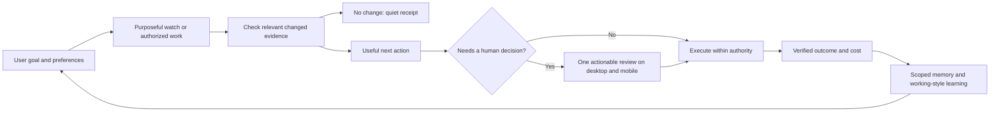

# Pre-tag requirement: visible, purposeful background work

Status: owner-requested acceptance addendum; implementation and installed-app acceptance remain open. This document does not certify release readiness or supersede the approval/resume canary.

## Owner's expectation

Clem should feel like a capable assistant whose work is understandable even when the user is not chatting. Heartbeats, memory maintenance, and workflows should visibly serve the user's goals. Her working style should improve through experience. Reliability, latency, and token efficiency take priority over decorative activity.

## Existing foundations verified in source

- `src/dashboard/activity-projection.ts` already projects workflows, detached tasks, and chat attempts from durable authority. Liveness comes from leases; success comes from settled records. Extend this contract, not a competing UI task tracker. Coordinate changes with the UI agent.
- `src/runtime/operational-telemetry.ts` already supports memory consolidation events and workflow, scheduler, and harness events. Event vocabulary alone does not prove that every producer emits a complete lifecycle or that either UI displays it.
- `src/runtime/prospective-adapters.ts` indexes active, self-driving goals with their objective, next resume, and goal ID. The index is not an execution authority. A stated aspiration does not automatically become an authorized recurring job.
- `src/memory/maintenance.ts` invokes existing identity evolution with discretionary-work deferral. `src/memory/identity-evolution.ts` proposes curated SOUL/IDENTITY changes from durable evidence, retains fact references, and requires approval before applying them. It already suppresses repeated proposals and unchanged output. Do not build a second personality writer.

These are source observations, not live proof of the requested experience.

## User journey and framework contract

1. **Working now (kanban only):** the owner's subsequent clarification places this detailed activity in the kanban view, not a Working now pane on Home. Show genuinely active workflows and background work, their purpose, stage, and elapsed time there. Explain waiting, deferred, failed, and interrupted states truthfully. Link to the originating goal, workflow, or maintenance receipt. Do not make quiet checks appear continuously busy. Home should prioritize the user's chosen Spaces, actionable decisions, and useful outcomes without duplicating the board.
2. **Recent progress:** show useful outcomes and concise learning receipts. A heartbeat that found nothing produces an inspectable last-check/next-check record, not an unread notification. Distinguish “checked,” “learned,” “proposed,” and “applied.” Never claim memory was learned before it is persisted.
3. **Needs you:** show only actionable decisions, with context and a direct response. One durable decision must be the same item on desktop and mobile. Responses, dismissals, and terminal states must survive restart without ghost tasks or duplicate sends.
4. **Goals:** associate work with stable goal identity and the applicable goal revision where available. Show evidence of progress, what remains, and the next purposeful action. An inferred goal is a suggestion until accepted. Corrections, pauses, completion, and superseding revisions must invalidate obsolete scheduled work and stale proposed actions.
5. **Growing with the user:** preserve provenance and scope for preferences and corrections. Demonstrate a later task behaving differently because of a retained correction. Surface SOUL/IDENTITY proposals as reviewable changes with their rationale; preserve existing approval and stale-proposal checks. Changes in style must not silently broaden tool permissions or external-write authority.

For each visible activity, derive an existing durable source identity, source kind, state, revision, lifecycle times, safe summary, and available goal/workflow/action references. Link to receipts for details. Do not synthesize missing costs, next-check times, progress percentages, or goal relationships. Mark unknown values as unavailable. Keep raw memory facts, credentials, and tool payloads out of global activity summaries.

## Efficiency requirements

- Visibility itself adds **zero model calls and zero model tokens**. Reuse durable records and existing event delivery; bounded queries and incremental updates must not scan the full memory or run history on every refresh.
- Heartbeats check relevant changes first. Do not send the entire conversation or memory vault through a reasoning loop on every tick. Coalesce repeated triggers and avoid overlapping work on the same intent.
- Use deterministic code for state transitions and comparisons. Use Jev for supported narrow decisions, and small workers for bounded generative tasks. Escalation must depend on capability and evidence, not provider-name conditions in the kernel.
- Record meaningful work outcomes separately from UI refreshes. Measure unchanged checks, useful actions, failed checks, elapsed time, model calls, and tokens. A failed read cannot become “nothing changed.”
- Foreground work must not wait for optional memory distillation. Existing deferral should remain effective, with an honest deferred state where shown.

## Implementation order and ownership

Harness owner: trace producer coverage for heartbeat and memory lifecycles; add missing authoritative receipts and goal references at the producer; pin failures before fixing them. Reuse existing stores and telemetry. No new independent scheduler or parallel activity database.

UI owner: consume the common projection on desktop and mobile. Present Working now, Recent progress, and Needs you as a clear hierarchy within the existing navigation. Keep raw telemetry in detail views, not the main command center. Coordinate backend projection/route changes because those files are already under active UI-agent work.

First vertical slice: one goal-linked check, one real memory operation, and one workflow with a human review. Make their lifecycle and outcomes legible on both surfaces before expanding coverage. Do not delay correctness work for animation or introduce simulated activity.

## Required installed-app acceptance

| Case | Evidence required |
| --- | --- |
| Unchanged heartbeat | Actual last check and next trigger where scheduled; no invented progress, repeated alerts, or narration calls |
| Relevant change | One goal-linked action/decision from repeated delivery; original evidence traceable |
| Memory maintenance | Started and settled/deferred/failed states reflect actual work; receipt identifies operation without exposing private facts |
| Retained correction | A subsequent matched task uses the correction; obsolete preference does not reappear |
| SOUL proposal | Proposed versus applied clearly distinct; approval applies the exact current proposal; stale proposals cannot overwrite newer edits |
| Human review | Find and respond on desktop and phone; restart plus double tap produces one continuation and one physical effect |
| Goal lifecycle | Paused/completed/revised goal does not continue obsolete work; relevant history remains accessible |
| Interrupted work | Restart does not leave immortal running indicators or fabricate success |
| Performance | Matched before/after wall time, model calls, tokens, and projection cost; visibility adds no model spend; any latency increase investigated |

Run on an agreed combined revision, verify installed `build-info`, and follow the Terminal hotpatch recipe. Use Grok/GLM for generative tests and Jev for decisions. Keep fixture resets isolated; live acceptance uses controlled named fixtures. Record what was verified, skipped, and remains owed. Source/unit evidence cannot replace desktop/mobile live evidence.

## Build trap

This new tracked document changes the source fingerprint inputs. The previously built harness candidate must be rebuilt before hotpatching. Do not install this branch over the UI agent's newer backend routes without agreeing and building the combined revision.
