# Contextual connection setup, desktop and mobile — 2026-09-29

## Outcome and source ownership

This is the first implementation slice of the owner's request to make setup feel native and let Clem carry a task through missing capabilities. UI and harness work belong together: a connection form without durable continuation would merely move the manual setup problem into chat.

Base: `4e2efe15bc348549e195e6660a305c011bff8cf1`. Implementation branch: `codex/contextual-connection-ui`; worktree: `/Users/nathan.reynolds/.codex/worktrees/connection-continuity/clementine-next`. The other agent's shell lane was last checked at `8da123b87`, branch `claude/shell-anywhere`; it was not modified. Main and the owner's uncommitted documents were not changed.

Source and UI builds are qualified separately from installation. This slice has **not been merged, hotpatched, tagged, or accepted in the installed app/live home**. The broader improvement goal remains open.

## What changes for the person

- A host-observed missing Composio connection offers setup directly in the conversation, on desktop and paired mobile. Arbitrary model prose cannot manufacture a connection form.
- The existing provider metadata drives OAuth, API credentials, account details, and custom OAuth application forms. Secrets stay in the form/request path, outside chat messages and continuity records.
- The original task remains visible. Returning from sign-in checks the exact provider-returned account. A successful check can send the original continuation once, using a stable host key across both surfaces.
- Reopening, a lost response, and retry retain that key. Cancel uses it too. Failures remain visible; a failed account-list fetch no longer presents an empty connections list as fact on mobile.
- The form follows the incumbent UI rather than introducing another dashboard: inline controls, clear primary action, optional developer fields collapsed, readable mobile width, accessible labels and status/error messages.

No model is called to render setup, interpret a connection button, or determine whether the provider reports the account ready. Existing task reasoning, tool discovery, Jev decisions, review, and approval rules still run in their existing lanes.

## Task and authority path

```mermaid
flowchart LR
  A[Original accepted request] --> B[Host observes missing connection]
  B --> C[Setup inside desktop or mobile chat]
  C --> D[Provider returns account identity]
  D --> E[Fresh exact-account verification]
  E --> F[Recheck task and setup binding]
  F --> G[One shared continuation receipt and executor]
  G --> H[Existing discovery and callable attestation]
  H --> I[Existing approval and effect receipts]
```

The setup record contains request/session/account identifiers and update time, not credentials or authorization URLs. Its verified snapshot is checked again at first admission, in the same SQLite transaction as the claim. A later real user request, Stop, or replaced account prevents a stale setup from starting work. The server-only verification snapshot is not accepted from browser input.

Receipt identity alone is insufficient: desktop and phone also share the existing run-attempt lease. Audience identity is copied from the original accepted source only after the exact durable receipt is checked. Ordinary chat audience checks remain unchanged. The continuation preserves original Plan mode and bypasses unrelated background-reply and approval-intent heuristics.

Connection readiness does **not** satisfy the missing-capability dependency. Canonical continuation plus fresh account-bound callable attestation still owns that transition. Nor does this slice force downstream execution onto the newly connected account: existing exact account/source routing remains responsible and can still request a choice.

## Intentional boundary that remains open

Normal and Plan continuations are implemented. An already-owned **reviewed Execute** is not restarted by this setup flow. It can connect the app and reports that execution remains paused. It is never silently converted to Normal, nor granted a second execution of the same immutable plan revision.

Before promising the entire setup journey works for Execute, implement and qualify resumption through its existing execution owner and completed-step/effect records. Do not bypass the one-execution-per-revision rule or create a new chat source pretending to own its previous claim. Existing generic chat behavior is unchanged by this new contextual guard.

Generic provider-reconnect questions without an exact toolkit still retain their existing answer choices; this slice does not infer a toolkit from prose. Local CLI/MCP enrollment, purchases such as phone-number provisioning, callback delivery, and delegated coding setup are subsequent slices, not claimed capabilities here.

## Verification and evidence

Targeted service/dependency/HTTP-route regressions: **31/31 passed**. Actual gateway continuation regressions: **10/10 passed**. These cover exact account readiness, stale tasks, replaced accounts before admission, database reopen, cross-device identity, original Plan mode, unrelated background work, a held desktop lease, and synthetic report-back events. Providers are injected; no paid model or real account action was used.

Mobile admission/cancellation helper regressions: **6/6 passed**. Existing mobile route suite: **107/107 passed**, including ordinary chat, pairing, approvals, idempotency, and answer streaming. One premature invocation during helper assembly failed on the missing export before tests started; the completed-source rerun passed all 107. It was an implementation-order error, not a pre-existing failure.

Earlier unchanged frontend checks in this slice: desktop chat transport **56 passed**; mobile connection helpers **8 passed**; mobile settings-state checks **8 passed**; new chat-engine continuation checks **8 passed**; existing engine checks **27 passed**. Runtime TypeScript and desktop/mobile production builds passed. The console build retains its large-chunk warning; this is not a claim of reduced JavaScript bundle size.

Controlled browser fixtures exercised save → verify → continuation on desktop and a 390-pixel mobile viewport. The mobile document had no horizontal overflow. Temporary fixture pages, servers, and browser tabs were removed. Those were mocked visual checks, not live provider acceptance.

The isolation runner explicitly could not prove its live-home sentinel because existing daemons were active (PID 78672 initially; the mobile route run also reported 86709). It observed daemon-owned files changing. Fixture homes and injected network guards are useful regression evidence, **not installed-app acceptance**. No daemon was stopped to manufacture that proof.

## Integration and live acceptance still owed

1. Finish the reviewed Execute continuation boundary above, or obtain an explicit narrower release scope; do not silently call the whole setup flow complete.
2. Review this source together with the shell agent's candidate. Inspect overlapping routing/approval behavior before combining, then run affected regression suites on the exact combined revision.
3. Build after the final source/checkpoint commit, coordinate the established Terminal/signing hotpatch, and verify the running app's served SHA/fingerprint, not just its disk stamp.
4. In the installed app/live home, use named controlled tasks to test new connection, expired connection, failed sign-in, desktop-to-phone and phone-to-desktop return, cancel, retry after lost response, and a new user request while sign-in is outstanding.
5. Prove one logical continuation and one physical executor, unchanged Plan restrictions, exact downstream model/tool/account routing, and no replay of completed writes. Include an ordinary chat/approval regression beside these tests.
6. Record wall time and all model/token lanes on matched work. This slice removes manual navigation and adds no setup-model calls; it has no measured live latency/token improvement yet.

## Framework traps to preserve

- `needs_input` attempts use `interrupted`; treating every interrupted attempt as cancelled hides legitimate setup cards.
- Background report-backs can emit `user_input_received` with `synthetic: true`. They must not replace the real user source when selecting a setup dependency.
- A source's audience is more than session ID. Both user ID and conversation key, including absence, matter to continuation consumption.
- Ordinary mobile request keys are device-scoped. This contextual continuation intentionally shares a host key; Stop must use the same derivation.
- Preserve original Plan mode; omitting a task mode means Normal, not inheritance.
- A last-good cached account list is not proof of present connection readiness.
- Recheck after awaits. Verification can finish before another setup changes the account or a newer user request wins the conversation.
- A receipt is not source acceptance. Mobile acknowledgement must not leave a stale rejected continuation waiting forever for an SSE source that was never created.

## UI woven into the next slices

| Harness work | Corresponding user experience | Acceptance evidence |
| --- | --- | --- |
| Event delivery, durable cursors, deduplication, retry, reconciliation | A compact connection detail showing last event, last successful sync, recovery action, and the task a result belongs to | Duplicate/out-of-order callback and reconnect do not duplicate work; stale/offline is visible |
| Provisioning with scoped cost/effect authority | A review card naming the requested resource, account, recurring cost, and exact action; one clear place to respond | No unexplained identifier-only approval or duplicate setup/send approval |
| Projects and agent delegation | Project view with objective, assigned agent, live work, waiting-on-you item, and direct return to the task conversation | User can open/steer/resume the exact child without creating a second owner |
| Proactive goals and memory maintenance | Purposeful check-ins that state why now, what changed, and the suggested next step | Suggestions cite durable evidence, respect dismissal, and do not pretend unperformed work is complete |
| Long tasks and learning | Concise progress and completion receipts with expandable evidence, account/model identity, and cost | Full task continuity and total-token accounting survive compaction and device handoff |

Keep each UI slice attached to a real state transition and its recovery path. Avoid another collection of status cards that cannot explain or control the underlying task.
