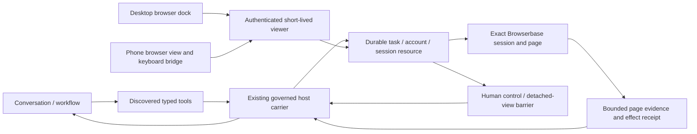

# Browserbase task browser — 2026-10-02

## Intended experience

A browser belongs to a Clem task. The conversation, steering, approvals and
completion evidence stay in Clem; a cloud browser gives that task a visible
workspace that can also be opened on the owner's phone. No second browser
planning model, cloned conversation or provider-specific kernel routing rule is
introduced.

## Source and ownership

This work extends the reviewed browser/model foundation at `c94a602f3` in the
managed `codex/browser-model-contracts` worktree. It does not edit the other
agent's `claude/blank-state-quiet` checkout or its installation recipes.
The integration lane advanced to `1b9eee75b` during this work, after
`97b7aaff5` and `28761ca7b`; its phone menu, running-work, resting composer and
round navigation changes must be included separately in a combined candidate.
It still had local phone Needs You/style edits at the last ownership check.
Preserve those edits and its model-catalog/refusal ownership as well.

The existing foundation's exact model selection, usage attribution and local
Chrome operation fixes remain part of this branch. Their earlier build receipt
does **not** qualify the new cloud-browser code. Every final source/document
commit needs a fresh combined build before installation.

## Implemented contract

- Browserbase configuration uses Clem's SecretStore for the API key and a
  private project/lifetime policy. A locally saved connection is configuration,
  not proof that the provider accepted that account.
- A durable reservation lands before session creation. Identical start retries
  rejoin the reservation; uncertain creates never silently create another paid
  session. Changed frozen recording options conflict rather than widening an
  earlier request. The owner can explicitly identify an uncertain creation in
  the provider console and adopt that exact session through the recovery route.
- A resource binds conversation, credential identity, project, provider session
  and page handles. Credentials cannot be replaced underneath a live resource.
  Expired resources cannot silently fall back to a local browser or a new cloud
  session.
- Agent schemas cover resource discovery/status, session creation, blank-tab
  creation, bounded page reads and HTTP(S) navigation. The authenticated host
  supplies the task identity; model arguments cannot select another conversation
  or inject a CDP URL, API key or script. Recording is an explicit owner UI
  choice; the agent's start tool always keeps it off.
- The same registry/schema fingerprints and existing host carrier bind normal
  and workflow execution. Mutations have no fabricated reconciliation and never
  redispatch to manufacture a successful receipt. A provider acknowledgment is
  distinct from independently observed terminal state.
- Desktop gets a browser dock alongside chat. Mobile gets a task-linked view
  with a bounded text/key bridge. The bridge requires an exact observed target,
  matching per-page viewer and current human-control lease. Missing provider
  page-ID mapping disables typing; URL/title guesses never select a target.
- Control versions invalidate old proposals. Returning control needs fresh page
  observation and first-party interactive-view detach acknowledgments. Other
  open devices cannot retain a first-party human view while Clem is granted
  control. A paused task is not automatically granted continuation authority by
  a browser control click.
- Viewer URLs remain only in authorized response/component memory; no keys,
  CDP connections or viewer capabilities enter general events, tool receipts or
  saved resources. Iframes accept only verified HTTPS provider origins, and
  disconnect messages require the exact frame source and minted URL's origin.
  A client-known viewer lease is reserved before the request so a lost response
  can still be closed. Detach tombstones prevent a delayed request from creating
  a new viewer after its owner already closed it.
- Logging and recording default off. Policy defaults are a five-minute idle
  release and a thirty-minute finite provider lifetime, configurable within the
  documented provider maximum. Visible viewers send explicit activity; merely
  polling a resource does not keep an abandoned browser running. Startup
  initializes maintenance without requiring a viewer to open.
- An unconfigured browser health poll never reads credentials. Configured
  credential reads have a bounded deadline and share an outstanding Keychain
  lookup, so an unavailable native credential store cannot hold the browser
  queue indefinitely or start accumulating duplicate lookups.

## What this does not certify

This is the first bounded cloud-browser slice, not proof that every website or
mobile gesture works. Agent-driven clicking, filling and submitting need a
truthful business-effect/consent contract before exposure; CDP interaction
internals are not advertised as an approved opaque script escape hatch.
Recording can be explicitly enabled at creation; embedded replay, persistent
login contexts, uploads/downloads and subscription billing are subsequent work.
Do not market these as delivered by this checkpoint.

First-party viewer detach coordinates Clem's desktop/mobile surfaces. It is not
provider-level revocation of a copied bearer link or an already-open external
viewer. Official documentation does not establish that URL expiration closes
an existing connection. Browserbase also does not keep Clem's local executor
running when the Mac is asleep or off.

Elapsed lifetime is visibility into the resource, not a provider invoice or an
exact price estimate. No general latency/token advantage is claimed. The
architectural saving is concrete: these fixed operations and the input bridge
use no new model planner; schemas remain discoverable rather than being added
to every brain turn. Resource discovery and operation receipts omit retained
dock page metadata rather than repeating it beside each read; exact page handles
and requested evidence remain in operation results. Measure real task totals
before claiming savings.

This slice mounts the dock in desktop Chat and the continuable conversation
thread, and in active mobile Chat. Agent-workspace and Space-specific chat
surfaces have not been expanded here. Physical desktop/iPhone visual acceptance
remains owed; a locked Mac prevented the bounded UI-control preview.

## Qualification and controlled live journey

Deterministic checks must cover exact account/session/page identity, private
URL/key boundaries, malformed/redirected responses, creation uncertainty,
same-request reuse/conflict, stale control, simultaneous first-party viewers,
restart with a pending effect, idle release, pending provider startup and actual
terminal stop. UI checks cover stale responses, missing pages, viewer-origin
messages and a phone input acknowledgment that is not mistaken for task
completion. Existing local-browser, catalog, model and artifact-closure pins
must remain green.

Before hotpatch, combine the current installer agent's work and this series into
one reviewed source revision, build backend plus both frontends, and verify
emitted artifacts and fingerprint. Never install this branch over their newer
phone work without that integration.

Then use the installed app and live home, with a named controlled fixture:

1. Configure Browserbase through the secured connection form; never paste the
   key in a chat, log, checkpoint or committed fixture.
2. Confirm served build identity, then create one task browser with recording
   off. Record creation, resource and exact provider identity privately.
3. Navigate to a public fixture and read known content. Verify discovery and
   the actual model/tool/account route; include routing, workers and review in
   the accepted-source token ledger.
4. Watch the same resource on desktop and a physical iPhone. Take control,
   exercise exact-page text/key input and verify visible results independently.
5. Return from one device while another interactive view remains open: agent
   browser dispatch must stay held until the other view actually detaches.
   Verify old proposals and stale keyboard requests cannot execute afterward.
6. Continue through the existing task route; the new page observation must
   reach the next proposal without repeating completed writes. Browser handoff
   itself must never claim the task is complete.
7. Restart through the coordinated installation owner, reconnect the exact
   still-live session, then stop it. Independently verify provider terminal
   status. Repeat an interrupted mutation without redispatch and inspect its
   honest unresolved receipt.
8. Compare a matched existing browser task against the installed baseline:
   wall time, calls, input/cached/output tokens, review verdict and delivered
   result. Keep an unavailable account or substituted model out of the pass
   column.

No Browserbase configuration was found in the inspected current configuration
or environment. Paid-session and physical-phone acceptance therefore still
require secure account setup. Mocked checks and a build are not installed-app
acceptance, and this checkpoint is not permission to tag.

## Official API evidence

- [Live View and mobile keyboard limits](https://docs.browserbase.com/platform/browser/observability/session-live-view)
- [Session live URLs](https://docs.browserbase.com/reference/api/session-live-urls)
- [Session lifecycle](https://docs.browserbase.com/platform/browser/getting-started/manage-browser-session)
- [Logging/recording controls](https://docs.browserbase.com/account/enterprise/zero-data-retention)
- [Replay lifecycle](https://docs.browserbase.com/platform/browser/observability/session-replay)
- [Pricing and separately billed model use](https://www.browserbase.com/pricing)

The debug API returns URI fields; a fixed `/live` or `/devtools-fullscreen`
pathname is not a documented contract. Consume the curated provider field with
the exact HTTPS origin guard. A synthetic test URL is not a live API receipt.

## Validation receipt

Frozen-source qualification: **152/152 deterministic tests passed** across the
new service, REST/CDP clients, authenticated routes, shared UI contracts and
discovery, plus existing local-browser, registry/taxonomy, model-selection,
reviewed storage carrier, transport/invoke artifact closure and thread-parity
checks. The backend service/client subset is 33 tests; shared UI helpers are 14.
The named run log is `/tmp/clem-browserbase-qualification.log`.

Backend, console and mobile typechecks passed. Public hygiene, operation identity
and whitespace checks passed. The manual Impeccable detector found no issues in
the six new UI components/styles. A separate protocol review rechecked known
viewer IDs, cancellation tombstones, actual detach barriers, background closure,
restart, unknown effects and failed-return observation recovery without finding
another concrete blocker.

The isolated runner explicitly reported that its live-home sentinel was **not
performed**, because the running daemon continues writing that home. These are
deterministic regression pins; they are not proof of installed/live behavior.
No model, paid session, credential mutation or hotpatch was used for these checks.

The final build identity and integration handoff are recorded separately in
`output/browserbase-task-browser-2026-10-02/` after this source checkpoint is
committed. That output does not alter the candidate fingerprint. Combine the
current installer lane before building the actual install candidate. Installed
identity, full combined release suite and physical/cloud acceptance remain owed.
