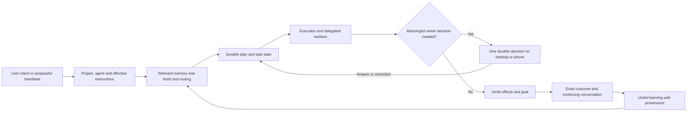

# Clementine: UI and harness refinement handoff

Review snapshot: October 2, 2026, Pacific time. This is an implementation handoff based on source inspection, read-only live records and existing test receipts. Recheck the candidate before working: another agent may have advanced it since this snapshot.

## Prompt to give the agent

> Continue Clementine's shared framework and desktop/mobile UX from the current integrated candidate. Read this document and the evidence it links before implementing. Preserve the recent approval voice, exact consent, pinned-agent model routing, stable tool-prefix caching and schema-92 history receipt fixes. First repair continuity through compaction and judge continuation, then reconcile the effective instructions seen by memory, execution and the judge. Make replies, selected context and Inbox decisions recoverable through failures. Finish exact workflow/result navigation and mobile proactive conversation parity. Optimize complete-task tokens and latency after correctness is pinned, keeping the owner's priority on judge accuracy. Finish storage retention through verified learning/dependency states rather than age-only deletion. Work at the class level, respect current ownership, and qualify the exact installed revision against controlled live-home cases. Report source, build, installed identity and live acceptance separately; do not infer completion from a successful tool call, a clean static scan or an older green suite.

## 1. North Star and binding scope

Clem should be an assistant that grows with the user: she remembers useful knowledge, applies current preferences, plans, retains that plan through execution, discovers available tools, delegates work, asks meaningful questions, and proves what happened. Desktop and mobile should make that work understandable and easy to resume.

Speed and token efficiency must preserve accuracy, access to tools, task continuity and honest effect receipts. Jev helps select relevant knowledge and capabilities; it does not substitute its prediction for an observed external result or invent authority to act.

The intended interaction is:

Requirements:

- Framework changes only. Do not repair personal/business Spaces, alter the owner's standing preferences, or tune a personal integration to make a test pass.
- Preserve other agents' edits, the intentional dirty North Star document and the token-meter work. Never stage the whole worktree, stash/pop another agent's work, or assume a branch is current from its name.
- Recheck ownership before editing shared files. The other agent owns installation/hotpatch coordination; this document does not authorize a competing install or restart.
- Installed-app/live-home acceptance is required. Unit fixtures support it; isolated-home success does not replace it. Never run destructive fixture resets against the live home.
- Use named controlled fixtures. Reconcile an uncertain write before retrying. A completed write must not replay during approval, review, restart or device continuation.
- Honor current owner-approved model/account selections and test spending constraints. Do not silently substitute providers or create extra paid review traffic. Clem's Claude OAuth connection is authoritative, not standalone CLI login status.
- Keep policy and execution decisions in shared code and typed state. Avoid provider-specific kernel branches, task-specific exceptions, new chat verbs and prompt-only remedies.

Before diagnosis/change, read `AGENTS.md` and:

1. `docs/checkpoints/2026-09-19-current-framework-state.md`
2. `docs/checkpoints/2026-09-19-active-configuration.md`
3. `docs/checkpoints/2026-09-19-weekend-refinements.md`
4. `docs/checkpoints/2026-09-19-live-acceptance.md`
5. `docs/NEXT-TAG-RELEASE-GATE.md`

Those are dated continuity sources. Verify present settings, branches and runtime rather than treating old observations as current.

## 2. Candidate and ownership snapshot

| Layer | Evidence at review time | Meaning |
|---|---|---|
| Main | `4c3a9e4217cd8c57499c9ec960c8c2335e752acc`, tag `v3.18.26` | This tag already exists. The weekend work is newer. |
| Active app/framework lane | `claude/blank-state-quiet`, `/Users/nathan.reynolds/clem-worktrees/blank-state-quiet` | Start by inspecting this lane, not an obsolete earlier branch. |
| Latest source observed | `eb6cab5a2be1e6a2ba584ffa631c31dcd9f7bb02` | Latest commit updates the weekend evidence record; runtime/UI source is its parent `89e97b606`. |
| Served installed source | `89e97b606630e9b04c6adee11f03db1423f18f95` | Authenticated build-info from the installed app. |
| Served fingerprint | `274132ed4e18ec220515488cdf38c15c1405702986bd4f5d3a6c7ea23140a23c` | Bind acceptance to this identity, or freshly record its replacement. |
| Served runtime | PID `42753`, schema `92`, exact `~/Applications/Clementine.app` daemon path | PID is historical. Recheck after any restart. |
| Version label | `3.18.24` | Retained shell label; not evidence that the served source is old. |

The primary worktree also has uncommitted `apps/web` marketing-site work. It is separate from the console/mobile app changes. Preserve it; do not attribute its cinematic visuals to the installed app or fold it into this lane without coordination.

This review did not change runtime/settings, launch model tests, hotpatch, commit or tag. This handoff is documentation, not a release qualification receipt.

## 3. Improvements already present: preserve them

- Today and Needs you use a more compact collection/detail layout rather than exposing every form at once.
- Approval cards use Clem's question and explanation while retaining the exact action content underneath. Reopened transcripts and human answers no longer depend on raw approval/result-handle narration.
- The latest Inbox/Needs you wording follows the same approval voice as chat.
- Switching a conversation to a saved agent applies its pinned model until the owner chooses a conversation model. The checkpoint records a live Haiku switch with requested/resolved model evidence and desktop/mobile chip checks.
- A multi-option choice reaches the owner rather than being answered through an unrelated standing yes/no approval.
- Local CLI install/login is treated consistently with equivalent local shell work, and installation records the owner's actual npm/install path.
- A fully specified irreversible workflow deletion can reach one exact consent card. It does not execute as a planning probe or unattended workflow step.
- Session tool promotions are bounded and steadier across turns. Tool visibility does not override invocation policy or remove discovery access.
- Claude transcript cache eligibility considers the complete prefix it caches, rather than the transcript alone.
- Schema 92 lets large shared-history frames support exact host/logical result receipts through verified readable views.
- Exact history preparation and the read-only learning census are merged. They retain proof and do not authorize history deletion.

Primary newer work record: [Weekend improvements](../../clem-worktrees/blank-state-quiet/docs/checkpoints/2026-10-03-weekend-improvements.md). Because this relative link depends on checkout location, the authoritative local path is `/Users/nathan.reynolds/clem-worktrees/blank-state-quiet/docs/checkpoints/2026-10-03-weekend-improvements.md`.

## 4. Evidence from recent owner and controlled runs

### 4.1 Approval-card recovery improved; scope the claim precisely

Controlled session: `sess-desktop-d97945b8640886734f2426ec`, fixture `clem-fixture card check 2`.

- Workflow-delete request reached one card in **3 brain calls / 29 seconds**; prior blocked attempt took **22 calls / 169 seconds** without a usable card.
- This measures time to the card, not full task wall including human decision time.
- Approval `apr-roxf` was rejected. Event `346666` records `work_binding:user_rejected_before_dispatch`, `executionKind=refused_pre_dispatch`, `dispatchState=not_started`, `physicalDispatchCount=0`.
- Physical dispatch records in that session contain only `workflow_get` and `tool_search`. The fixture workflow remains present with its pre-test modification time.
- The final reply confirms no retry/no change. The checkpoint records desktop/mobile/Needs-you card and reopened conversation checks; this review did not independently inspect those screenshot pixels.

**Accepted:** new decline/no-effect path. **Still separate:** approval followed by a controlled write, correction, stale/duplicate response handling and desktop-to-physical-iPhone continuation. Do not repeat deletion merely to broaden coverage.

### 4.2 Scheduled workflows show operational progress

- Platform 49's October 2 scheduled runs at 08:00, 12:00 and 16:00 PT have completed records and passing full objective reviews. Latest observed duration: **132.58 seconds**.
- Team Slack's latest scheduled run completed in **101.03 seconds**, with one recorded Slack write and a passing goal review.
- Daily stand-up email completed that morning.

These are actual owner runs, not fixtures. They do not independently verify every external artifact, qualify a later runtime revision, or establish matched token savings.

### 4.3 Friday snapshot exposes instruction/reviewer disagreement

Run: `trigger-572f895657a43e7bb043dfe0f5f61a14`, `end-of-week-team-sales-snapshot`, finished October 2 at 23:36Z.

- Saved compile instruction required eight reps, one line per rep.
- Exact retained memory packets at events `346166`, `346193`, `346228` contained the owner's explicit standing instruction to exclude one rep from weekly sales reports.
- The brain followed that real standing instruction. The goal judge treated it as unsubstantiated because it was not reconciled with `workflow_contract`.
- One Slack message was recorded as landed at event `346200`; the runner preserved it and did not automatically replay it.
- Run state is deliberately split: `completed`, `terminalOutcome=succeeded`, `goalOutcome=gap`, `goalValidation.pass=false`, `judgeFailedOpen=false`.
- Console/mobile already map the goal gap to **Done, with a gap**. Success learning is excluded. The notification still leads with **Workflow completed** and has `needsAttention=false`, although its body requests an owner decision.

This is a shared effective-instruction/review-provenance problem. Do not delete the standing rule, edit the personal workflow to disguise the conflict, or resend Slack.

Live evidence locations:

- `~/.clementine-next/workflows/runs/trigger-572f895657a43e7bb043dfe0f5f61a14.json`
- That workflow's `runs/<id>/events.jsonl`
- `~/.clementine-next/state/notifications.json`
- Exact retained model-memory context and accepted source/effect records in the live harness database

### 4.4 Cost accounting must include approval continuations

Telephony setup source `345676`, with approval continuations `345740`, `345775`, `345875`:

| Measure | Whole original-source lineage |
|---|---:|
| Model calls | 21: 16 brain, 4 reviewer, 1 Jev |
| Input tokens | 1,269,254 |
| Cached input | 916,354 |
| Uncached input | 352,900 |
| Output tokens | 15,764 |
| Initial request to final completion | Approximately 190.78 seconds, including owner waits |

The earlier 29.34-second segment was only the first approval stop. All matched canonical usage rows were certified. Canonical `uncached_tokens` includes uncached input **plus output**; do not relabel it as uncached input.

Across six short telephony asks, recorded input totaled 2,923,473, of which 2,037,414 was cached and 886,059 uncached, plus 54,893 output. This is observed spend before qualification of all new cache fixes, not a matched A/B result or a billing-dollar estimate.

The setup source's respond-bridge preparation was about 5 ms. Repeated setup recovery, discovery/history and model calls were the larger opportunity in that case. Do not assume the preparation lane is always the bottleneck from older observations.

Other useful acceptance anchors:

- Owner HTML continuation `344132` was blocked after 61.22 seconds with `exact_checkpoint_admission_exhausted`; keep it as a large-output/checkpoint regression case for the schema-92 class fix.
- Mobile project explanation `344470` completed in 25.41 seconds, reading four project files with a passing Sonnet completion review.

## 5. Implementation sequence

### Priority 1 — Continuity through review, compaction and reopen

**Evidence class:** open defect recorded by the active agent, not independently reproduced by this review. The weekend record lists compacted history overwritten after a judge continuation.

Start in `src/runtime/harness/host-turn-runner.ts`, its completion-review continuation path, compaction/checkpoint serialization and focused continuity tests.

Implement a class-level fix that preserves the current compacted state instead of replacing it with an older transcript. Retain the approved plan, latest corrections, pending decisions, completed-effect receipts and exact source/task linkage. Original evidence can remain behind verified lookup handles; it need not be pasted back into every model turn.

Acceptance:

- [ ] A failing pin exercises compaction followed by an actual judge continuation.
- [ ] Reopen/restart preserves the same plan, correction, pending approval and completed write.
- [ ] No duplicate external effect and no restoration of superseded instructions.
- [ ] Matched long-session traces show frame/history growth before and after; correctness remains intact.

### Priority 2 — One effective contract for execution and review

**Evidence class:** live instruction/reviewer disagreement in Friday's owner run.

Start in `src/execution/workflow-runner.ts` goal-review construction and the shared standing-rule/memory projection paths. Preserve authored workflow definitions while deriving the applicable execution contract from current, scoped, proven instructions.

Pass the same instruction provenance and precedence to the brain and judge. A judge must distinguish an authorized later rule from an invented preference. Unresolved material conflict should have a clear decision path before a write; avoid asking again when precedence is already established by the owner's applicable instructions.

Keep effect outcome separate from goal satisfaction. Update notifications and navigation so a goal gap is actionable and honestly titled, without pretending a landed write failed or is safe to replay.

Acceptance:

- [ ] Controlled older workflow requirement plus later scoped standing rule yields a consistent effective contract.
- [ ] Unrelated/global memories cannot override the task by accident.
- [ ] Brain and reviewer agree on the provenance of an applicable rule.
- [ ] A post-effect gap preserves the effect and creates the correct next action on all surfaces.
- [ ] Success learning requires the appropriate goal/effect certification.

### Priority 3 — Recoverable replies, decisions and selected context

**Evidence class:** source-demonstrated behavior gaps; not newly live-reproduced during this review.

Relevant files, relative to the active worktree:

| File | Observed issue | Required behavior |
|---|---|---|
| `apps/console-web/src/components/home/NeedsYouPane.tsx` around 98/330 | Draft clears before acceptance; notice can replace response controls | Keep draft until accepted receipt; render error beside usable retry controls |
| `apps/console-web/src/components/home/FromClemPane.tsx` around 66/177/187 | Error replaces actions; local draft is labeled saved | Recoverable retry; durable draft if claiming saved across navigation |
| `apps/console-web/src/screens/Inbox.tsx` around 178/582 | One feed error hides good/cached decisions | Per-source availability/freshness and decision revalidation |
| `apps/console-web/src/screens/Home.tsx` around 151 | Agent/project preparation errors become `{}` and sending continues | Preserve intent/message when selected context cannot be honored |
| `apps/console-web/src/screens/Inbox.tsx` around 95 | Mounted deep link selects but does not open narrow detail | Select and open the exact decision on an already-mounted screen |
| `apps/console-web/src/components/inbox/DecisionList.tsx` around 47 | Focus outline removed without replacement | Visible keyboard focus and predictable list/detail return |
| `apps/console-web/src/components/chat/ModelPicker.tsx` around 112/199 | Unknown agent-model lookup falls back to global chip | Distinguish resolving/unavailable from an authoritative default |

Reuse shared presenters/state contracts instead of duplicating another frontend interpretation of the engine. A stale cached decision may remain readable, but an action must reconcile the current object/version. Preserve exact effect arguments and duplicate-response protection.

Acceptance:

- [ ] Failed submission retains the exact answer and allows an in-place retry.
- [ ] Retry/duplicate tap yields one accepted decision/resume.
- [ ] One unavailable source does not erase other available approvals.
- [ ] Agent/project preparation failure leaves the message recoverable and does not silently route elsewhere.
- [ ] Existing narrow Inbox opens a newly deep-linked decision and restores useful focus when returning.

### Priority 4 — Purposeful command center, desktop/mobile parity

Use the same collection/detail grammar across projects, agents, workflows, meetings and memory. Lead with purpose, current work, required next action and outcome; show secondary collections through compact previews and deliberate detail paths.

Specific next work:

1. **Workflow navigation:** `apps/console-web/src/screens/WorkflowPage.tsx` currently directs a started task to “Automate → last run.” Retain the admitted run ID and offer **Open this run**. Lead with trigger, On/Off/testing state and current outcome before graph editing.
2. **Proactive phone experience:** mobile Home lacks the From Clem feed/reply surface. Reuse the desktop durable item/source/version semantics and continuing conversation. Decide Goals/Heartbeat navigation intentionally; do not add dense controls just for nominal parity.
3. **Approval parity:** mobile chat's voiced branch around `apps/mobile-web/src/screens/Chat.tsx:854` has Yes/No and reply guidance, but no Not now control. Define and qualify consistent defer behavior.
4. **Page companion:** `apps/console-web/src/components/chat/PagePreviewPanel.tsx` preserves the conversation but makes the full window modal. Wide desktop should permit chat alongside the same sandboxed preview. Narrow screens need reliable Back. Repair iframe keyboard traversal and restore trigger focus.
5. **Projects and agents:** keep goal/current work/next action prominent; secondary resources, pages, conversations and learning should not become another stacked dashboard. Preserve the distinct meaning of project, agent and Space.
6. **Setup tasks:** make installation/authentication/connection/readiness one durable task with typed states and repair paths. Clem should prepare what she can and request only an actual secret, meaningful choice or authorization. Private credentials need a secure entry path, not chat/log/prompt storage.

Acceptance should cover physical iPhone, narrow desktop, keyboard, dark theme, long generated HTML, meaningful empty/error states and continuation to the exact same task. Headless phone-width screenshots are useful but do not replace real-device acceptance.

### Priority 5 — Quiet background work with honest degraded states

**Calendar discovery:** `src/agents/calendar-watch-runtime.ts:829` currently returns “No calendar connected yet,” quiet/readFailures zero, whenever no learned operation exists. Discovery/model/provider failure is not proof of absent configuration. Distinguish never configured, discovery unknown and known configuration degraded. Keep blank homes quiet while exposing one useful recovery path for an actual configured failure.

**Keychain recovery:** inspect `src/execution/keychain-unlock-followup.ts` and `src/execution/workflow-runner.ts` around 17374.

- An ambient locked probe currently relabels any deterministic command failure as keychain-caused. Keep the environmental observation separate from a correlated credential/dependency failure and retain the original error.
- Follow-up is durably marked `asked` before requeue/notification occurs. A crash or disk failure in that gap can suppress recovery forever. Use recoverable pending state/outbox, stable action identity and a durable terminal receipt.
- Different requeue refusals currently share “may have started writing”/“ready to run again” text. Preserve typed refusal reasons and appropriate actions.

Do not weaken external mutation/reconciliation guards. Qualify the keychain probe against an actual lock cycle; unit mocks of the shell exit code alone do not establish state accuracy.

**Relay:** initial registration/HELLO and time before the first PING still deserve qualification. Avoid guessing a universal timeout that breaks older relay peers; derive deadlines from protocol capabilities and test actual drop/sleep/LAN-to-cellular recovery.

Acceptance includes unavailable discovery, known setup loss, unrelated script failure while locked, real credential failure, unknown probe state and restart at each recovery claim/effect boundary.

### Priority 6 — Complete-task efficiency without weaker accuracy

The owner prioritizes judge accuracy over shaving review latency. Address duplicated work and unnecessary context before reducing review coverage.

Work in this order after continuity/instruction correctness is pinned:

1. Keep approval-resume prefixes stable. Record tools/system/history prefix fingerprints to explain cache misses.
2. Retain compaction through review continuation. Measure prompt size over a long task, not just the first turn.
3. Make the advertised `call_tool` argument shape and normalization agree so a routine representation mismatch does not cost a model round. Preserve exact normalized arguments in consent/effect evidence.
4. Use Jev with a compact learned-capability index to select fresh exact tools/accounts and relevant memories before the brain's first frame. Account/schema/policy changes must invalidate stale proof; uncertainty retains discovery access.
5. Use bounded reviewer summaries with verified evidence lookup handles where supported. Keep all material evidence reachable and applicable rules visible; an unavailable review is not a successful verdict.
6. Retain requested model/account identity through delegation and fallback. Report an unavailable selection truthfully; do not label a substituted model as the requested one.
7. Profile new foreground history publication. `accepted-model-batch-checkpoint.ts:569/618` and checkpoint storage still call `storeAcceptedModelHistory` inside the writer transaction; the store parses/hashes/deflates synchronously. Existing preparation fixes old-row conversion, not this foreground path. Move preparation off the owning critical section with exact under-lock re-attestation, then measure actual contention and event-loop delay.

For matched cases, record complete original-source lineage and every brain/worker/Jev/watcher/judge/learning call. Separate cached input, uncached input, output, missing usage and owner wait. Report total input as context/load, not as uncached billing spend. Compare with the same task/model/account/settings and equivalent successful output; use repeated samples for variable latency.

No general post-cache-fix live savings were established by this review. The latest checkpoint explicitly says to measure the next live day. Do not convert fixture compression, selector latency or time-to-card into an overall token-efficiency claim.

### Priority 7 — Finish storage lifecycle and useful memory

Preserve commits `91dc089d0` (exact history preparation) and `a820338e0` (learning inventory), plus schema-92 receipt compatibility. Do not merge the old automatic cadence prototype wholesale.

Separate three questions:

1. Has useful learning been extracted or intentionally skipped with a durable receipt?
2. Does any plan, approval, unresolved effect, continuation, learned proof or other consumer still depend on the source?
3. Has physical storage actually been reclaimed?

The learning inventory is read-only and is not a deletion certificate. Pending/failed extraction, unavailable source, inconsistent receipt and pending promotion require explicit handling. Rows classified as no extraction required can still be required as task/effect proof. Rejected/unpromoted candidates do not imply all their underlying source evidence is disposable.

Implement bounded dependency-aware expiry with durable progress and interruption recovery. Preserve compact useful facts and tool certificates with source/account/schema provenance. Convert/reclaim only eligible evidence. Measure allocated file bytes, reusable pages, WAL and backups separately; exact compressed payload savings are not automatically SSD savings.

Automatic old-history conversion/expiry and physical reclamation remain unfinished. Qualification must include live reads and foreground responsiveness under actual WAL/disk conditions, plans/approvals across upgrade, and storage UI that labels partial/unavailable measurements honestly.

Storage continuity documents in the primary checkout:

- `docs/checkpoints/2026-10-02-existing-history-conversion.md`
- `docs/checkpoints/2026-10-02-history-publication-preparation.md`
- `docs/checkpoints/2026-10-02-learning-retention-inventory.md`
- `output/storage-review-2026-10-02/REVIEW.md`

## 6. Qualification and evidence discipline

Latest completed full-suite receipt inspected: `20d79d9c7`, **19,593 passed / 0 failed / 8 skipped**. A targeted rerun recorded **331/331**. A newer `40765e31b` suite had no terminal result when inspected; collect its result and the later candidate's required checks. Earlier green suites do not qualify `89e97b606` or a subsequent change automatically.

The static UI detector returned no findings across 41 scoped markup files. It does not test async recovery, routing, approval meaning or visual usability. Fresh rendered interaction was unavailable during this review: native Mac was locked and a new browser tab at the console route returned Unauthorized. No auth/settings changes or UI test actions were performed to overcome that limitation.

Use tests that pin each semantic failure, not tests that merely repeat implementation details. Run the full suite/journeys on an otherwise idle machine, honor repository release gates, and attribute named failures at the exact revision rather than calling them pre-existing from an old log.

The authoritative current desktop runtime log observed was `~/.clementine-next/logs/desktop/supervisor.log`. The old `logs/daemon.log` was stale. Bound log windows and distinguish owner runs, canaries, startup recovery and historical failures. Do not count a multi-day tail as current-candidate regressions.

Minimum controlled installed-app/live-home matrix:

| Case | Required outcome |
|---|---|
| Long conversation + compaction + judge continuation + reopen | Current plan/corrections/pending approval retained; completed writes never replay |
| Applicable standing rule conflicts with older saved workflow instruction | One consistent effective contract, truthful review and pre-write resolution |
| New approval + correction + retry/duplicate response | Exact final payload, one accepted decision/resume/effect, accurate reopened transcript |
| Declined irreversible action | Zero dispatch; existing effect/definition unchanged |
| One failed Inbox feed and one failed reply | Other decisions remain accessible; original reply survives and can retry |
| Agent/project/model selection unavailable | Message/context retained; requested/effective identity truthful |
| Workflow author → enable → execute | Exact workflow/run identity, criteria and effects verified; usable result destination |
| Desktop ↔ physical iPhone continuation | Same task/decision/draft contract; no replay of completed work |
| Proactive check-in | Purpose/evidence/next action visible; answer reaches durable conversation exactly once |
| Known setup failure / keychain recovery / relay reconnect | Useful accurate status; recovery survives restart without duplicate action |
| Large HTML/result and exact shared history | Open/reopen/readback correct, responsive UI and valid receipts |
| Storage maintenance alongside foreground work | Exact evidence retained, bounded work, truthful storage measurements |

Qualification should exercise native tools, local MCP, CLI/shell and Composio where they are involved in the controlled cases. Validate exact tool, account and model choices. Discovery remains available for capabilities not already learned. Do not bypass sensible external-write consent to make a run appear fast.

## 7. Completion report and next release

For each accepted change, provide:

1. Concrete defect and class-level fix, with source revision.
2. Failing-before/passing-after pin and required check results.
3. Build identity and installed served source/fingerprint/schema.
4. Named live acceptance, original-source/task lineage and exact effect/decision receipts.
5. Matched latency/token/storage measurements and their limitations.
6. What was verified, skipped and still owed; traps added to continuity memory/checkpoint.

Reconcile branches and preserved work before integration. Use the coordinated Terminal/signing hotpatch recipe, confirm served identity after install, and launch the exact app by path when launch is part of authorized acceptance. Rebuild after the final source/commit changes that affect its fingerprint. Do not tag solely because this document or a source fix is complete.

The next release should make it easier to understand and finish a real task: one current intent, one durable plan, one meaningful decision, one verified outcome and useful retained learning. Its improvements should be demonstrated by complete-task evidence.
